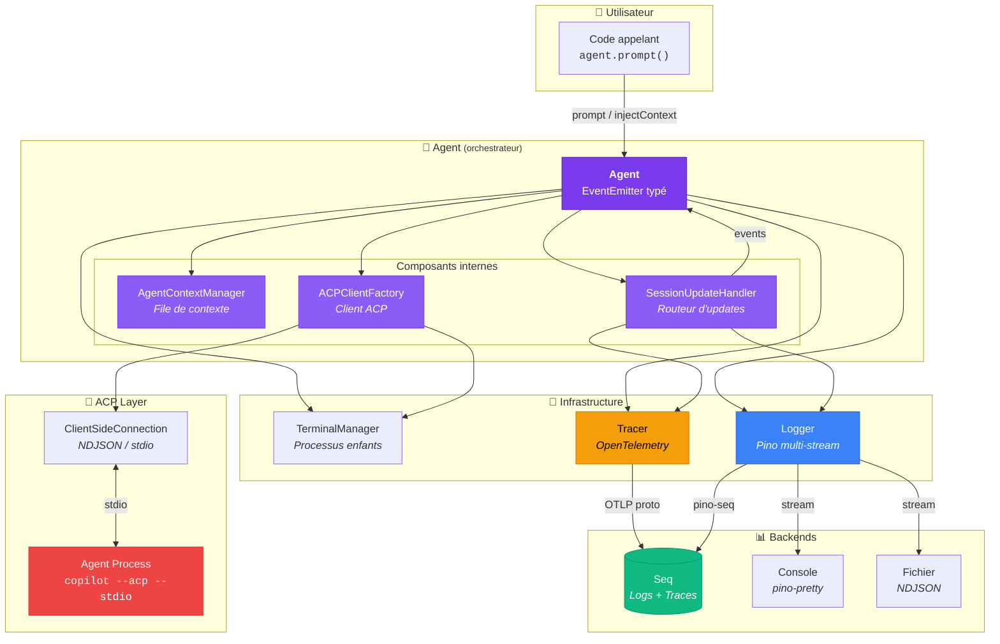
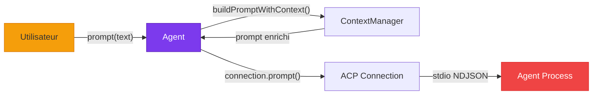
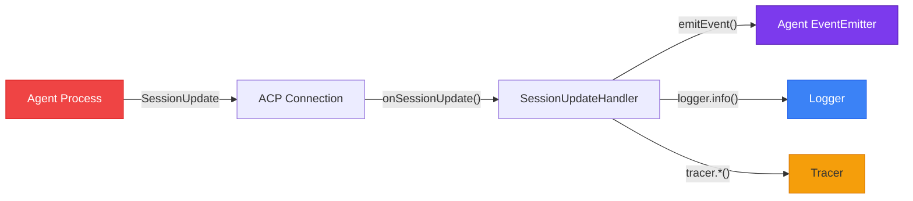
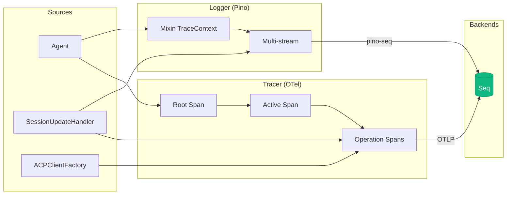
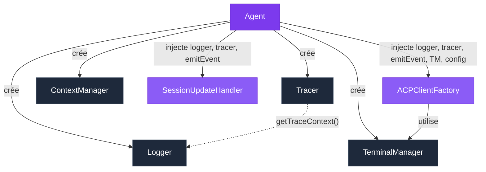
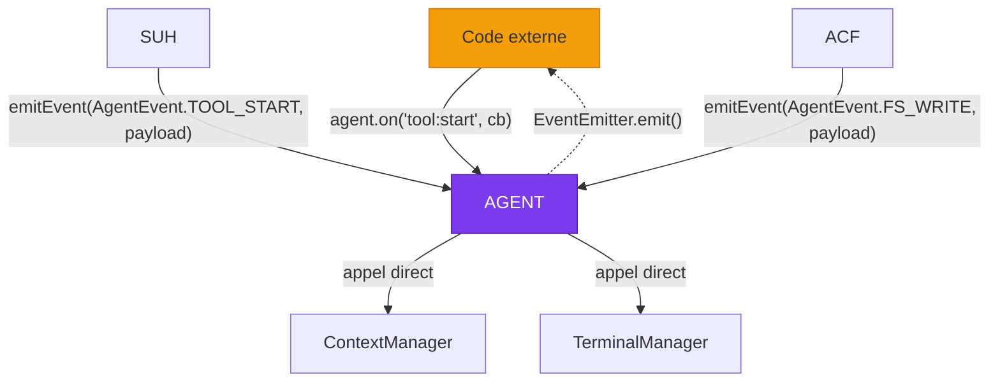

# 🏗️ Architecture — Vue d'ensemble

> Cette page décrit l'architecture globale de Stark, les composants qui le composent,
> et comment ils interagissent pour former un système d'agent autonome observable.

---

## Philosophie

Stark suit trois principes architecturaux fondamentaux :

1. **Séparation des responsabilités** — Chaque brique a un rôle unique et bien défini
2. **Composition par injection** — Les dépendances sont injectées, jamais instanciées en interne
3. **Observabilité native** — Chaque action est loguée, tracée et émise comme événement

Le résultat : un système où chaque composant peut être testé, remplacé ou étendu indépendamment.

---

## Diagramme d'architecture

---

## Les 8 briques

Le système se décompose en **8 composants** répartis en 3 couches :

### Couche Orchestration

| Composant | Fichier | Rôle |
|-----------|---------|------|
| [**Agent**](../components/agent.md) | `classes/agent/agent.ts` | Orchestrateur principal. Étend `EventEmitter` avec un typage fort. Gère le cycle de vie complet : spawn du processus, négociation ACP, envoi de prompts, destruction. |

### Couche Logique métier

| Composant | Fichier | Rôle |
|-----------|---------|------|
| [**AgentContextManager**](../components/context-manager.md) | `classes/agent/agent-context-manager.ts` | File FIFO pure (aucune dépendance) qui gère l'injection de contexte entre les prompts. |
| [**SessionUpdateHandler**](../components/session-update-handler.md) | `classes/agent/agent-session-update-handler.ts` | Routeur qui dispatche chaque `SessionUpdate` ACP vers le bon handler (logging, tracing, événements). |
| [**ACPClientFactory**](../components/acp-client-factory.md) | `classes/agent/agent-acp-client-factory.ts` | Fabrique du client ACP : implémente les callbacks de permissions, filesystem et terminal. |

### Couche Infrastructure

| Composant | Fichier | Rôle |
|-----------|---------|------|
| [**Tracer**](../components/tracer.md) | `classes/tracer/tracer.ts` | Wrapper générique OpenTelemetry. Gère la hiérarchie root → active → operation spans. |
| [**Logger**](../components/logger.md) | `logger/create-logger.ts` | Fabrique de loggers Pino multi-transport (console, JSON, Seq) avec corrélation trace. |
| [**TerminalManager**](../components/terminal-manager.md) | `classes/terminal-manager/terminal-manager.ts` | Gestionnaire de processus enfants : spawn, output, exit, kill. |

---

## Flux de données

Le système présente **trois flux de données** distincts :

### 1. Flux de commande (descendant)

### 2. Flux de données (ascendant)

### 3. Flux d'observabilité (transversal)

---

## Graphe de dépendances

Chaque composant reçoit ses dépendances par injection dans le constructeur.
L'`Agent` est le seul point d'assemblage (composition root) :

!!! info "Composition Root"
    Le constructeur de `Agent` est le seul endroit où les dépendances sont assemblées.
    Aucun composant interne n'instancie lui-même ses dépendances — tout est injecté.

---

## Communication inter-composants

Les composants communiquent via **trois mécanismes** :

| Mécanisme | Utilisé par | Direction |
|-----------|------------|-----------|
| **Appels directs** | `Agent` → `ContextManager`, `TerminalManager` | Descendant |
| **Callbacks injectés** | `emitEvent` passé à `SessionUpdateHandler`, `ACPClientFactory` | Ascendant |
| **EventEmitter** | `Agent.on()` pour les consommateurs externes | Sortant |

---

## Séparation des responsabilités

Chaque composant a un **périmètre strict** :

| Composant | Sait | Ne sait pas |
|-----------|------|-------------|
| **Agent** | Comment orchestrer le tout | Les détails du protocole ACP |
| **ContextManager** | Gérer une file FIFO | Qu'un agent existe |
| **SessionUpdateHandler** | Router des updates vers les bons handlers | Comment spawner un processus |
| **ACPClientFactory** | Implémenter les callbacks ACP | Le cycle de vie de l'agent |
| **TerminalManager** | Spawner et gérer des processus | Le protocole ACP |
| **Tracer** | Gérer des spans OpenTelemetry | Le domaine métier |
| **Logger** | Écrire des logs structurés | Ce qu'est un agent |

!!! tip "Principe Open/Closed"
    Le `Tracer` est volontairement générique (domain-agnostic). Pour tracer un nouveau concept
    métier, on crée des **fonctions helper externes** qui composent l'API du Tracer —
    sans jamais modifier la classe elle-même.

---

## Prochaines étapes

- [**Flux & Séquences**](sequences.md) — Diagrammes de séquence détaillés de chaque flux
- [**Agent**](../components/agent.md) — Plongée dans l'orchestrateur principal
- [**Démarrage rapide**](../guide/quickstart.md) — Lancez votre premier agent