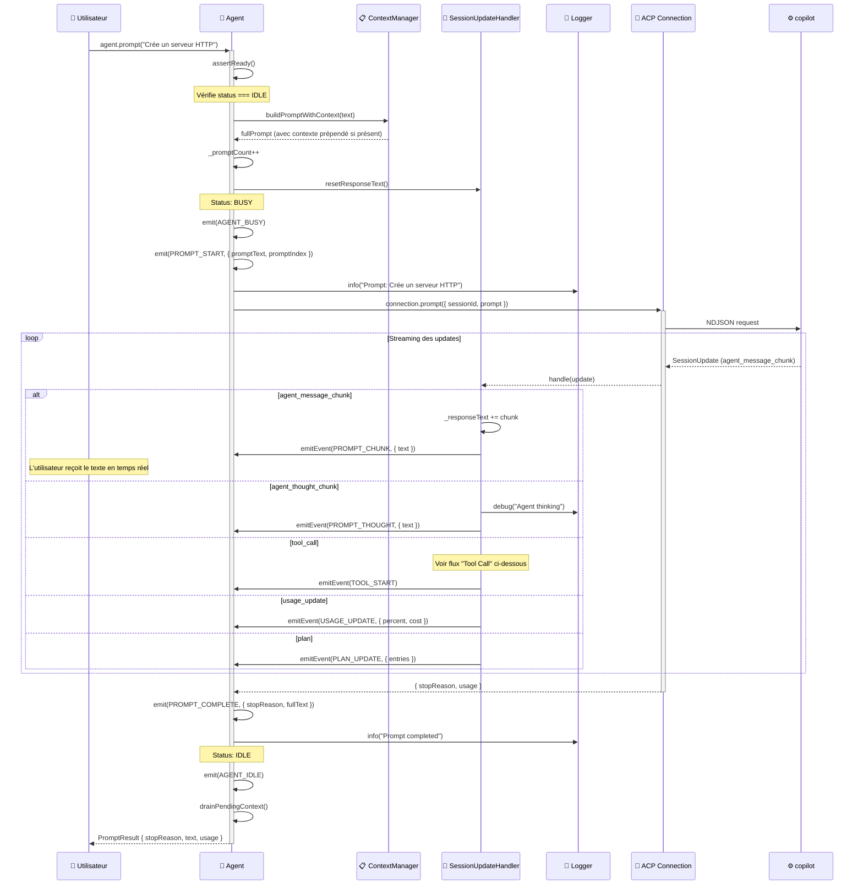
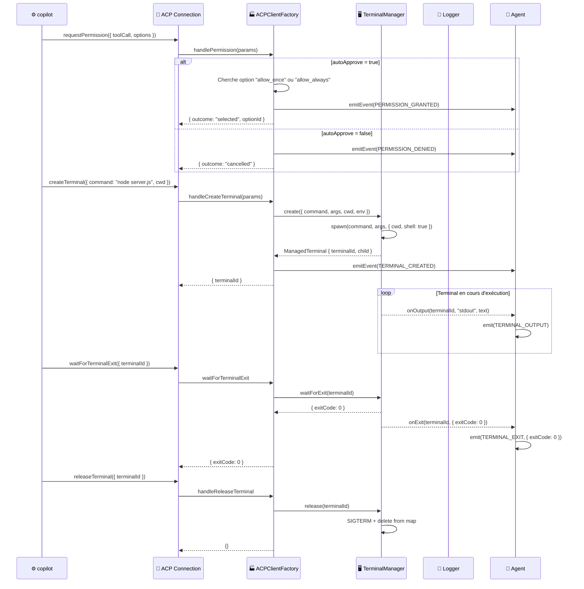
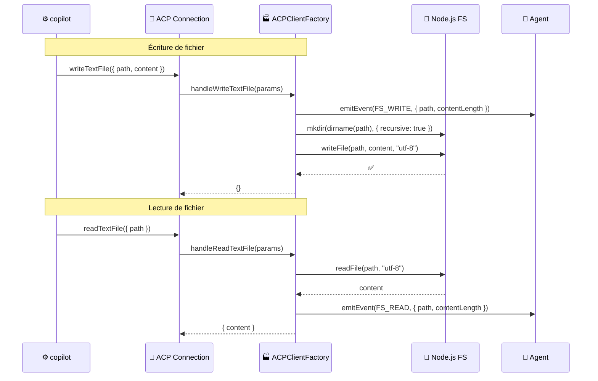
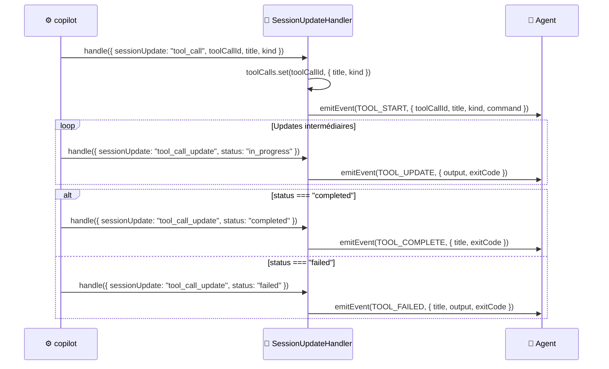
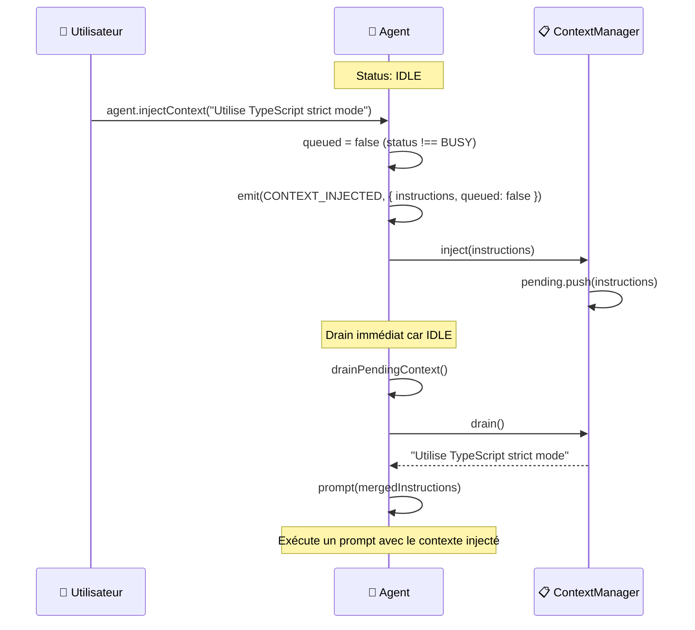
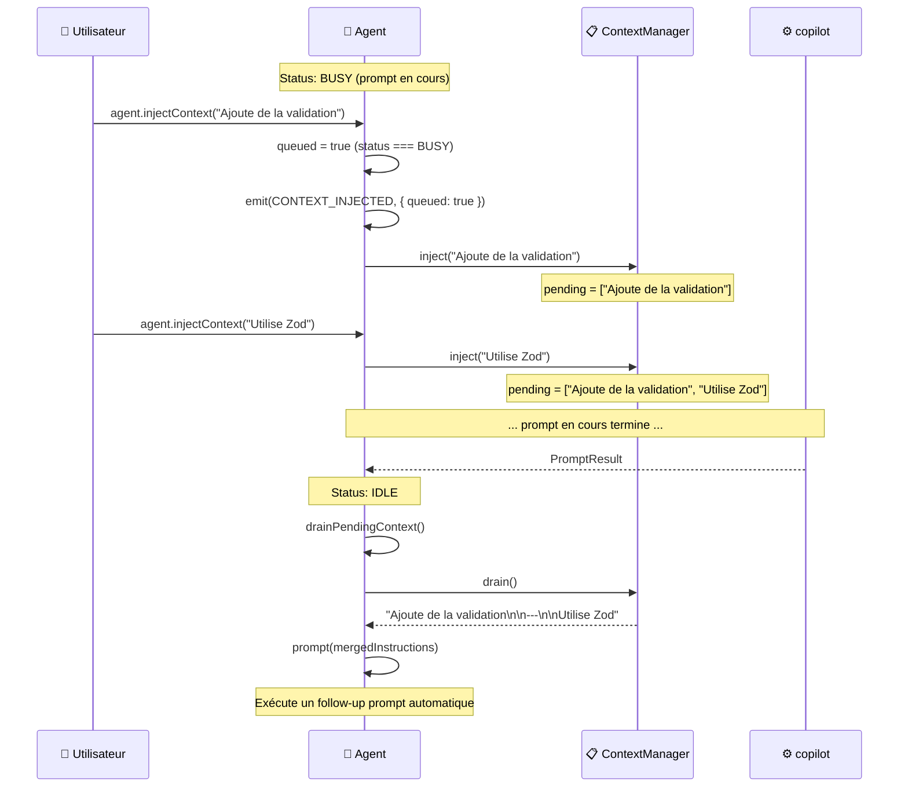
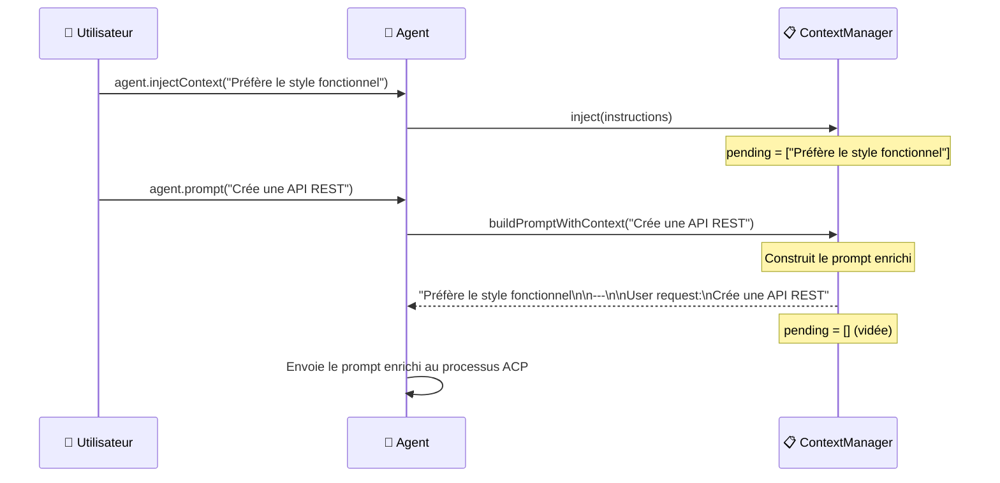

# 🔀 Flux & Diagrammes de séquence

> Cette page détaille les flux principaux du système à travers des diagrammes de séquence.
> Chaque diagramme montre **qui appelle qui**, **dans quel ordre**, et **quelles données transitent**.

---

## Vue d'ensemble des flux

Le système Stark s'articule autour de **5 flux majeurs** :

| Flux | Déclencheur | Description |
|------|-------------|-------------|
| [Initialisation](#1-initialisation-de-lagent) | `new Agent(config)` | Spawn du processus, négociation ACP, création de session |
| [Envoi de prompt](#2-envoi-dun-prompt) | `agent.prompt(text)` | Envoi d'un message, réception streaming, accumulation réponse |
| [Tool call](#3-exécution-dun-tool-call) | Décision de l'IA | L'agent IA demande d'exécuter une commande ou manipuler un fichier |
| [Injection de contexte](#4-injection-de-contexte) | `agent.injectContext(text)` | Ajout d'instructions au vol, immédiat ou en file d'attente |
| [Destruction](#5-destruction-de-lagent) | `agent.destroy()` | Arrêt propre de tous les composants et processus |

---

## 1. Initialisation de l'agent

Quand on instancie `new Agent(config)`, le constructeur lance une chaîne d'initialisation asynchrone.
Le consommateur attend `await agent.ready` avant d'envoyer des prompts.

```mermaid
sequenceDiagram
    participant U as 👤 Utilisateur
    participant A as 🤖 Agent
    participant L as 📝 Logger
    participant TM as 🖥️ TerminalManager
    participant CTX as 📋 ContextManager
    participant SUH as 🔀 SessionUpdateHandler
    participant ACF as 🏭 ACPClientFactory
    participant PROC as ⚙️ copilot process

    Note over U,A: Construction (synchrone)

    U->>+A: new Agent(config)

    A->>L: createLogger(identity)
    L-->>A: pino logger

    A->>CTX: new AgentContextManager()
    A->>TM: new TerminalManager()

    A->>SUH: new SessionUpdateHandler(logger, emitEvent)
    A->>ACF: new ACPClientFactory(logger, emitEvent, TM, config)

    A->>TM: setOutputCallback(cb)
    A->>TM: setExitCallback(cb)

    Note over A: Status: INITIALIZING

    A-->>U: agent (ready = Promise<void>)

    Note over A,PROC: Initialisation async (agent.ready)

    rect rgb(40, 40, 70)
        Note over A,PROC: Phase 1 — Spawn du processus

        A->>PROC: spawn("copilot", ["--acp", "--stdio"])
        PROC-->>A: ChildProcess (stdin/stdout pipes)
    end

    rect rgb(40, 40, 70)
        Note over A,PROC: Phase 2 — Connexion ACP

        A->>A: ndJsonStream(stdin, stdout)
        A->>ACF: build(onSessionUpdate)
        ACF-->>A: acp.Client

        A->>A: new ClientSideConnection(client, stream)
    end

    rect rgb(40, 40, 70)
        Note over A,PROC: Phase 3 — Handshake ACP

        A->>PROC: connection.initialize({ protocolVersion, capabilities })
        PROC-->>A: { protocolVersion, agentInfo }
        A->>L: info("ACP protocol initialized")
    end

    rect rgb(40, 40, 70)
        Note over A,PROC: Phase 4 — Création de session

        A->>PROC: connection.newSession({ cwd, mcpServers })
        PROC-->>A: { sessionId }
        A->>L: info("Session created")
    end

    Note over A: Status: IDLE

    A->>A: emit(AGENT_READY, { sessionId })
    A-->>U: ready resolved ✅
```

!!! info "Gestion des erreurs"
    Si n'importe quelle phase échoue, le status passe à `ERROR`, et un événement `agent:error` est émis.
    La promise `agent.ready` est rejetée.

---

## 2. Envoi d'un prompt

Le flux principal : l'utilisateur envoie un message, l'agent IA traite et répond en streaming.

!!! tip "Streaming en temps réel"
    L'événement `prompt:chunk` est émis à chaque fragment de texte reçu.
    C'est ce qui permet d'afficher la réponse en temps réel dans le terminal
    (via `process.stdout.write(e.text)`).

---

## 3. Exécution d'un tool call

Quand l'agent IA décide d'exécuter une action (commande shell, lecture/écriture de fichier),
un flux de tool call se déclenche **à l'intérieur** d'un prompt.

### 3a. Exécution d'une commande terminal

### 3b. Lecture / écriture de fichier

### 3c. Cycle de vie d'un tool call (updates)

---

## 4. Injection de contexte

L'injection de contexte permet de modifier le comportement de l'agent entre les prompts
(ou pendant un prompt, en file d'attente).

### 4a. Injection immédiate (agent IDLE)

### 4b. Injection en file d'attente (agent BUSY)

### 4c. Contexte prépendé au prochain prompt

---

## 5. Destruction de l'agent

Le flux de destruction assure un arrêt propre de **tous** les composants.

```mermaid
sequenceDiagram
    participant U as 👤 Utilisateur
    participant A as 🤖 Agent
    participant TM as 🖥️ TerminalManager
    participant PROC as ⚙️ copilot process
    participant CONN as 🔌 ACP Connection

    U->>+A: agent.destroy()

    Note over A: Status: DESTROYED (immédiat)
    Note over A: Empêche les erreurs "process exited unexpectedly"

    rect rgb(60, 30, 30)
        Note over A,TM: Phase 1 — Nettoyage des terminaux
        A->>TM: destroyAll()
        TM->>TM: Pour chaque terminal : kill(SIGTERM) + delete
    end

    rect rgb(60, 30, 30)
        Note over A,CONN: Phase 2 — Fermeture du stream ACP
        A->>CONN: outputStream.close()
        Note over CONN: Le SDK détecte la fermeture

        A->>CONN: await connection.closed (timeout 500ms)
    end

    rect rgb(60, 30, 30)
        Note over A,PROC: Phase 3 — Arrêt du processus
        A->>PROC: stdin.end()
        A->>PROC: kill(SIGTERM)

        alt Processus se termine dans les 2s
            PROC-->>A: exit event
        else Timeout 2s dépassé
            A->>PROC: kill(SIGKILL)
        end
    end

    A->>A: emit(AGENT_DESTROYED)
    A->>A: logger.info("Agent destroyed")

    A-->>-U: void (destroy terminé)
```

!!! warning "Point important"
    Le status est mis à `DESTROYED` **en tout premier** dans le flux de destruction.
    Cela empêche le handler d'événement `process.exit` d'émettre un faux
    `AGENT_ERROR` quand le processus se termine suite à notre `SIGTERM`.

---

## Résumé des interactions

| Flux | Composants impliqués | Événements émis |
|------|---------------------|-----------------|
| **Init** | Agent → ACP → Process | `agent:ready` / `agent:error` |
| **Prompt** | Agent → ContextManager → ACP → SUH | `prompt:start` → `prompt:chunk`* → `prompt:complete` |
| **Tool call** | SUH, ACF → TerminalManager | `tool:start` → `tool:update`* → `tool:complete` / `tool:failed` |
| **Terminal** | ACF → TerminalManager → Agent | `terminal:created` → `terminal:output`* → `terminal:exit` |
| **Permission** | ACF → Agent | `permission:requested` → `permission:granted` / `permission:denied` |
| **FS** | ACF → Node.js FS | `fs:read` / `fs:write` |
| **Context** | Agent → ContextManager | `context:injected` |
| **Destroy** | Agent → TerminalManager → Process | `agent:destroyed` |

---

## Prochaines lectures

- [**Agent**](../components/agent.md) — L'orchestrateur qui pilote tous ces flux
- [**SessionUpdateHandler**](../components/session-update-handler.md) — Le routeur d'events ACP
- [**Événements typés**](../concepts/events.md) — Le détail de chaque événement émis
- [**Cycle de vie**](../concepts/lifecycle.md) — La machine à états de l'agent