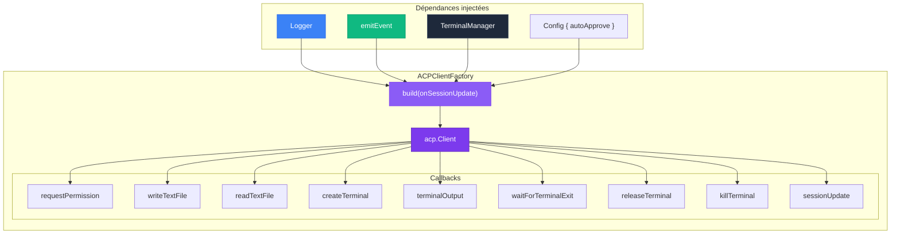
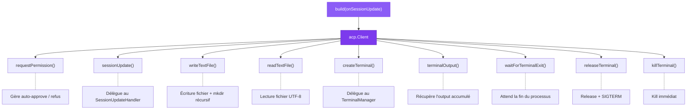
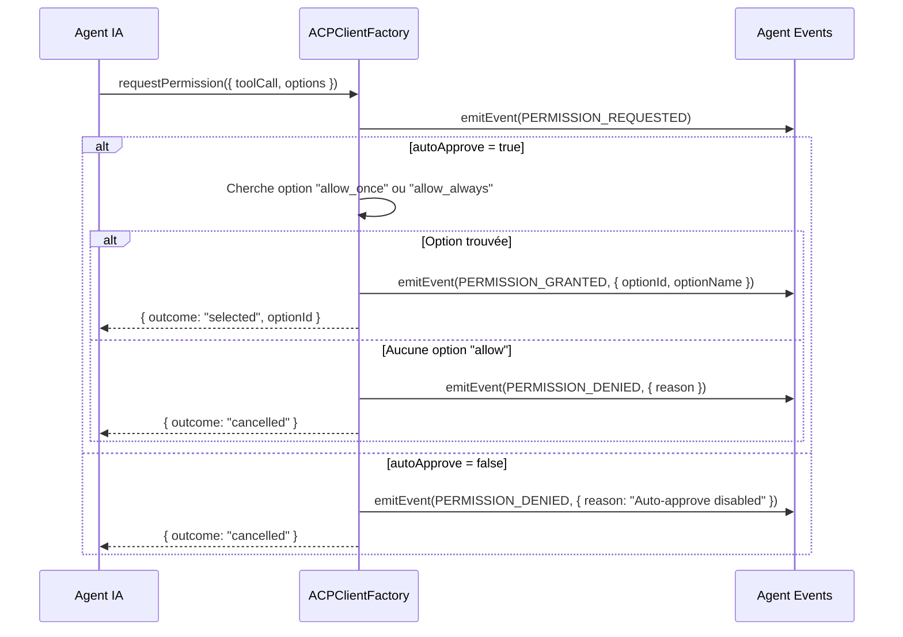
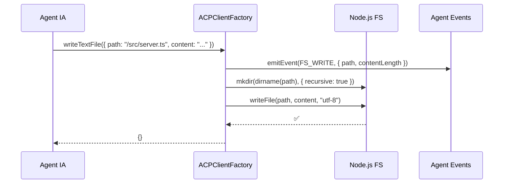
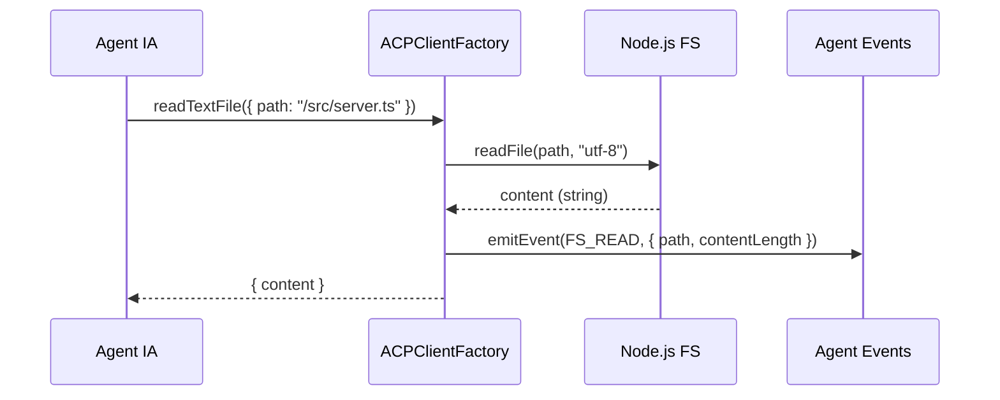
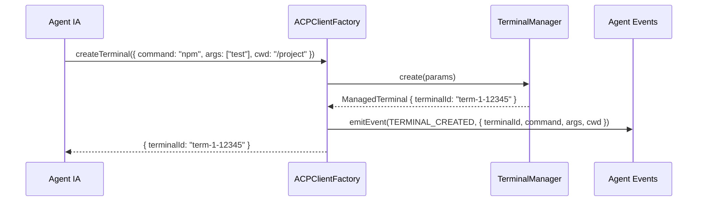
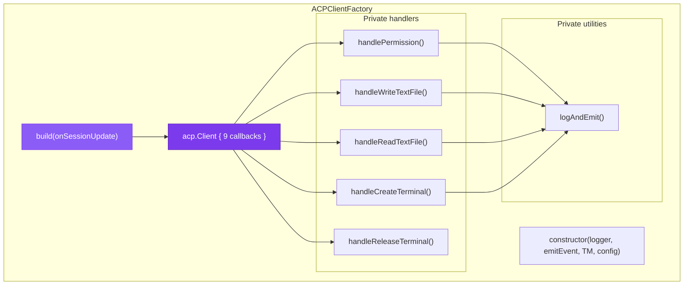
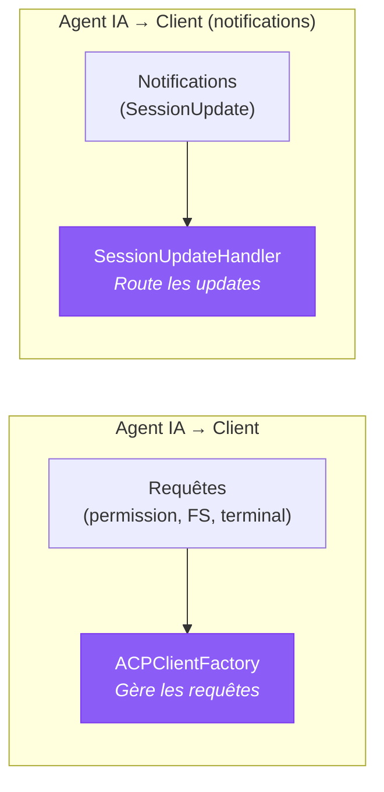
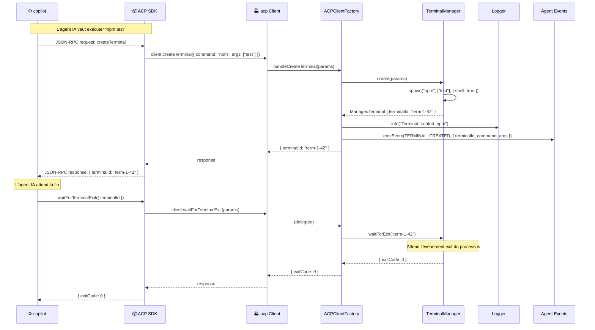
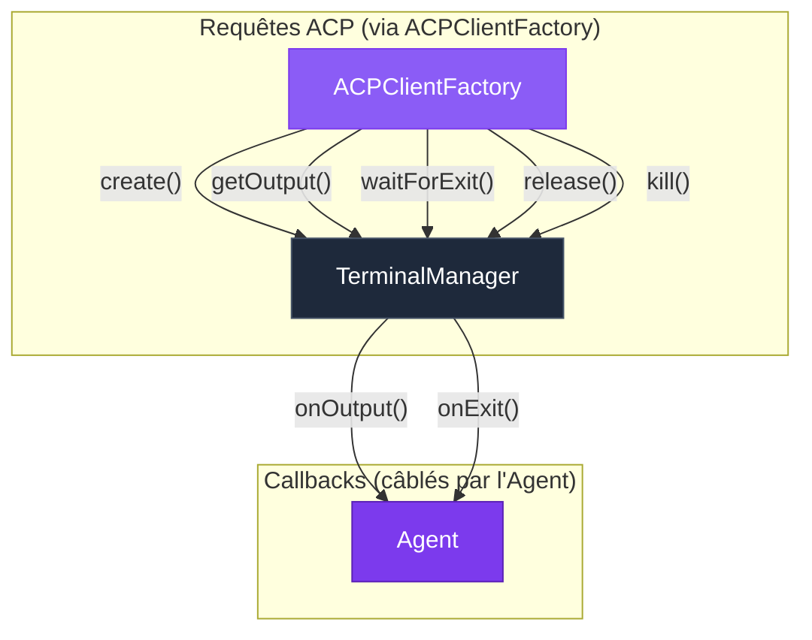

# 🏭 ACPClientFactory — Construction du client ACP

> L'`ACPClientFactory` est la **fabrique** qui construit l'objet `acp.Client` —
> l'implémentation concrète de tous les callbacks que l'agent IA peut invoquer :
> permissions, filesystem, terminal. C'est le pont entre le protocole ACP et
> l'infrastructure de Stark.

---

## Rôle et importance

Quand l'agent IA veut exécuter une commande, lire un fichier ou demander une permission,
il envoie une requête via le protocole ACP. Le SDK ACP route cette requête vers le bon
callback de l'objet `acp.Client`. L'ACPClientFactory **construit cet objet** en câblant
chaque callback aux bons composants de Stark.

| Responsabilité | Description |
|----------------|-------------|
| 🏗️ **Construction** | Produit un `acp.Client` complet via `build()` |
| 🔐 **Permissions** | Gère les demandes d'autorisation (auto-approve ou refus) |
| 📂 **Filesystem** | Implémente la lecture et l'écriture de fichiers |
| 🖥️ **Terminal** | Délègue au [TerminalManager](terminal-manager.md) pour les processus |
| 📊 **Observabilité** | Chaque opération est loguée et émise comme événement |
| 🧩 **Découplé** | Ne connaît pas l'Agent — communique uniquement via les dépendances injectées |



---

## Instanciation

L'ACPClientFactory reçoit ses **quatre dépendances** par injection dans le constructeur :

```typescript
import { AgentAcpClientFactory } from "./classes/agent/agent-acp-client-factory.ts";

const factory = new AgentAcpClientFactory(
  logger,           // pino.Logger — logging structuré
  emitEvent,        // EmitEventFn — callback d'émission d'événements
  terminalManager,  // TerminalManager — gestion des processus
  { autoApprove: true },  // Config — comportement des permissions
);
```

### Instanciation dans l'Agent

```typescript
// Dans le constructeur de Agent :
this.acpClientFactory = new AgentAcpClientFactory(
  this.logger,
  this.emitTyped.bind(this),
  this.terminalManager,
  { autoApprove: this.config.autoApprove },
);
```

---

## La méthode `build()` — Construire le client ACP

C'est la méthode principale. Elle retourne un objet `acp.Client` complet :

```typescript
const client = acpClientFactory.build((update) => {
  sessionUpdateHandler.handle(update);
});

// Le client est ensuite passé au SDK ACP :
const connection = new ClientSideConnection(client, ndJsonStream);
```

### Structure du client retourné



---

## Les callbacks en détail

### 1. `requestPermission` — Gestion des permissions

C'est le callback de **sécurité**. Avant chaque action sensible, l'agent IA demande
l'autorisation au client.



#### Options de permission

L'agent IA propose toujours plusieurs options. L'ACPClientFactory cherche la première
option de type "allow" :

```typescript
const allowOption = params.options.find(
  (o) => o.kind === "allow_always" || o.kind === "allow_once",
);
```

| Kind de l'option | Description | Sélectionné par autoApprove ? |
|------------------|-------------|-------------------------------|
| `allow_once` | Autoriser cette fois | ✅ Oui (prioritaire) |
| `allow_always` | Autoriser toujours | ✅ Oui |
| `deny` | Refuser | ❌ Non |

!!! info "Denial ≠ Error"
    Un refus de permission est un **résultat métier valide**, pas une erreur opérationnelle.

---

### 2. `sessionUpdate` — Notifications de session

Ce callback transmet les `SessionUpdate` au handler injecté via `build()` :

```typescript
sessionUpdate: (update) => {
  onSessionUpdate(update);
},
```

C'est un simple pass-through vers le [SessionUpdateHandler](session-update-handler.md).

---

### 3. `writeTextFile` — Écriture de fichier

Quand l'agent IA veut créer ou modifier un fichier :



**Points importants :**

- Le répertoire parent est créé automatiquement avec `mkdir({ recursive: true })`
- L'écriture est encodée en UTF-8
- L'événement `FS_WRITE` est émis **avant** l'écriture (pour le suivi en temps réel)

```typescript
private async handleWriteTextFile(params: WriteTextFileRequest): Promise<WriteTextFileResponse> {
  // Événement émis AVANT l'écriture
  this.logAndEmit(
    AgentEvent.FS_WRITE,
    { path: params.path, contentLength: params.content.length },
    `FS write: ${params.path}`,
  );

  const { writeFile, mkdir } = await import("node:fs/promises");
  const { dirname } = await import("node:path");

  await mkdir(dirname(params.path), { recursive: true });
  await writeFile(params.path, params.content, "utf-8");

  return {};
}
```

---

### 4. `readTextFile` — Lecture de fichier

Quand l'agent IA veut lire le contenu d'un fichier :



**Différence avec `writeTextFile` :** L'événement `FS_READ` est émis **après** la lecture
(car on a besoin de la taille du contenu).

---

### 5. `createTerminal` — Création d'un terminal

Quand l'agent IA veut exécuter une commande shell :



---

### 6. `terminalOutput` — Sortie d'un terminal

Retourne l'output accumulé d'un terminal :

```typescript
terminalOutput: (params) => {
  return this.terminalManager.getOutput(params.terminalId);
},
```

---

### 7. `waitForTerminalExit` — Attente de fin

Attend qu'un terminal se termine et retourne son code de sortie :

```typescript
waitForTerminalExit: async (params) => {
  return this.terminalManager.waitForExit(params.terminalId);
},
```

---

### 8. `releaseTerminal` — Libération d'un terminal

Libère un terminal (SIGTERM + suppression de la map) :

```typescript
releaseTerminal: (params) => {
  this.terminalManager.release(params.terminalId);
  this.logAndEmit(
    AgentEvent.TERMINAL_RELEASED,
    { terminalId: params.terminalId },
    `Terminal released: ${params.terminalId}`,
  );
  return {};
},
```

---

### 9. `killTerminal` — Kill d'un terminal

Kill immédiat d'un terminal (SIGKILL) :

```typescript
killTerminal: (params) => {
  this.terminalManager.kill(params.terminalId);
  return {};
},
```

---

## Le helper `logAndEmit`

Un pattern récurrent dans l'ACPClientFactory : chaque action doit à la fois :

1. Produire un **log structuré** (pour l'observabilité)
2. Émettre un **événement typé** (pour l'orchestration)

Le helper `logAndEmit` combine les deux en un seul appel :

```typescript
private logAndEmit<K extends AgentEvent>(
  event: K,
  payload: Omit<AgentEventMap[K], keyof BaseAgentEvent>,
  message: string,
): void {
  this.logger.info(payload, message);
  this.emitEvent(event, payload);
}
```

**Exemples d'utilisation :**

```typescript
// Écriture de fichier
this.logAndEmit(AgentEvent.FS_WRITE, { path, contentLength }, `FS write: ${path}`);

// Lecture de fichier
this.logAndEmit(AgentEvent.FS_READ, { path, contentLength }, `FS read: ${path}`);

// Création de terminal
this.logAndEmit(
  AgentEvent.TERMINAL_CREATED,
  { terminalId, command, args, cwd },
  `Terminal created: ${command}`,
);
```

---

## Diagramme d'architecture interne



---

## Comparaison avec le SessionUpdateHandler

L'ACPClientFactory et le [SessionUpdateHandler](session-update-handler.md) sont les **deux faces**
de la communication ACP :



| Aspect | ACPClientFactory | SessionUpdateHandler |
|--------|-----------------|---------------------|
| **Direction** | Agent IA → Client (requêtes) | Agent IA → Client (notifications) |
| **Modèle** | Request/Response | Fire-and-forget |
| **Retour** | Chaque callback retourne une réponse | Pas de retour (`void`) |
| **Actions** | Effectue des actions (FS, terminal, permissions) | Observe et dispatche |
| **État** | Pas d'état interne significatif | `toolCalls` map + `responseText` |
| **Dépendances** | Logger, emitEvent, **TerminalManager**, config | Logger, emitEvent |

---

## Flux complet — De la requête ACP au résultat

Voici un flux complet montrant comment une requête ACP traverse l'ACPClientFactory :



---

## Séparation des responsabilités

L'ACPClientFactory est le **seul** composant qui interagit directement avec le
[TerminalManager](terminal-manager.md) pour les requêtes ACP. L'Agent câble les callbacks
du TerminalManager (output, exit) séparément.



!!! tip "Pourquoi cette séparation ?"
    L'ACPClientFactory gère les **requêtes synchrones** de l'ACP (create, getOutput, etc.),
    tandis que l'Agent gère les **événements asynchrones** du TerminalManager (output, exit).
    Cela évite un couplage circulaire et permet de tester chaque flux indépendamment.

---

## Configuration

L'ACPClientFactory n'a qu'un seul paramètre de configuration :

```typescript
interface AgentAcpClientFactoryConfig {
  /** Quand true, les permissions sont automatiquement approuvées */
  autoApprove: boolean;
}
```

| Valeur | Comportement |
|--------|-------------|
| `true` (défaut) | Sélectionne la première option "allow" disponible |
| `false` | Refuse toutes les demandes de permission |

---

## Exemple d'utilisation autonome

L'ACPClientFactory peut être instancié indépendamment pour les tests :

```typescript
import { AgentAcpClientFactory } from "./classes/agent/agent-acp-client-factory.ts";
import { TerminalManager } from "./classes/terminal-manager/terminal-manager.ts";
import { createSilentLogger } from "./logger/create-logger.ts";
import { AgentEvent } from "./enums/agent-event.enum.ts";

// Créer les dépendances
const logger = createSilentLogger();
const terminalManager = new TerminalManager();

const events: Array<{ event: string; payload: unknown }> = [];
const emitEvent = (event: AgentEvent, payload: unknown) => {
  events.push({ event, payload });
};

// Créer la factory
const factory = new AgentAcpClientFactory(
  logger,
  emitEvent,
  terminalManager,
  { autoApprove: true },
);

// Construire le client
const client = factory.build((update) => {
  console.log("Session update:", update.sessionUpdate);
});

// Utiliser un callback directement
const writeResult = await client.writeTextFile({
  path: "/tmp/test.txt",
  content: "Hello World",
});
console.log(writeResult); // {}
console.log(events[0].event); // "fs:write"

// Créer un terminal
const termResult = await client.createTerminal({
  command: "echo",
  args: ["test"],
  cwd: "/tmp",
});
console.log(termResult.terminalId); // "term-1-..."

// Nettoyer
terminalManager.destroyAll();
```

---

## Résumé

| Concept | Description |
|---------|-------------|
| **Pattern** | Factory — produit un `acp.Client` via `build()` |
| **Callbacks** | 9 callbacks couvrant permissions, FS et terminal |
| **Permissions** | Auto-approve configurable |
| **Filesystem** | Read/write avec mkdir récursif |
| **Terminal** | Délégation complète au TerminalManager |
| **Helper** | `logAndEmit()` combine logging + événement en un appel |
| **Dépendances** | Logger, emitEvent, TerminalManager, config |
| **État** | Minimal — pas de Map ni d'accumulateur |

---

## Liens

- [**Architecture**](../architecture/overview.md) — Vue d'ensemble du système
- [**Agent**](agent.md) — L'orchestrateur qui crée l'ACPClientFactory
- [**Agent Client Protocol**](acp.md) — Le protocole dont cette factory implémente le client
- [**SessionUpdateHandler**](session-update-handler.md) — L'autre face de la communication ACP
- [**TerminalManager**](terminal-manager.md) — Gestion des processus, utilisé par la factory
- [**Événements typés**](../concepts/events.md) — Events émis par la factory
- [**Flux & Séquences**](../architecture/sequences.md) — Diagrammes montrant la factory en action