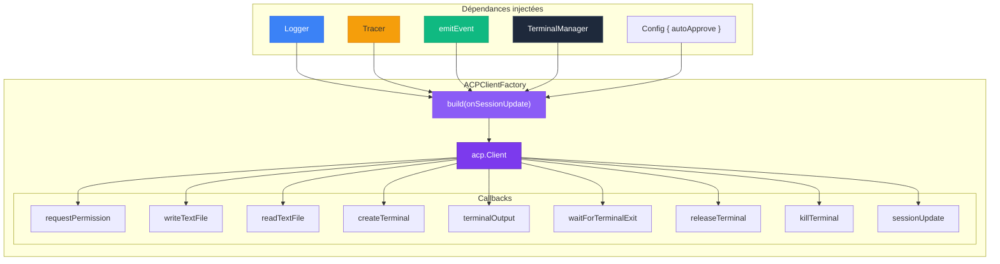
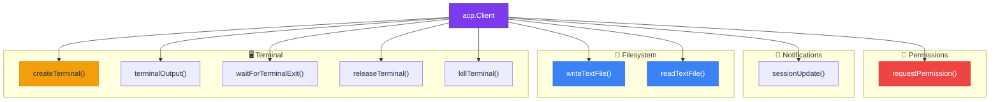
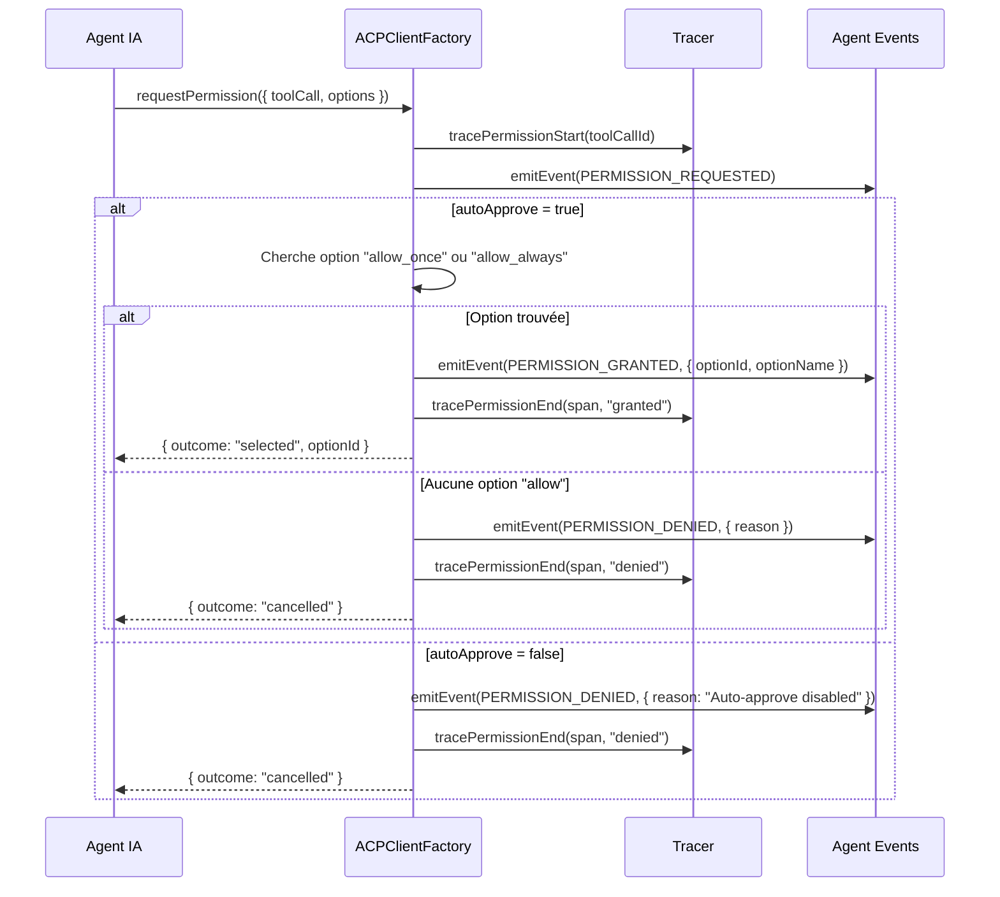
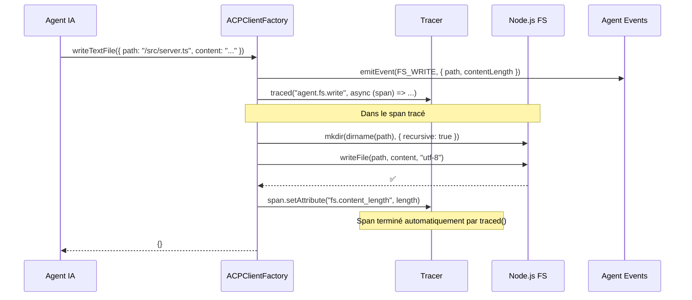
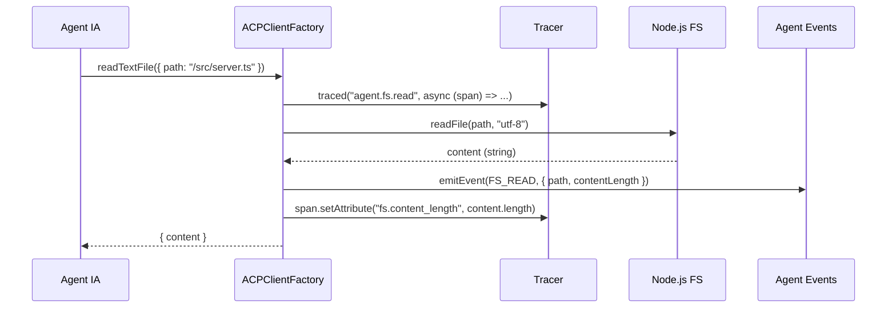
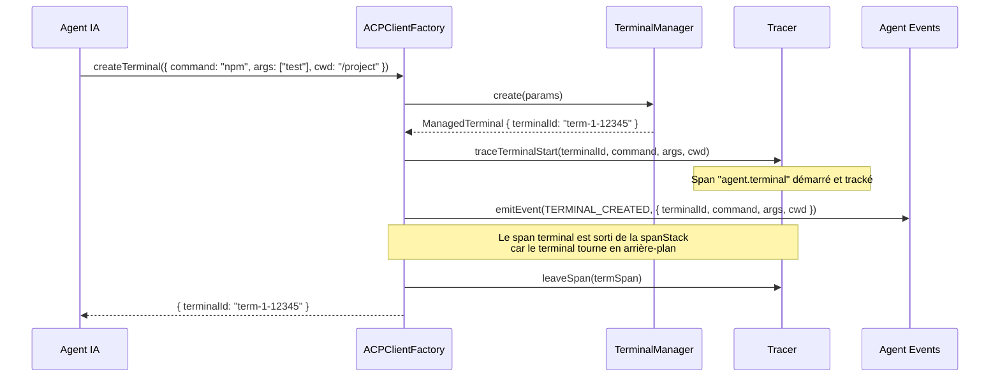
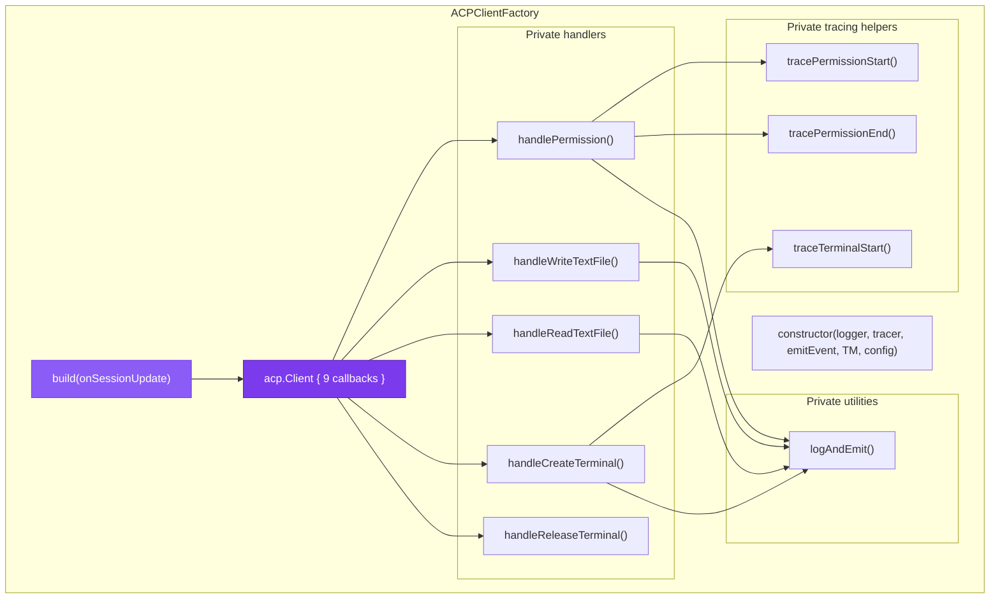
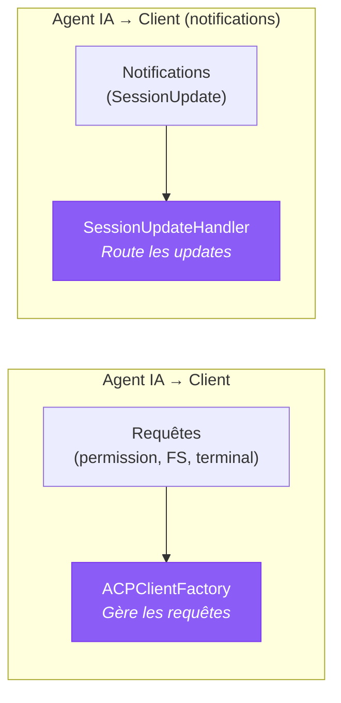
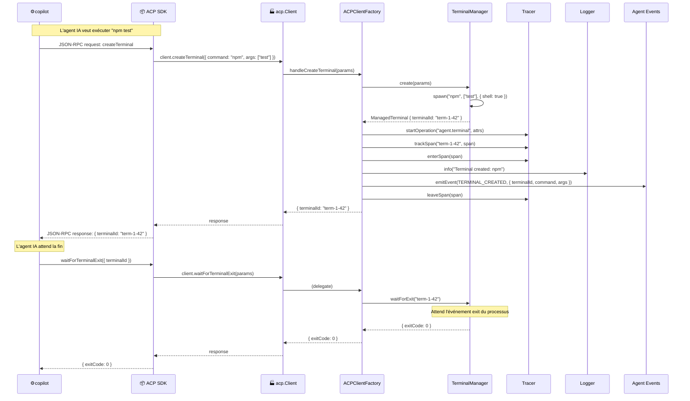
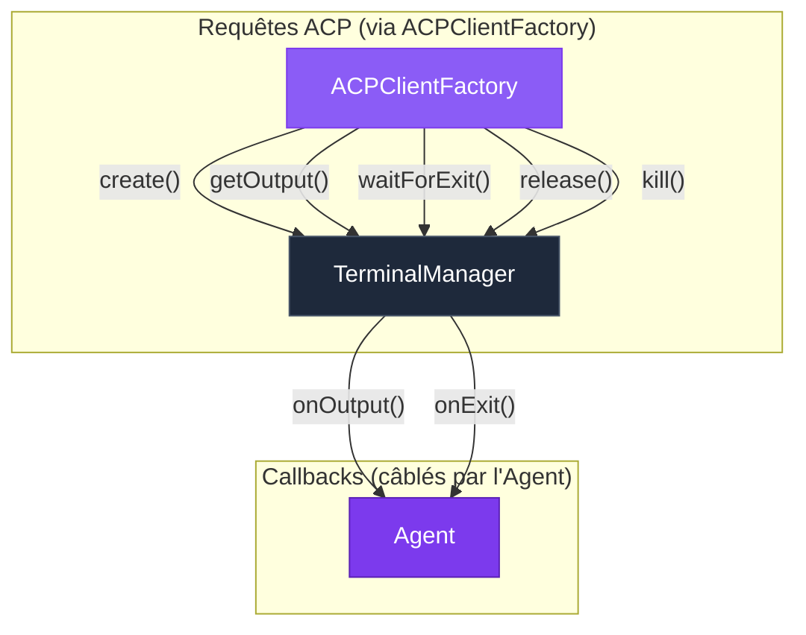

# 🏭 ACPClientFactory — Construction du client ACP

> L'`ACPClientFactory` est la **fabrique** qui construit l'objet `acp.Client` —
> l'implémentation concrète de tous les callbacks que l'agent IA peut invoquer :
> permissions, filesystem, terminal. C'est le pont entre le protocole ACP et
> l'infrastructure de Stark.

---

## Rôle et importance

Quand l'agent IA veut exécuter une commande, lire un fichier ou demander une permission,
il envoie une requête via le protocole ACP. Le SDK ACP route cette requête vers le bon
callback de l'objet `acp.Client`. L'ACPClientFactory **construit cet objet** en câblant
chaque callback aux bons composants de Stark.

| Responsabilité | Description |
|----------------|-------------|
| 🏗️ **Construction** | Produit un `acp.Client` complet via `build()` |
| 🔐 **Permissions** | Gère les demandes d'autorisation (auto-approve ou refus) |
| 📂 **Filesystem** | Implémente la lecture et l'écriture de fichiers |
| 🖥️ **Terminal** | Délègue au [TerminalManager](terminal-manager.md) pour les processus |
| 📊 **Observabilité** | Chaque opération est loguée, tracée et émise comme événement |
| 🧩 **Découplé** | Ne connaît pas l'Agent — communique uniquement via les dépendances injectées |



---

## Instanciation

L'ACPClientFactory reçoit ses **cinq dépendances** par injection dans le constructeur :

```typescript
import { AgentAcpClientFactory } from "./classes/agent/agent-acp-client-factory.ts";

const factory = new AgentAcpClientFactory(
  logger,           // pino.Logger — logging structuré
  tracer,           // Tracer — spans OpenTelemetry
  emitEvent,        // EmitEventFn — callback d'émission d'événements
  terminalManager,  // TerminalManager — gestion des processus
  { autoApprove: true },  // Config — comportement des permissions
);
```

### Instanciation dans l'Agent

```typescript
// Dans le constructeur de Agent :
this.acpClientFactory = new AgentAcpClientFactory(
  this.logger,
  this.tracer,
  this.emitTyped.bind(this),
  this.terminalManager,
  { autoApprove: this.config.autoApprove },
);
```

---

## La méthode `build()` — Construire le client ACP

La méthode `build()` est le point d'entrée principal. Elle retourne un objet `acp.Client`
complet, prêt à être passé à `ClientSideConnection` :

```typescript
const client = factory.build((update) => {
  sessionUpdateHandler.handle(update);
});

// Utilisation avec le SDK ACP :
const connection = new acp.ClientSideConnection(
  (_agent) => client,
  stream,
);
```

### Structure du client retourné

L'objet `acp.Client` contient **9 callbacks** :



---

## Les callbacks en détail

### 1. `requestPermission` — Gestion des permissions

C'est le callback de **sécurité**. Avant chaque action sensible, l'agent IA demande
l'autorisation au client.



#### Options de permission

L'agent IA propose toujours plusieurs options. L'ACPClientFactory cherche la première
option de type "allow" :

```typescript
const allowOption = params.options.find(
  (o) => o.kind === "allow_always" || o.kind === "allow_once",
);
```

| Kind de l'option | Description | Sélectionné par autoApprove ? |
|------------------|-------------|-------------------------------|
| `allow_once` | Autoriser cette fois | ✅ Oui (prioritaire) |
| `allow_always` | Autoriser toujours | ✅ Oui |
| `deny` | Refuser | ❌ Non |

#### Tracing des permissions

Les permissions ont leur propre span `agent.permission` :

```typescript
// Le span est parenté au span du tool call (si trouvé) ou au span actif
private tracePermissionStart(toolCallId: string, toolCallTitle?: string): Span {
  const toolSpan = this.tracer.getTrackedSpan(toolCallId);
  const parent = toolSpan ?? "active";

  const span = this.tracer.startOperation("agent.permission", {
    "permission.tool_call_id": toolCallId,
    "permission.tool_call_title": toolCallTitle,
  }, parent);

  this.tracer.enterSpan(span);
  return span;
}
```

!!! info "Denial ≠ Error"
    Un refus de permission utilise `SpanStatusCode.UNSET` (pas `ERROR`) car c'est un
    **résultat métier valide**, pas une erreur opérationnelle.

---

### 2. `sessionUpdate` — Notifications de session

Le callback le plus simple : il redirige chaque notification vers le callback
`onSessionUpdate` fourni à `build()` :

```typescript
sessionUpdate: async (params) => {
  onSessionUpdate(params.update);
},
```

En pratique, ce callback est câblé vers le [SessionUpdateHandler](session-update-handler.md).

---

### 3. `writeTextFile` — Écriture de fichier

Quand l'agent IA veut créer ou modifier un fichier :



**Points importants :**

- Le répertoire parent est créé automatiquement avec `mkdir({ recursive: true })`
- L'écriture est encodée en UTF-8
- Le span porte les attributs `fs.path`, `fs.operation`, `fs.content_length`
- L'événement `FS_WRITE` est émis **avant** l'écriture (pour le suivi en temps réel)

```typescript
private async handleWriteTextFile(params: WriteTextFileRequest): Promise<WriteTextFileResponse> {
  // Événement émis AVANT l'écriture
  this.logAndEmit(
    AgentEvent.FS_WRITE,
    { path: params.path, contentLength: params.content.length },
    `FS write: ${params.path}`,
  );

  return this.tracer.traced(
    "agent.fs.write",
    async (span) => {
      const { writeFile, mkdir } = await import("node:fs/promises");
      const { dirname } = await import("node:path");

      await mkdir(dirname(params.path), { recursive: true });
      await writeFile(params.path, params.content, "utf-8");

      span.setAttribute("fs.content_length", params.content.length);
      return {};
    },
    {
      attributes: {
        "fs.path": params.path,
        "fs.operation": "write",
        "fs.content_length": params.content.length,
      },
      parent: "active",
    },
  );
}
```

---

### 4. `readTextFile` — Lecture de fichier

Quand l'agent IA veut lire le contenu d'un fichier :



**Différence avec `writeTextFile` :** L'événement `FS_READ` est émis **après** la lecture
(car on a besoin de la taille du contenu).

---

### 5. `createTerminal` — Création d'un terminal

Quand l'agent IA veut exécuter une commande shell :



**Pourquoi `leaveSpan` après la création ?**

Le terminal tourne en arrière-plan. Si on gardait son span dans la stack,
tous les logs suivants (qui ne concernent pas le terminal) porteraient le `SpanId`
du terminal. Le span reste **tracké** (via `trackSpan`) mais pas **actif dans la stack**.

#### Tracing du terminal

```typescript
private traceTerminalStart(
  terminalId: string,
  command: string,
  args?: string[],
  cwd?: string,
): void {
  const span = this.tracer.startOperation(
    "agent.terminal",
    {
      "terminal.id": terminalId,
      "terminal.command": command,
      ...(cwd && { "terminal.cwd": cwd }),
    },
    "active",
  );

  // Les args sont stockés comme tableau natif (OTel supporte string[])
  if (args && args.length > 0) {
    span.setAttribute("terminal.args", args);
  }

  this.tracer.trackSpan(terminalId, span, "terminal");
  this.tracer.enterSpan(span);
}
```

---

### 6. `terminalOutput` — Sortie d'un terminal

Retourne la sortie accumulée d'un terminal. Simple délégation :

```typescript
terminalOutput: async (params) => {
  this.logger.debug({ terminalId: params.terminalId }, "Terminal output requested");
  return this.terminalManager.getOutput(params.terminalId);
},
```

---

### 7. `waitForTerminalExit` — Attente de fin

Attend qu'un terminal se termine. Simple délégation :

```typescript
waitForTerminalExit: async (params) => {
  this.logger.debug({ terminalId: params.terminalId }, "Waiting for terminal exit");
  return this.terminalManager.waitForExit(params.terminalId);
},
```

---

### 8. `releaseTerminal` — Libération d'un terminal

Libère un terminal et ses ressources :

```typescript
releaseTerminal: async (params) => {
  this.terminalManager.release(params.terminalId);
  this.logger.debug({ terminalId: params.terminalId }, "Terminal released");
  this.emitEvent(AgentEvent.TERMINAL_RELEASED, {
    terminalId: params.terminalId,
  });
  return {};
},
```

---

### 9. `killTerminal` — Kill d'un terminal

Envoie SIGKILL à un terminal sans le libérer :

```typescript
killTerminal: async (params) => {
  this.terminalManager.kill(params.terminalId);
  this.logger.debug({ terminalId: params.terminalId }, "Terminal killed");
  return {};
},
```

---

## Le helper `logAndEmit`

Pour éviter la répétition `logger.info(...); emitEvent(...)` dans chaque handler,
l'ACPClientFactory utilise un helper combiné :

```typescript
private logAndEmit<K extends AgentEvent>(
  event: K,
  payload: Omit<AgentEventMap[K], keyof BaseAgentEvent>,
  logMessage: string,
): void {
  this.logger.info(payload as Record<string, unknown>, logMessage);
  this.emitEvent(event, payload);
}
```

**Avantages :**

- Élimine la duplication code
- Garantit que le log et l'événement portent le **même payload**
- Réduit le risque d'oublier l'un ou l'autre

**Utilisation :**

```typescript
// Avant (sans helper) :
this.logger.info({ path: params.path, contentLength: params.content.length }, `FS write: ${params.path}`);
this.emitEvent(AgentEvent.FS_WRITE, { path: params.path, contentLength: params.content.length });

// Après (avec helper) :
this.logAndEmit(
  AgentEvent.FS_WRITE,
  { path: params.path, contentLength: params.content.length },
  `FS write: ${params.path}`,
);
```

---

## Diagramme d'architecture interne



---

## Comparaison avec le SessionUpdateHandler

L'ACPClientFactory et le [SessionUpdateHandler](session-update-handler.md) sont les **deux faces**
de la communication ACP :



| Aspect | ACPClientFactory | SessionUpdateHandler |
|--------|-----------------|---------------------|
| **Direction** | Agent IA → Client (requêtes) | Agent IA → Client (notifications) |
| **Modèle** | Request/Response | Fire-and-forget |
| **Retour** | Chaque callback retourne une réponse | Pas de retour (`void`) |
| **Actions** | Effectue des actions (FS, terminal, permissions) | Observe et dispatche |
| **État** | Pas d'état interne significatif | `toolCalls` map + `responseText` |
| **Dépendances** | Logger, Tracer, emitEvent, **TerminalManager**, config | Logger, Tracer, emitEvent |

---

## Flux complet — De la requête ACP au résultat

Voici un flux complet montrant comment une requête ACP traverse l'ACPClientFactory :



---

## Séparation des responsabilités

L'ACPClientFactory est le **seul** composant qui interagit directement avec le
[TerminalManager](terminal-manager.md) pour les requêtes ACP. L'Agent câble les callbacks
du TerminalManager (output, exit) séparément.



!!! tip "Pourquoi cette séparation ?"
    L'ACPClientFactory gère les **requêtes synchrones** de l'ACP (create, getOutput, etc.),
    tandis que l'Agent gère les **événements asynchrones** du TerminalManager (output, exit).
    Cela évite un couplage circulaire et permet de tester chaque flux indépendamment.

---

## Configuration

L'ACPClientFactory n'a qu'un seul paramètre de configuration :

```typescript
interface AgentAcpClientFactoryConfig {
  /** Quand true, les permissions sont automatiquement approuvées */
  autoApprove: boolean;
}
```

| Valeur | Comportement |
|--------|-------------|
| `true` (défaut) | Sélectionne la première option "allow" disponible |
| `false` | Refuse toutes les demandes de permission |

---

## Exemple d'utilisation autonome

L'ACPClientFactory peut être instancié indépendamment pour les tests :

```typescript
import { AgentAcpClientFactory } from "./classes/agent/agent-acp-client-factory.ts";
import { TerminalManager } from "./classes/terminal-manager/terminal-manager.ts";
import { Tracer } from "./classes/tracer/tracer.ts";
import { createSilentLogger } from "./logger/create-logger.ts";
import { AgentEvent } from "./enums/agent-event.enum.ts";

// Créer les dépendances
const logger = createSilentLogger();
const tracer = new Tracer({ enabled: false });
const terminalManager = new TerminalManager();

const events: Array<{ event: string; payload: unknown }> = [];
const emitEvent = (event: AgentEvent, payload: unknown) => {
  events.push({ event, payload });
};

// Créer la factory
const factory = new AgentAcpClientFactory(
  logger,
  tracer,
  emitEvent,
  terminalManager,
  { autoApprove: true },
);

// Construire le client
const client = factory.build((update) => {
  console.log("Session update:", update.sessionUpdate);
});

// Utiliser un callback directement
const writeResult = await client.writeTextFile({
  path: "/tmp/test.txt",
  content: "Hello World",
});
console.log(writeResult); // {}
console.log(events[0].event); // "fs:write"

// Créer un terminal
const termResult = await client.createTerminal({
  command: "echo",
  args: ["test"],
  cwd: "/tmp",
});
console.log(termResult.terminalId); // "term-1-..."

// Nettoyer
terminalManager.destroyAll();
```

---

## Résumé

| Concept | Description |
|---------|-------------|
| **Pattern** | Factory — produit un `acp.Client` via `build()` |
| **Callbacks** | 9 callbacks couvrant permissions, FS et terminal |
| **Permissions** | Auto-approve configurable, tracing dédié |
| **Filesystem** | Read/write avec `traced()` pour le tracing automatique |
| **Terminal** | Délégation complète au TerminalManager |
| **Helper** | `logAndEmit()` combine logging + événement en un appel |
| **Dépendances** | Logger, Tracer, emitEvent, TerminalManager, config |
| **État** | Minimal — pas de Map ni d'accumulateur |

---

## Liens

- [**Architecture**](../architecture/overview.md) — Vue d'ensemble du système
- [**Agent**](agent.md) — L'orchestrateur qui crée l'ACPClientFactory
- [**Agent Client Protocol**](acp.md) — Le protocole dont cette factory implémente le client
- [**SessionUpdateHandler**](session-update-handler.md) — L'autre face de la communication ACP
- [**TerminalManager**](terminal-manager.md) — Gestion des processus, utilisé par la factory
- [**Tracer**](tracer.md) — Tracing des permissions et opérations FS
- [**Événements typés**](../concepts/events.md) — Events émis par la factory
- [**Flux & Séquences**](../architecture/sequences.md) — Diagrammes montrant la factory en action