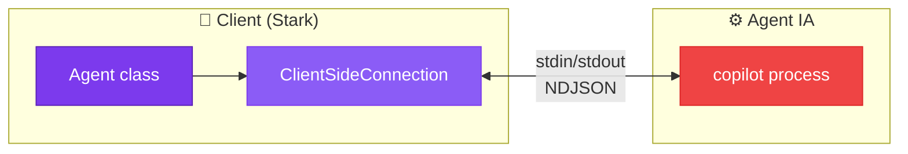
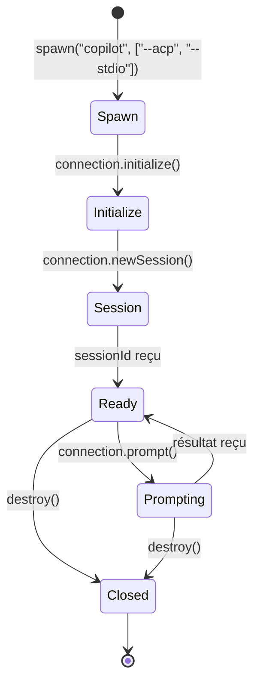
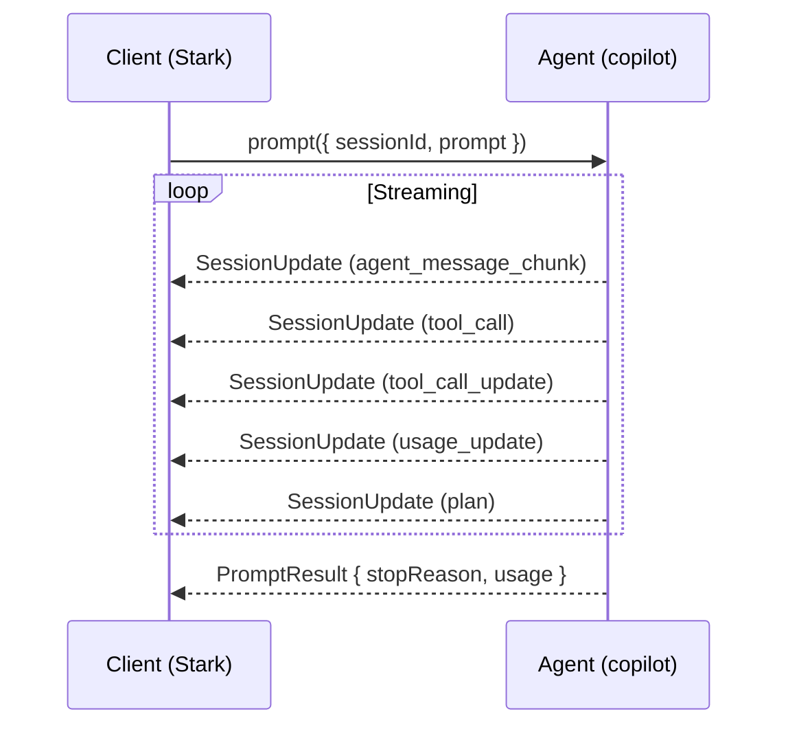
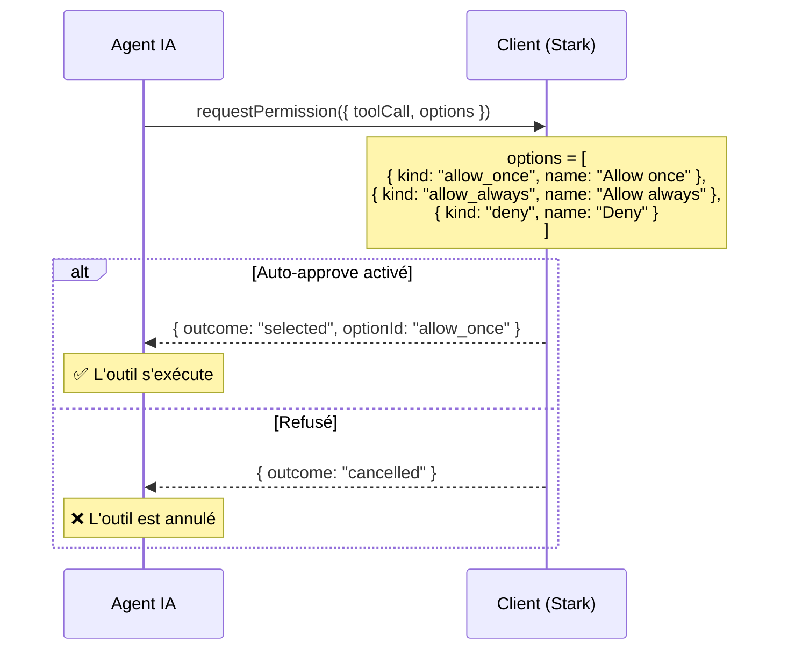
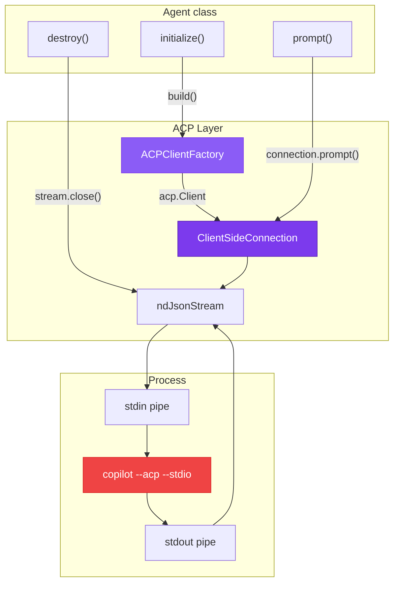

# 📡 Agent Client Protocol (ACP)

> L'**Agent Client Protocol** est le protocole de communication qui permet à Stark
> de piloter un agent IA comme un processus externe. C'est la colonne vertébrale
> de tout le système : sans ACP, pas d'agent.

---

## Qu'est-ce que l'ACP ?

L'ACP (Agent Client Protocol) est un protocole ouvert qui standardise la communication
entre un **client** (notre code Stark) et un **agent IA** (le processus `copilot`).

Il fonctionne sur un principe simple :

- Le client **spawne** un processus agent avec les flags `--acp --stdio`
- La communication se fait via **stdin/stdout** en format **NDJSON** (Newline-Delimited JSON)
- Le protocole définit des **requêtes**, **réponses** et **notifications** typées



!!! info "SDK officiel"
    Stark utilise le package `@agentclientprotocol/sdk` (v0.14.x) qui fournit les types
    TypeScript et les utilitaires de connexion. Toute la complexité du protocole est
    abstraite par ce SDK.

---

## Cycle de vie d'une connexion ACP

Le protocole suit un cycle de vie strict en **4 phases** :



| Phase | Méthode | Description |
|-------|---------|-------------|
| **Spawn** | `spawn()` | Lancement du processus agent avec pipes stdio |
| **Initialize** | `connection.initialize()` | Handshake protocolaire : version + capacités |
| **New Session** | `connection.newSession()` | Création d'une session de travail (cwd, MCP servers) |
| **Prompt** | `connection.prompt()` | Envoi de messages et réception streaming |

---

## Phase 1 — Spawn du processus

L'agent IA est un exécutable externe lancé comme processus enfant :

```typescript
import { spawn } from "node:child_process";

// Le chemin de l'exécutable est configurable
const executable = process.env.COPILOT_CLI_PATH ?? "copilot";

const proc = spawn(executable, ["--acp", "--stdio"], {
  stdio: ["pipe", "pipe", "inherit"],
  //       stdin   stdout   stderr → console parent
});
```

!!! tip "Flags importants"
    - `--acp` : Active le mode Agent Client Protocol
    - `--stdio` : Utilise stdin/stdout pour la communication (au lieu de TCP/WebSocket)

Les streams stdin/stdout sont ensuite convertis en flux web standard :

```typescript
import { Readable, Writable } from "node:stream";
import * as acp from "@agentclientprotocol/sdk";

const output = Writable.toWeb(proc.stdin) as WritableStream<Uint8Array>;
const input = Readable.toWeb(proc.stdout) as ReadableStream<Uint8Array>;

// ndJsonStream crée un transport NDJSON bidirectionnel
const stream = acp.ndJsonStream(output, input);
```

---

## Phase 2 — Initialisation (Handshake)

Le client envoie ses **capacités** et le serveur répond avec les siennes :

```typescript
const connection = new acp.ClientSideConnection(
  (_agent) => client, // notre implémentation du client ACP
  stream,
);

const initResult = await connection.initialize({
  protocolVersion: acp.PROTOCOL_VERSION,
  clientCapabilities: {
    fs: {
      readTextFile: true,   // On sait lire des fichiers
      writeTextFile: true,  // On sait écrire des fichiers
    },
    terminal: true,         // On sait exécuter des commandes
  },
});

// initResult contient :
// {
//   protocolVersion: "2025-03-26",
//   agentInfo: { name: "Claude", version: "..." }
// }
```

### Capacités du client

Les capacités déclarent ce que le client **sait faire**. L'agent IA adapte son
comportement en conséquence :

| Capacité | Description | Effet si absent |
|----------|-------------|-----------------|
| `fs.readTextFile` | Lire le contenu d'un fichier | L'agent ne demandera pas de lectures |
| `fs.writeTextFile` | Écrire dans un fichier | L'agent ne demandera pas d'écritures |
| `terminal` | Exécuter des commandes shell | L'agent ne lancera pas de commandes |

---

## Phase 3 — Création de session

Une session représente un **contexte de travail** persistant avec un historique de conversation :

```typescript
const sessionResult = await connection.newSession({
  cwd: "/mon/projet",       // Répertoire de travail
  mcpServers: [],            // Serveurs MCP optionnels
});

const sessionId = sessionResult.sessionId;
// Ex: "session-abc123..."
```

!!! info "Session ID"
    Le `sessionId` est utilisé dans toutes les requêtes suivantes pour identifier
    la conversation. Chaque prompt envoyé s'ajoute à l'historique de cette session.

---

## Phase 4 — Envoi de prompts

C'est le cœur de l'interaction. Un prompt est envoyé et la réponse arrive en **streaming**
via des notifications `SessionUpdate` :

```typescript
const result = await connection.prompt({
  sessionId: sessionId,
  prompt: [
    { type: "text", text: "Crée un serveur HTTP en TypeScript" },
  ],
});

// result contient :
// {
//   stopReason: "end_turn",
//   usage: { inputTokens: 1500, outputTokens: 800, totalTokens: 2300 }
// }
```

### Le flux de streaming

Pendant qu'un prompt est en cours, l'agent envoie des **notifications** que le SDK
route vers notre objet `client` :



---

## Le client ACP — Callbacks

Le client ACP est un objet qui implémente les **callbacks** que l'agent peut invoquer.
C'est le mécanisme par lequel l'agent IA "demande" au client d'effectuer des actions :

```typescript
const client: acp.Client = {
  // L'agent demande la permission d'effectuer une action
  requestPermission: async (params) => {
    // Approuver ou refuser
    return { outcome: { outcome: "selected", optionId: "allow_once" } };
  },

  // L'agent envoie une mise à jour de session (streaming)
  sessionUpdate: async (params) => {
    handleUpdate(params.update); // Router vers le SessionUpdateHandler
  },

  // L'agent veut écrire un fichier
  writeTextFile: async (params) => {
    await writeFile(params.path, params.content, "utf-8");
    return {};
  },

  // L'agent veut lire un fichier
  readTextFile: async (params) => {
    const content = await readFile(params.path, "utf-8");
    return { content };
  },

  // L'agent veut créer un terminal
  createTerminal: async (params) => {
    const terminal = terminalManager.create(params);
    return { terminalId: terminal.terminalId };
  },

  // L'agent veut la sortie d'un terminal
  terminalOutput: async (params) => {
    return terminalManager.getOutput(params.terminalId);
  },

  // L'agent attend qu'un terminal se termine
  waitForTerminalExit: async (params) => {
    return terminalManager.waitForExit(params.terminalId);
  },

  // L'agent veut libérer un terminal
  releaseTerminal: async (params) => {
    terminalManager.release(params.terminalId);
    return {};
  },

  // L'agent veut tuer un terminal
  killTerminal: async (params) => {
    terminalManager.kill(params.terminalId);
    return {};
  },
};
```

!!! tip "Dans Stark"
    Tout ce câblage est encapsulé dans l'[`ACPClientFactory`](acp-client-factory.md).
    Vous n'avez jamais besoin de construire cet objet manuellement.

---

## Types de Session Updates

Les `SessionUpdate` sont les notifications envoyées par l'agent pendant un prompt.
Chaque type est identifié par le champ discriminant `sessionUpdate` :

| Type | Enum | Description |
|------|------|-------------|
| `agent_message_chunk` | `AGENT_MESSAGE_CHUNK` | Fragment de texte de la réponse |
| `agent_thought_chunk` | `AGENT_THOUGHT_CHUNK` | Fragment de raisonnement interne (chain-of-thought) |
| `user_message_chunk` | `USER_MESSAGE_CHUNK` | Écho du message utilisateur |
| `tool_call` | `TOOL_CALL` | Nouvelle invocation d'outil par l'agent |
| `tool_call_update` | `TOOL_CALL_UPDATE` | Progression ou complétion d'un tool call |
| `plan` | `PLAN` | Plan d'exécution de l'agent |
| `usage_update` | `USAGE_UPDATE` | Métriques de consommation de tokens |
| `current_mode_update` | `CURRENT_MODE_UPDATE` | Changement de mode (ask, code, architect) |
| `config_option_update` | `CONFIG_OPTION_UPDATE` | Modification de configuration |
| `session_info_update` | `SESSION_INFO_UPDATE` | Métadonnées de session (titre, etc.) |
| `available_commands_update` | `AVAILABLE_COMMANDS_UPDATE` | Commandes slash disponibles |

Ces types sont centralisés dans l'enum `SessionUpdateType` :

```typescript
export enum SessionUpdateType {
  USER_MESSAGE_CHUNK      = "user_message_chunk",
  AGENT_MESSAGE_CHUNK     = "agent_message_chunk",
  AGENT_THOUGHT_CHUNK     = "agent_thought_chunk",
  TOOL_CALL               = "tool_call",
  TOOL_CALL_UPDATE        = "tool_call_update",
  PLAN                    = "plan",
  AVAILABLE_COMMANDS_UPDATE = "available_commands_update",
  CURRENT_MODE_UPDATE     = "current_mode_update",
  CONFIG_OPTION_UPDATE    = "config_option_update",
  SESSION_INFO_UPDATE     = "session_info_update",
  USAGE_UPDATE            = "usage_update",
}
```

---

## Système de permissions

L'ACP inclut un mécanisme de **permissions** pour sécuriser les actions sensibles.
Avant d'exécuter un outil, l'agent demande l'autorisation au client :



Dans Stark, l'option `autoApprove: true` (par défaut) sélectionne automatiquement
la première option "allow" disponible :

```typescript
const agent = new Agent({
  autoApprove: true,  // ← Approuve automatiquement toutes les permissions
});
```

!!! warning "Sécurité"
    En production, vous voudrez probablement implémenter une logique de permission
    plus fine. `autoApprove: false` refuse toutes les actions par défaut.

---

## Format NDJSON

Le protocole utilise le format **NDJSON** (Newline-Delimited JSON) pour la sérialisation :

```
{"jsonrpc":"2.0","id":1,"method":"initialize","params":{...}}\n
{"jsonrpc":"2.0","id":1,"result":{...}}\n
{"jsonrpc":"2.0","method":"sessionUpdate","params":{...}}\n
```

Chaque ligne est un objet JSON complet, terminé par `\n`. Ce format est :

- **Streamable** — Pas besoin d'attendre la fin du message
- **Simple** — Un `JSON.parse()` par ligne
- **Compatible** — Utilisable avec n'importe quel langage

Le SDK `@agentclientprotocol/sdk` gère tout cela via `acp.ndJsonStream()`.

---

## Architecture dans Stark

Voici comment l'ACP s'intègre dans l'architecture globale de Stark :



---

## Résumé

| Concept | Description |
|---------|-------------|
| **Protocole** | JSON-RPC 2.0 sur NDJSON / stdio |
| **SDK** | `@agentclientprotocol/sdk` v0.14.x |
| **Transport** | stdin/stdout du processus enfant |
| **Handshake** | `initialize()` → version + capacités |
| **Session** | `newSession()` → contexte de travail persistant |
| **Streaming** | `SessionUpdate` notifications pendant les prompts |
| **Permissions** | Système d'autorisation avant chaque action sensible |

---

## Liens

- [**Architecture**](../architecture/overview.md) — Vue d'ensemble du système
- [**Agent**](agent.md) — L'orchestrateur qui utilise l'ACP
- [**ACPClientFactory**](acp-client-factory.md) — Construction du client ACP
- [**SessionUpdateHandler**](session-update-handler.md) — Routage des SessionUpdates
- [**Flux & Séquences**](../architecture/sequences.md) — Diagrammes détaillés
- :material-link: [Agent Client Protocol (site officiel)](https://agentclientprotocol.com)