# 🧠 AgentPool — Orchestration multi-agents adaptative

> `AgentPool` est le système d'orchestration intelligent de Stark.
> Il analyse dynamiquement chaque tâche pour décider de sa propre architecture
> d'exécution : un seul agent ou plusieurs agents spécialisés coordonnés.

---

## Rôle et importance

L'`AgentPool` est la **couche supérieure** d'orchestration de Stark. Là où l'`Agent` gère
un seul processus IA, l'`AgentPool` pilote un ensemble d'agents en fonction de la nature
de la tâche. Il remplit **8 missions fondamentales** :

| Mission | Description |
|---------|-------------|
| 🧠 **Planification adaptative** | Analyse chaque tâche via LLM pour décider : single ou multi-agent |
| 🔀 **Exécution parallèle conditionnelle** | Respecte le graphe de dépendances entre subtasks |
| 🧵 **Conversations LLM isolées** | 4 conversations séparées pour éviter la contamination token |
| 📡 **Suivi de contexte temps réel** | Capture et distille chaque événement agent en deltas structurés |
| 🔗 **Partage d'information conditionnel** | LLM-driven, jamais automatique, agents inconscients les uns des autres |
| 🔔 **Notifications silence-by-default** | Aucun message sans demande explicite de l'utilisateur |
| 🛡️ **Protection injection prompt** | Double couche : patterns regex + wrapping |
| 🔐 **OpenRouter exclusif** | Provider non interchangeable, retry exponentiel, validation JSON stricte |

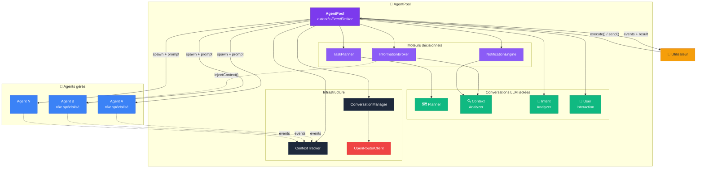

---

## Architecture complète

### Vue d'ensemble des composants

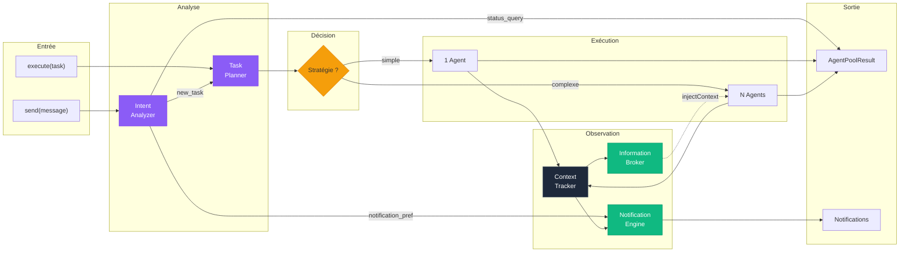

---

## Flow d'exécution global

Le pipeline complet de `execute(task)` en 5 phases :

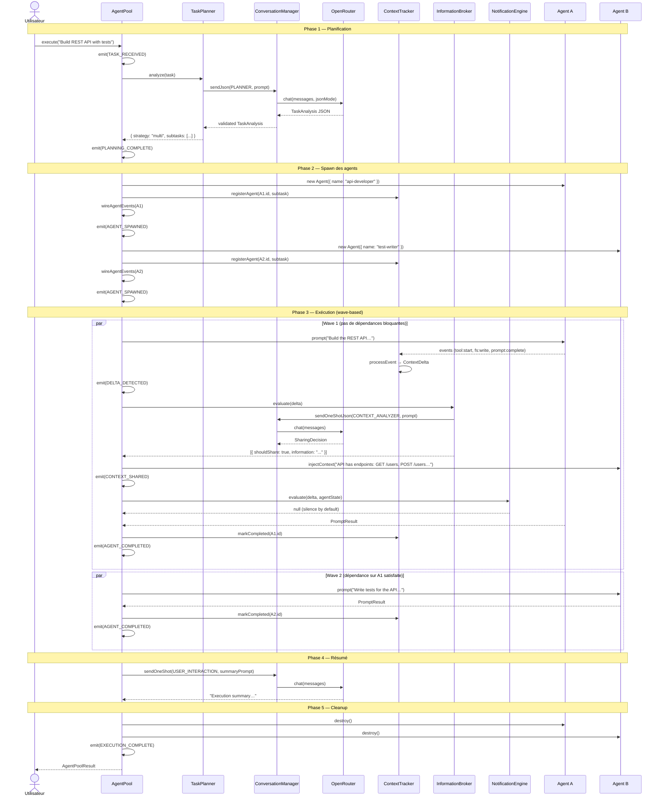

---

## Décision adaptative : single vs multi-agent

Le point le plus critique de l'architecture. Le `TaskPlanner` **ne force jamais** le multi-agents :

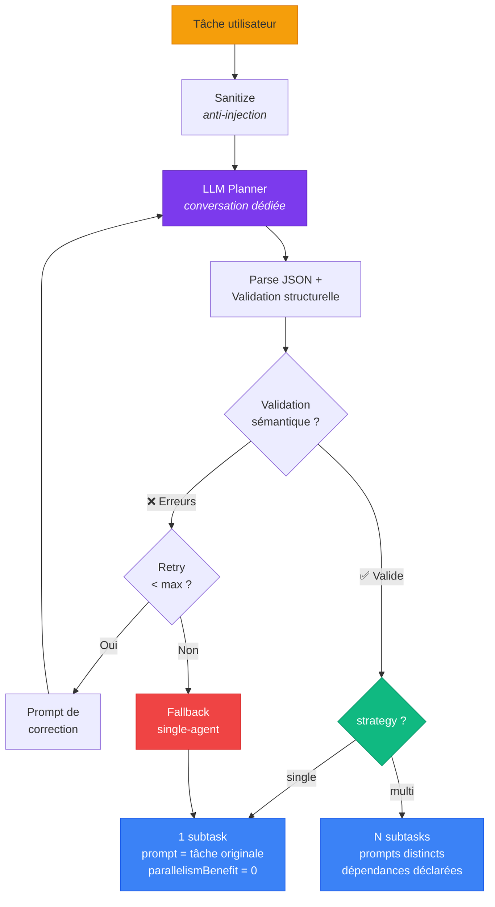

### Critères de décision (LLM-driven)

Le planner est guidé par un system prompt strict :

| Choisir `single` quand… | Choisir `multi` quand… |
|---|---|
| Tâche directe et autonome | Responsabilités clairement distinctes |
| Pas de séparation naturelle | Subtasks parallélisables |
| Le découpage ajouterait de l'overhead | Chaque subtask = livrable indépendant |
| Raisonnement séquentiel profond | Bénéfice réel de la spécialisation |
| Sortie = un artefact unique | Frontières naturelles entre domaines |

### Validations

Chaque `TaskAnalysis` subit une double validation :

1. **Structurelle** — via `validateTaskAnalysis()` : types corrects, champs requis, cohérence strategy/subtask count
2. **Sémantique** — via `semanticValidationErrors()` :
    - IDs de subtasks uniques
    - Références de dépendances valides
    - Pas d'auto-dépendance
    - Pas de dépendances circulaires (DFS)
    - Single strategy → 0 dépendances

---

## Exécution topologique des subtasks

Quand la stratégie est `multi`, les subtasks sont exécutées par **vagues** en respectant le graphe de dépendances :

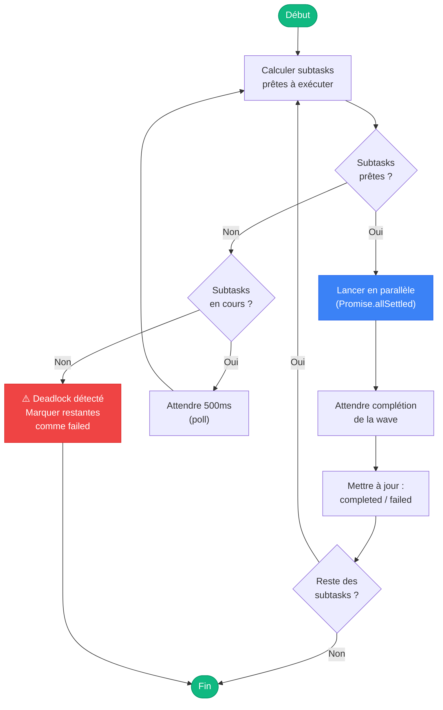

### Exemple concret de graphe de dépendances

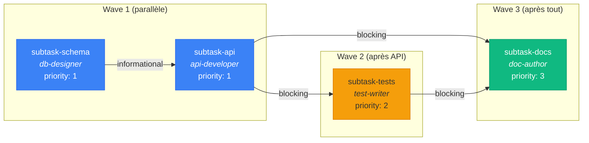

!!! info "Types de dépendances"
    - **`blocking`** : La subtask cible **ne peut pas démarrer** tant que la source n'est pas terminée.
    - **`informational`** : La subtask cible **bénéficierait** de la sortie de la source, mais peut démarrer sans.

---

## Conversations LLM isolées

L'un des choix architecturaux les plus importants : **4 conversations séparées** avec des historiques indépendants.

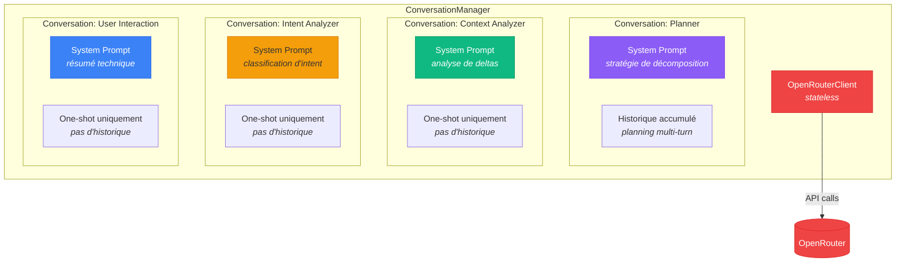

### Pourquoi l'isolation ?

| Problème sans isolation | Solution avec isolation |
|---|---|
| L'historique de planning pollue l'analyse de deltas | Chaque conversation a son propre contexte |
| Les tokens explosent en contexte partagé | Budget token maîtrisé par conversation |
| Les décisions de notification influencent le planning | Responsabilités strictement séparées |
| Impossible de scaler indépendamment | Chaque conversation peut être reset sans affecter les autres |

### Méthodes d'envoi

| Méthode | Historique | Usage |
|---|---|---|
| `send()` | ✅ Accumulé | Planning multi-turn |
| `sendJson()` | ✅ Accumulé | Planning avec validation JSON |
| `sendOneShot()` | ❌ Stateless | Résumés, analyse ponctuelle |
| `sendOneShotJson()` | ❌ Stateless | Décisions de partage/notification |

---

## Modèle de contexte et delta

### ContextTracker — Suivi par agent

Chaque agent géré possède un `AgentContextState` mis à jour incrémentalement :

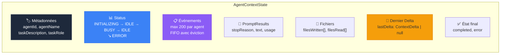

### Pipeline de delta

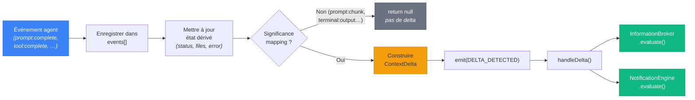

### Table de significance

| Événement agent | DeltaType | Significance |
|---|---|---|
| `prompt:complete` | `PROMPT_COMPLETE` | **0.8** |
| `tool:failed` | `TOOL_FAILED` | **0.9** |
| `agent:error` | `AGENT_ERROR` | **1.0** |
| `plan:update` | `PLAN_UPDATE` | 0.6 |
| `tool:complete` | `TOOL_COMPLETE` | 0.5 |
| `fs:write` | `FILE_WRITTEN` | 0.5 |
| `agent:idle` | `STATUS_CHANGE` | 0.3 |
| `fs:read` | `FILE_READ` | 0.2 |
| `agent:busy` | `STATUS_CHANGE` | 0.1 |

!!! tip "Pre-filtre avant LLM"
    Seuls les événements avec un mapping de significance produisent un delta.
    Les événements bruyants (`prompt:chunk`, `terminal:output`, `permission:granted`)
    sont enregistrés dans l'historique mais ne déclenchent **aucune** analyse LLM.

---

## Partage d'information conditionnel

Le `InformationBroker` est le **seul arbitre** du partage inter-agents. Les agents ne se connaissent jamais entre eux.

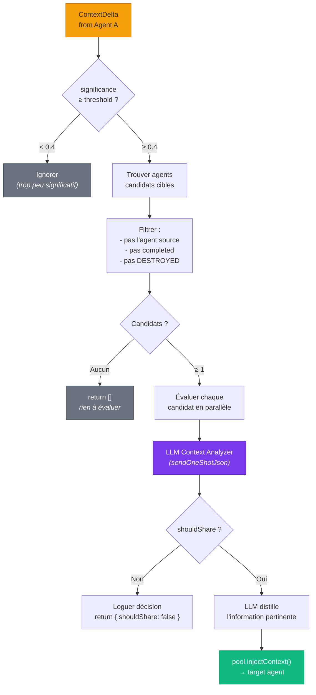

!!! warning "Coordination émergente, pas automatique"
    Même quand une dépendance `blocking` ou `informational` existe entre deux agents,
    le broker **consulte toujours le LLM** pour décider si le contenu du delta est
    réellement pertinent pour l'agent cible. Le partage n'est **jamais** automatique.

---

## Notifications utilisateur

Le `NotificationEngine` applique une politique stricte de **silence par défaut** :

```mermaid
flowchart TD
    DELTA[ContextDelta] --> PREF{Préférence<br/>définie ?}

    PREF -->|"Non (null)"| SILENCE1["return null<br/><em>silence absolu</em>"]

    PREF -->|Oui| ENABLED{enabled ?}
    ENABLED -->|Non| SILENCE2["return null"]

    ENABLED -->|Oui| THRESH{significance<br/>≥ minSignificance ?}
    THRESH -->|Non| SILENCE3["return null<br/><em>sous le seuil</em>"]

    THRESH -->|Oui| TYPES{Type dans<br/>types[] ?}
    TYPES -->|"Non (et types définis)"| SILENCE4["return null<br/><em>type non souhaité</em>"]

    TYPES -->|"Oui (ou pas de filtre)"| LLM["LLM Context Analyzer<br/><em>(sendOneShotJson)</em>"]

    LLM --> NOTIFY{shouldNotify ?}
    NOTIFY -->|Non| SILENCE5["return null<br/><em>LLM : pas pertinent</em>"]
    NOTIFY -->|Oui| MESSAGE["UserNotification<br/><em>message, significance,<br/>agentId, type, timestamp</em>"]
    MESSAGE --> EMIT["emit(NOTIFICATION)"]

    style DELTA fill:#f59e0b,stroke:#d97706
    style SILENCE1 fill:#6b7280,stroke:#4b5563,color:#fff
    style SILENCE2 fill:#6b7280,stroke:#4b5563,color:#fff
    style SILENCE3 fill:#6b7280,stroke:#4b5563,color:#fff
    style SILENCE4 fill:#6b7280,stroke:#4b5563,color:#fff
    style SILENCE5 fill:#6b7280,stroke:#4b5563,color:#fff
    style LLM fill:#7c3aed,stroke:#5b21b6,color:#fff
    style MESSAGE fill:#10b981,stroke:#059669,color:#fff
```

### Cycle de vie des préférences

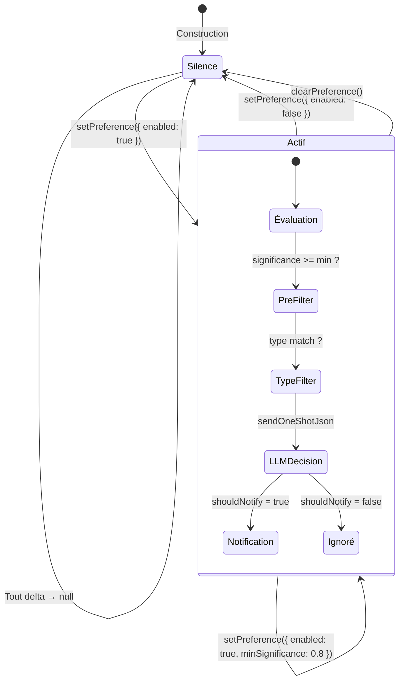

---

## Analyse d'intent utilisateur

Quand un message arrive via `send()`, il passe par l'`Intent Analyzer` :

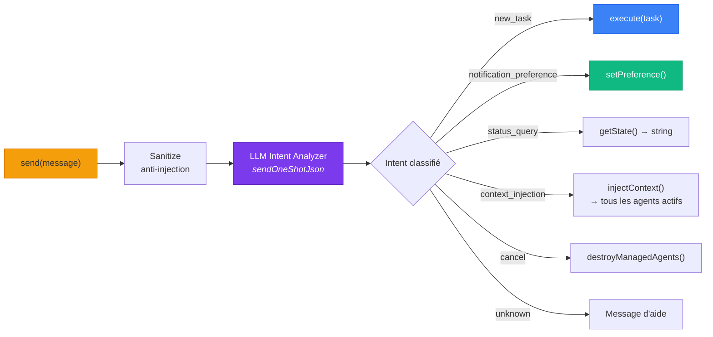

---

## Graphe de dépendances interne

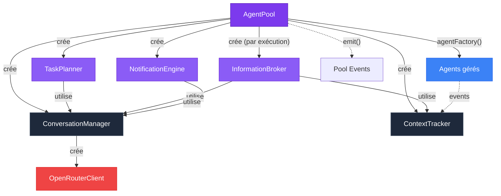

!!! info "Composition Root"
    Le constructeur d'`AgentPool` est le seul point d'assemblage.
    `InformationBroker` est recréé à chaque exécution car il dépend
    des dépendances spécifiques à la tâche en cours.

---

## Système d'événements

`AgentPool` étend `EventEmitter` avec un typage strict via `PoolEventMap` :

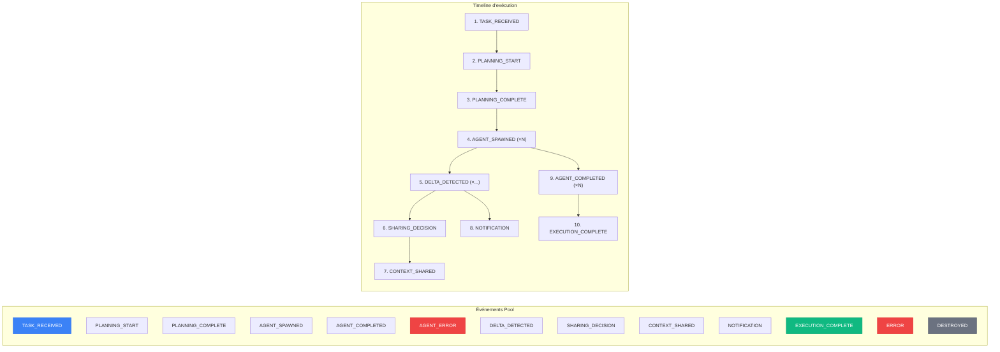

---

## OpenRouter — Client LLM

Le `OpenRouterClient` est le seul point de contact avec un fournisseur LLM :

```mermaid
flowchart TD
    subgraph "OpenRouterClient"
        direction TB
        CHAT["chat(messages)"]
        CHATJ["chatJson(messages, validator)"]
        SAN["sanitize(input)"]
    end

    CHATJ --> JSON_MODE["responseFormat:<br/>json_object"]
    JSON_MODE --> SEND["sdk.chat.send()"]
    CHAT --> SEND

    SEND --> RETRY["@openrouter/sdk<br/><em>retry automatique<br/>backoff exponentiel</em>"]

    RETRY --> RESP{Réponse}
    RESP -->|Texte| EXTRACT["extractContent()"]

    CHATJ --> PARSE["JSON.parse()"]
    PARSE --> VALIDATE{validator() ?}
    VALIDATE -->|null| CORRECT["Prompt de correction<br/><em>jusqu'à maxAttempts</em>"]
    CORRECT --> SEND
    VALIDATE -->|valid| RETURN["return T"]
    VALIDATE -->|"max atteint"| THROW["throw JsonValidationError"]

    SAN --> PATTERNS["6 patterns regex<br/><em>injection detection</em>"]
    PATTERNS --> MATCH{Matches ?}
    MATCH -->|"≥ 2"| REJECT["throw PromptInjectionError"]
    MATCH -->|"1"| WARN["⚠️ Warning + pass-through"]
    MATCH -->|"0"| PASS["Pass-through"]

    style SEND fill:#ef4444,stroke:#dc2626,color:#fff
    style RETRY fill:#f59e0b,stroke:#d97706
    style RETURN fill:#10b981,stroke:#059669,color:#fff
    style THROW fill:#ef4444,stroke:#dc2626,color:#fff
    style REJECT fill:#ef4444,stroke:#dc2626,color:#fff
```

---

## Prompts Handlebars

Tous les prompts sont des templates Handlebars pré-compilés :

| Template | Rôle | Conversation |
|---|---|---|
| `planningSystemPrompt` | System prompt du planner | PLANNER |
| `taskAnalysisPrompt` | Prompt d'analyse de tâche | PLANNER |
| `contextAnalysisSystemPrompt` | System prompt de l'analyseur de contexte | CONTEXT_ANALYZER |
| `contextAnalysisPrompt` | Prompt d'analyse de delta | CONTEXT_ANALYZER |
| `sharingDecisionPrompt` | Prompt de décision de partage | CONTEXT_ANALYZER |
| `notificationDecisionPrompt` | Prompt de décision de notification | CONTEXT_ANALYZER |
| `intentAnalysisSystemPrompt` | System prompt de l'analyseur d'intent | INTENT_ANALYZER |
| `intentAnalysisPrompt` | Prompt de classification d'intent | INTENT_ANALYZER |
| `summarySystemPrompt` | System prompt du résumé | USER_INTERACTION |
| `summaryPrompt` | Prompt de génération de résumé | USER_INTERACTION |

!!! tip "Helpers Handlebars"
    Trois helpers sont enregistrés globalement :
    
    - `{{json obj}}` — Sérialise en JSON indenté (SafeString)
    - `{{eq a b}}` — Comparaison d'égalité
    - `{{truncate text length}}` — Troncature avec ellipsis

---

## API publique

### `execute(task)` — Exécuter une tâche

```typescript
const pool = new AgentPool({
  openRouterApiKey: process.env.OPENROUTER_API_KEY!,
  model: "anthropic/claude-sonnet-4-20250514",
  agentConfig: { cwd: "/my/project", autoApprove: true },
});

const result = await pool.execute("Build a REST API with tests");

console.log(result.strategy);   // "single" | "multi"
console.log(result.summary);    // Résumé LLM de l'exécution
console.log(result.agents);     // Résultats par agent
console.log(result.durationMs); // Temps total
```

### `send(message)` — Envoyer un message

```typescript
// Le message est analysé par le LLM pour classifier l'intent
await pool.send("Notify me of important changes");     // → notification_preference
await pool.send("What's the current status?");          // → status_query
await pool.send("Add authentication to the API");       // → new_task → execute()
await pool.send("Focus on security best practices");    // → context_injection
await pool.send("Stop everything");                     // → cancel
```

### `getState()` — Inspecter l'état

```typescript
const state = pool.getState();
// {
//   executing: boolean,
//   currentTask: string | null,
//   strategy: "single" | "multi" | null,
//   activeAgentCount: number,
//   agents: [{ agentId, agentName, status, taskRole, completed }],
//   notificationsEnabled: boolean,
//   deltaCount: number,
//   sharingDecisionCount: number,
// }
```

### `setNotificationPreference(pref)` — Configurer les notifications

```typescript
// Bypass le LLM intent analyzer — configuration directe
pool.setNotificationPreference({
  enabled: true,
  minSignificance: 0.6,
  types: [DeltaType.PROMPT_COMPLETE, DeltaType.AGENT_ERROR],
});
```

### `destroy()` — Destruction propre

```typescript
await pool.destroy();
// Détruit tous les agents gérés
// Émet DESTROYED
// Le pool ne peut plus être réutilisé
```

### Événements typés

```typescript
pool.on(PoolEvent.PLANNING_COMPLETE, (event) => {
  console.log(event.analysis.strategy);   // Typé : PlanningCompleteEvent
});

pool.on(PoolEvent.AGENT_SPAWNED, (event) => {
  console.log(event.agentName, event.subtask.role);
});

pool.on(PoolEvent.CONTEXT_SHARED, (event) => {
  console.log(`${event.sourceAgentId} → ${event.targetAgentId}`);
});

pool.on(PoolEvent.NOTIFICATION, (event) => {
  console.log(event.notification.message);
});
```

---

## Configuration

```typescript
interface AgentPoolConfig {
  /** Clé API OpenRouter (obligatoire). */
  openRouterApiKey: string;

  /** Modèle LLM. Défaut : "anthropic/claude-sonnet-4-20250514" */
  model?: string;

  /** Config de base pour les agents spawnés. */
  agentConfig?: AgentConfig;

  /** Agents concurrents max. Défaut : 5 */
  maxAgents?: number;

  /** Retry API max. Défaut : 3 */
  maxRetries?: number;

  /** Température LLM. Défaut : 0.2 */
  temperature?: number;

  /** Factory d'agents pour les tests. */
  createAgent?: AgentFactory;
}
```

---

## Séparation des responsabilités

| Composant | Sait | Ne sait pas |
|---|---|---|
| **AgentPool** | Orchestrer le pipeline complet | Les détails du protocole ACP |
| **TaskPlanner** | Analyser et décomposer une tâche | L'existence des agents réels |
| **ConversationManager** | Gérer N conversations isolées | Le domaine métier |
| **OpenRouterClient** | Communiquer avec OpenRouter | Ce qu'est un agent |
| **ContextTracker** | Suivre l'état de chaque agent | Comment partager l'information |
| **InformationBroker** | Décider du partage inter-agents | Comment exécuter une subtask |
| **NotificationEngine** | Décider de notifier l'utilisateur | Le graphe de dépendances |
| **Agent** (externe) | Exécuter un prompt | Qu'un AgentPool existe |

---

## Contraintes architecturales

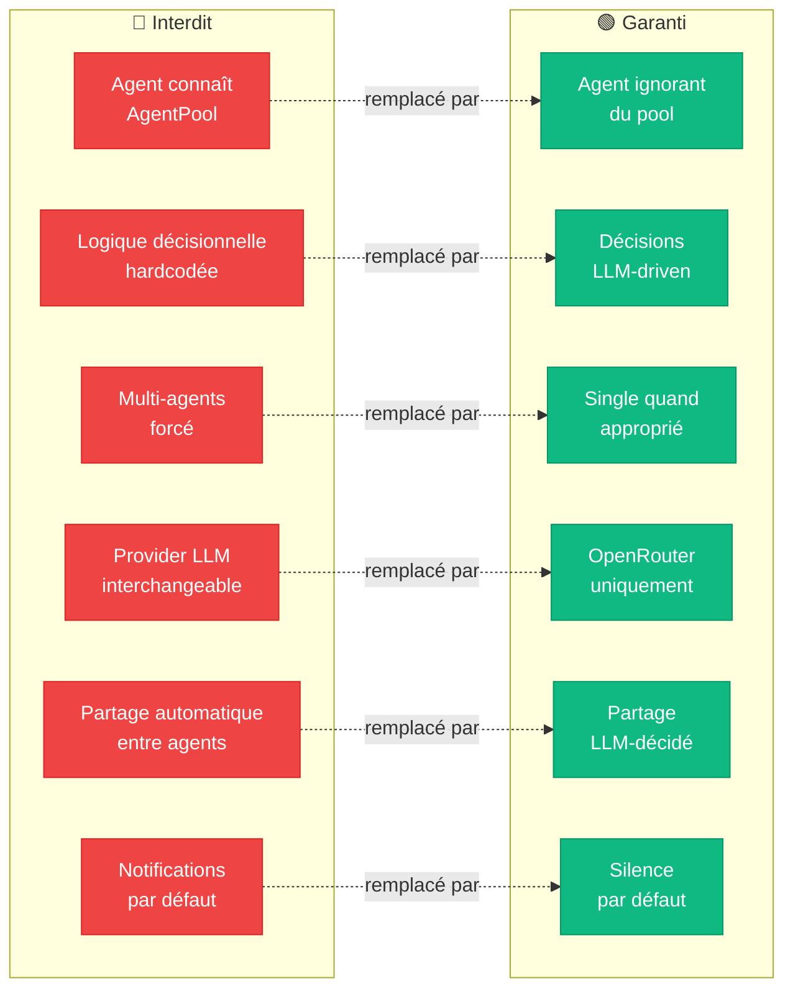

---

## Liens

- [Architecture — Vue d'ensemble](../architecture/overview.md)
- [Agent — L'orchestrateur principal](agent.md)
- [Événements typés](../concepts/events.md)
- [Cycle de vie](../concepts/lifecycle.md)