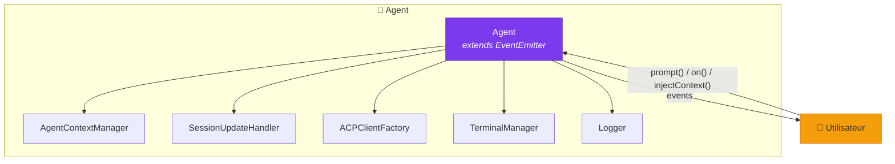
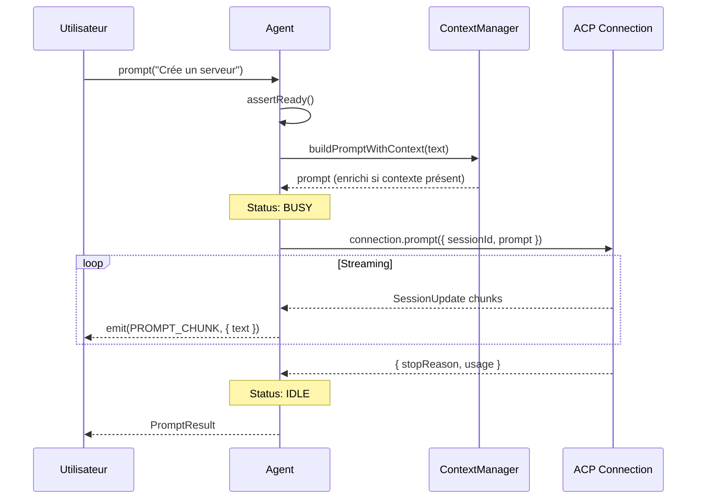
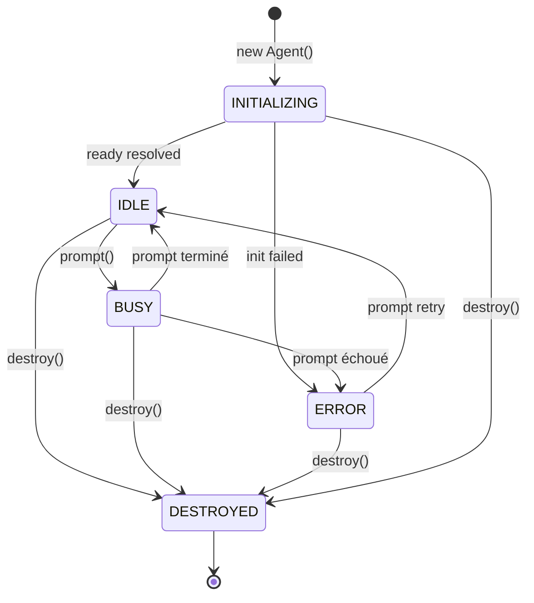
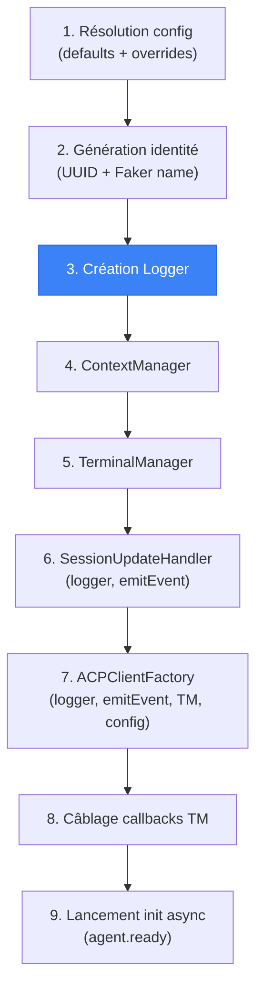

# 🤖 Agent — L'orchestrateur principal

> La classe `Agent` est le **point d'entrée unique** du système Stark.
> Elle orchestre toutes les autres briques — ACP, Logger, TerminalManager —
> et expose une API simple pour interagir avec un agent IA.

---

## Rôle et importance

L'`Agent` est le **composition root** de Stark : c'est le seul endroit où toutes les
dépendances sont assemblées. Il remplit 6 missions fondamentales :

| Mission | Description |
|---------|-------------|
| 🔌 **Connexion ACP** | Spawne le processus agent, négocie le protocole, crée une session |
| 💬 **Envoi de prompts** | API `prompt()` avec gestion du contexte et du streaming |
| 📡 **Événements typés** | Étend `EventEmitter` avec un typage fort pour l'orchestration |
| 💉 **Injection de contexte** | Modifie le comportement de l'agent au vol |
| 📊 **Observabilité** | Chaque action est loguée et émise comme événement |
| 🧹 **Cycle de vie** | Initialisation asynchrone et destruction propre |



---

## Instanciation minimale

```typescript
import { Agent } from "./classes/agent/agent.ts";

// Création avec la configuration par défaut
const agent = new Agent();

// Attendre que l'agent soit prêt
await agent.ready;

console.log(`Agent "${agent.name}" prêt (${agent.id})`);
// → Agent "Swift Nova" prêt (a1b2c3d4-...)
```

!!! info "Initialisation asynchrone"
    Le constructeur lance l'initialisation en arrière-plan. Il faut **toujours**
    attendre `await agent.ready` avant d'appeler `prompt()`.

---

## Configuration complète

```typescript
import { Agent } from "./classes/agent/agent.ts";

const agent = new Agent({
  // ── Identité ──────────────────────────────────────
  name: "Mon Agent",        // Nom humain (sinon généré par Faker)
  id: "agent-001",          // ID programmatique (sinon UUID v4)

  // ── Processus ACP ────────────────────────────────
  executable: "/usr/local/bin/copilot",  // Chemin (ou $COPILOT_CLI_PATH)
  cwd: "/mon/projet",                   // Répertoire de travail
  autoApprove: true,                     // Approuver les permissions auto

  // ── Logging ───────────────────────────────────────
  logOutput: {
    console: true,                       // pino-pretty dans le terminal
    json: "./logs/agent.ndjson",         // Fichier NDJSON
    seq: true,                           // Streaming vers Seq
  },
  logLevel: "info",

});
```

Consultez la page [Configuration](../guide/configuration.md) pour le détail de chaque option.

---

## API publique

### `prompt(text)` — Envoyer un message

C'est la méthode principale. Elle envoie un prompt à l'agent IA et attend la réponse complète.

```typescript
const result = await agent.prompt("Crée un serveur HTTP en TypeScript");

console.log(result.text);       // Le texte complet de la réponse
console.log(result.stopReason); // "end_turn"
console.log(result.usage);      // { inputTokens: 1500, outputTokens: 800, ... }
```

Le type retourné est un `PromptResult` :

```typescript
interface PromptResult {
  /** Raison de l'arrêt de la génération */
  stopReason: StopReason;

  /** Texte complet accumulé pendant le streaming */
  text: string;

  /** Statistiques d'utilisation de tokens */
  usage?: Usage | null;
}
```

!!! warning "Un seul prompt à la fois"
    L'agent ne peut traiter qu'un prompt à la fois. Appeler `prompt()` pendant que
    l'agent est `BUSY` lance une erreur. Le status passe de `IDLE` → `BUSY` → `IDLE`.

#### Ce qui se passe en interne



---

### `injectContext(instructions)` — Modifier le comportement

Permet d'injecter des instructions supplémentaires dans le contexte de l'agent.
Le comportement dépend du status actuel :

```typescript
// ── Cas 1 : Agent IDLE → envoi immédiat ─────────────
agent.injectContext("Utilise TypeScript strict mode à partir de maintenant");
// → Envoyé immédiatement comme follow-up prompt

// ── Cas 2 : Agent BUSY → file d'attente ─────────────
const promise = agent.prompt("Construis l'API");  // fire-and-forget
agent.injectContext("Ajoute de la validation");     // → mis en file
agent.injectContext("Utilise Zod pour les schémas"); // → mis en file
await promise;
// → Les deux instructions sont envoyées automatiquement après le prompt
```

```mermaid
flowchart TD
    INJ["injectContext(instructions)"] --> CHECK{Agent BUSY ?}

    CHECK -->|Non - IDLE| IMM[Envoi immédiat<br/><code>drainPendingContext()</code>]
    CHECK -->|Oui - BUSY| QUEUE[Mise en file<br/><code>contextManager.inject()</code>]

    QUEUE --> WAIT[Attend fin du prompt]
    WAIT --> DRAIN["drainPendingContext()"]
    DRAIN --> SEND[Envoie comme follow-up prompt]

    IMM --> SEND

    style INJ fill:#7c3aed,stroke:#5b21b6,color:#fff
    style SEND fill:#10b981,stroke:#059669,color:#fff
```

---

### `on(event, callback)` — Écouter les événements

L'Agent étend `EventEmitter` avec un **typage fort**. TypeScript infère automatiquement
le type du payload pour chaque événement :

```typescript
import { AgentEvent } from "./enums/agent-event.enum.ts";

// TS sait que `e` est un ToolStartEvent
agent.on(AgentEvent.TOOL_START, (e) => {
  console.log(e.title);    // ✅ typé
  console.log(e.kind);     // ✅ typé
  console.log(e.command);  // ✅ typé
});

// Streaming en temps réel
agent.on(AgentEvent.PROMPT_CHUNK, (e) => {
  process.stdout.write(e.text);  // Affiche la réponse au fur et à mesure
});

// Suivi de la consommation
agent.on(AgentEvent.USAGE_UPDATE, (e) => {
  console.log(`Context: ${e.contextPercent}% utilisé`);
  if (e.cost) {
    console.log(`Coût: $${e.cost.amount.toFixed(4)} ${e.cost.currency}`);
  }
});

// Cycle de vie
agent.on(AgentEvent.AGENT_READY, (e) => {
  console.log(`Session: ${e.sessionId}`);
});

agent.on(AgentEvent.AGENT_ERROR, (e) => {
  console.error(`Erreur: ${e.error.message} (${e.context})`);
});
```

Voir la page [Événements typés](../concepts/events.md) pour la liste complète des événements.

---

### `snapshot()` — Inspecter l'état

Retourne une photo instantanée de l'état de l'agent, utile pour l'orchestration de pools :

```typescript
const snap = agent.snapshot();

console.log(snap.identity.id);       // "a1b2c3d4-..."
console.log(snap.identity.name);     // "Swift Nova"
console.log(snap.status);            // "idle"
console.log(snap.sessionId);         // "session-xyz..."
console.log(snap.promptCount);       // 3
console.log(snap.pendingContextCount); // 0
```

Le type retourné est un `AgentSnapshot` :

```typescript
interface AgentSnapshot {
  identity: AgentIdentity;
  status: AgentStatus;
  sessionId: string | null;
  promptCount: number;
  pendingContextCount: number;
}
```

---

### `destroy()` — Arrêt propre

Arrête proprement l'agent et libère toutes les ressources :

```typescript
await agent.destroy();

console.log(agent.status); // "destroyed"
// L'agent ne peut plus être utilisé après cette opération
```

L'ordre de nettoyage est strict :

1. **Status → DESTROYED** (empêche les fausses erreurs)
2. **Kill des terminaux** (`terminalManager.destroyAll()`)
3. **Fermeture du stream ACP** (prévient les erreurs d'écriture)
4. **Attente de la connexion** (timeout 500ms)
5. **SIGTERM au processus** (puis SIGKILL après 2s si nécessaire)
6. **Émission de `AGENT_DESTROYED`**

!!! danger "Irréversible"
    Une fois `destroy()` appelé, l'instance d'agent ne peut plus être réutilisée.
    Toute tentative d'appeler `prompt()` ou `injectContext()` lancera une erreur.

---

## Propriétés publiques

| Propriété | Type | Description |
|-----------|------|-------------|
| `identity` | `AgentIdentity` | L'identité complète (id + name) |
| `id` | `string` | Raccourci pour `identity.id` |
| `name` | `string` | Raccourci pour `identity.name` |
| `status` | `AgentStatus` | Le status actuel du cycle de vie |
| `sessionId` | `string \| null` | L'ID de session ACP (null avant `ready`) |
| `logger` | `pino.Logger` | Le logger Pino pour usage externe |
| `ready` | `Promise<void>` | Résout quand l'agent est prêt |

---

## Identité de l'agent

Chaque agent reçoit une identité unique à la création :

```typescript
interface AgentIdentity {
  /** UUID v4 — identifiant programmatique */
  readonly id: string;

  /** Nom mémorable généré par Faker.js */
  readonly name: string;
}
```

Par défaut, le nom est généré automatiquement avec un format `"Adjectif Prénom"` :

```typescript
// Exemples de noms générés :
// "Swift Elena", "Clever Atlas", "Bold Orion", "Bright Nova"

// Ou on peut le surcharger :
const agent = new Agent({ name: "Jarvis", id: "jarvis-001" });
```

L'identité est injectée dans :

- Chaque **ligne de log** (champs `agentId`, `agentName`)
- Chaque **événement émis** (champ `agent`)


---

## Cycle de vie (Machine à états)

L'agent suit une machine à états stricte :



| Status | Valeur | Signification |
|--------|--------|--------------|
| `INITIALIZING` | `"initializing"` | Spawn + handshake ACP en cours |
| `IDLE` | `"idle"` | Prêt à recevoir un prompt |
| `BUSY` | `"busy"` | Prompt en cours de traitement |
| `ERROR` | `"error"` | Erreur — peut retenter un prompt |
| `DESTROYED` | `"destroyed"` | Arrêté — irréversible |

Voir [Cycle de vie](../concepts/lifecycle.md) pour les détails sur chaque transition.

---

## Architecture interne

Le constructeur de l'Agent assemble toutes les dépendances dans un ordre précis :




---

## Composants délégués

L'Agent ne fait pas tout lui-même. Il délègue à des composants spécialisés :

| Composant | Responsabilité | Injecté avec |
|-----------|---------------|--------------|
| [**ContextManager**](context-manager.md) | File FIFO de contexte | Rien (pure logique) |
| [**SessionUpdateHandler**](session-update-handler.md) | Router les updates ACP | `logger`, `emitEvent` |
| [**ACPClientFactory**](acp-client-factory.md) | Callbacks ACP (FS, terminal, permissions) | `logger`, `emitEvent`, `TM`, `config` |
| [**TerminalManager**](terminal-manager.md) | Gestion des processus enfants | Callbacks output/exit |
| [**Logger**](logger.md) | Logs structurés multi-transport | Identité |

---

## Exemple complet

Voici un exemple complet qui utilise toutes les capacités de l'Agent :

```typescript
import { Agent } from "./classes/agent/agent.ts";
import { AgentEvent } from "./enums/agent-event.enum.ts";

async function main() {
  // 1. Créer l'agent
  const agent = new Agent({
    cwd: process.cwd(),
    logOutput: { console: true, seq: true },
    autoApprove: true,
  });

  // 2. Écouter les événements
  agent.on(AgentEvent.PROMPT_CHUNK, (e) => {
    process.stdout.write(e.text);
  });

  agent.on(AgentEvent.TOOL_START, (e) => {
    console.error(`🔧 ${e.title}`);
  });

  agent.on(AgentEvent.TOOL_COMPLETE, (e) => {
    console.error(`✅ ${e.title} (exit ${e.exitCode})`);
  });

  // 3. Attendre l'initialisation
  await agent.ready;
  console.error(`Agent "${agent.name}" prêt !`);

  // 4. Envoyer un prompt
  const result = await agent.prompt("Crée un fichier hello.ts qui affiche 'Hello World'");
  console.error(`\n→ ${result.stopReason}, ${result.text.length} caractères`);

  // 5. Injecter du contexte pour le prochain prompt
  agent.injectContext("Ajoute des tests unitaires pour le fichier créé");

  // 6. Envoyer un second prompt
  const result2 = await agent.prompt("Maintenant, exécute le fichier");
  console.error(`→ ${result2.stopReason}`);

  // 7. Inspecter l'état
  const snap = agent.snapshot();
  console.error(`Prompts exécutés: ${snap.promptCount}`);

  // 8. Nettoyer
  await agent.destroy();
}

main().catch(console.error);
```

---

## Gestion des erreurs

L'Agent gère les erreurs à plusieurs niveaux :

### Erreur d'initialisation

```typescript
const agent = new Agent({ executable: "/chemin/inexistant" });

try {
  await agent.ready;
} catch (err) {
  console.error("Init échouée:", err.message);
  // → "Failed to spawn ACP process "/chemin/inexistant": ..."
  console.log(agent.status); // "error"
}
```

### Erreur de prompt

```typescript
try {
  const result = await agent.prompt("...");
} catch (err) {
  console.error("Prompt échoué:", err.message);
  // Le status passe à ERROR, un événement agent:error est émis
  // On peut retenter un prompt (le status repassera à BUSY → IDLE)
}
```

### Appels invalides

```typescript
// Prompt sur un agent non initialisé
const agent = new Agent();
agent.prompt("..."); // ❌ Error: Agent is still initializing

// Prompt sur un agent occupé
await agent.ready;
agent.prompt("..."); // lancé
agent.prompt("..."); // ❌ Error: Agent is already processing a prompt

// Prompt sur un agent détruit
await agent.destroy();
agent.prompt("..."); // ❌ Error: Agent has been destroyed
```

---

## Liens

- [**Architecture**](../architecture/overview.md) — Vue d'ensemble du système
- [**Flux & Séquences**](../architecture/sequences.md) — Diagrammes de séquence détaillés
- [**Agent Client Protocol**](acp.md) — Le protocole sous-jacent
- [**Événements typés**](../concepts/events.md) — Tous les événements émis par l'Agent
- [**Cycle de vie**](../concepts/lifecycle.md) — Machine à états détaillée
- [**Configuration**](../guide/configuration.md) — Toutes les options de configuration