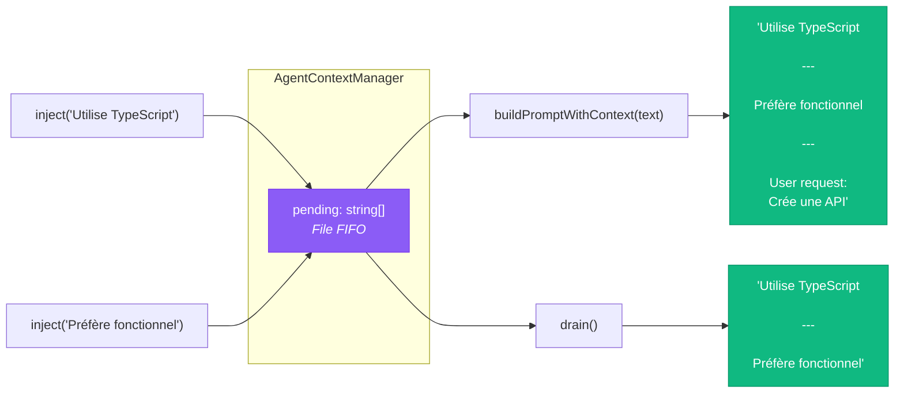
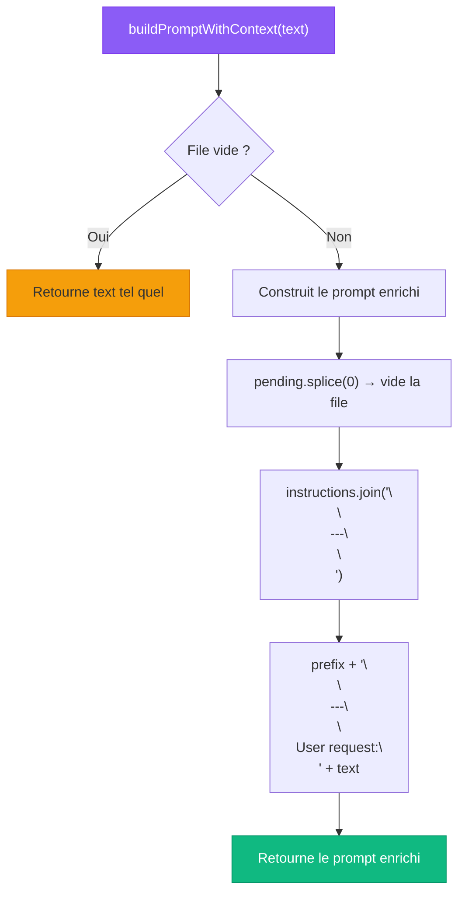
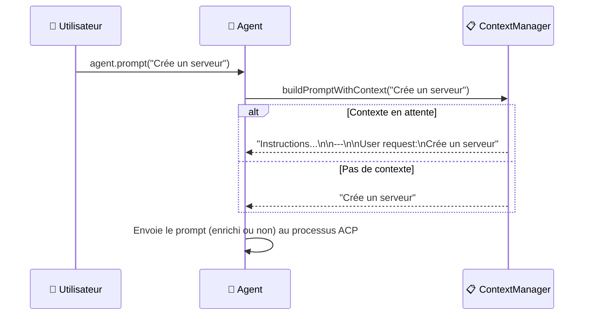
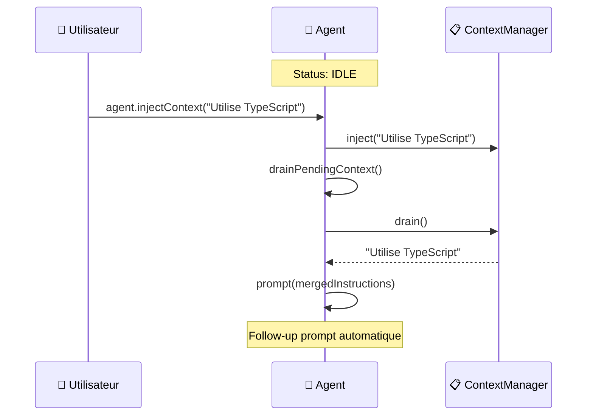
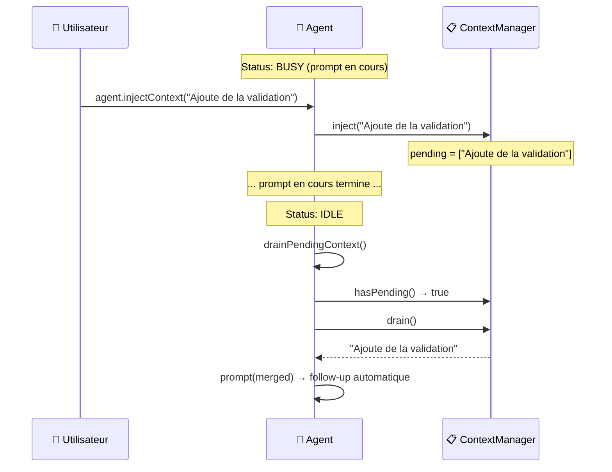
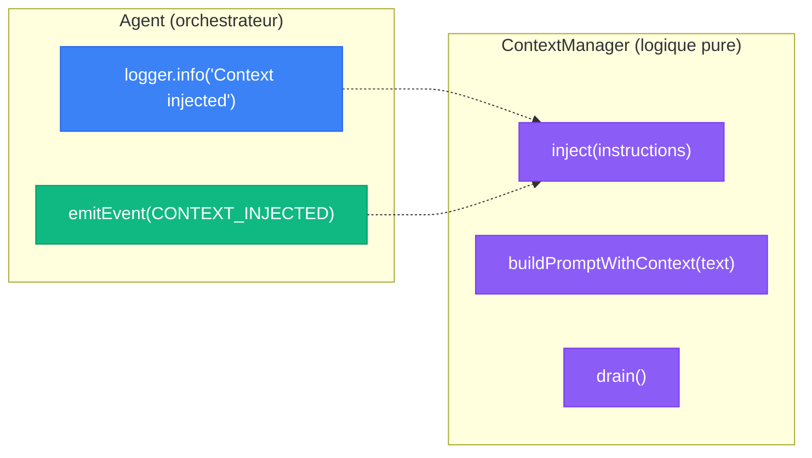

# 📋 AgentContextManager — File d'attente d'injection de contexte

> L'`AgentContextManager` est la brique la plus simple de Stark — et c'est
> intentionnel. C'est une **file FIFO pure** sans aucune dépendance, qui gère
> l'injection de contexte entre les prompts de l'agent.

---

## Rôle et importance

L'AgentContextManager résout un problème subtil : **comment modifier le comportement
d'un agent IA entre deux prompts, ou même pendant qu'il travaille ?**

La solution est une file d'attente d'instructions qui sont automatiquement
prépendées au prochain prompt ou envoyées comme follow-up.

| Responsabilité | Description |
|----------------|-------------|
| 📥 **Injection** | Empile des instructions dans une file FIFO |
| 🔗 **Fusion** | Concatène les instructions en un seul bloc avec séparateurs |
| 📝 **Enrichissement de prompt** | Prépend le contexte accumulé au prochain prompt |
| 🚰 **Drain** | Vide la file et retourne le contenu fusionné |
| 🧹 **Zéro dépendance** | Aucune dépendance sur Logger ou Agent |



!!! tip "Pure logique"
    L'AgentContextManager est une classe **pure** : pas de logging,
    pas d'événements, pas d'effets de bord. Elle ne gère que des données.
    C'est l'`Agent` qui décide **quand** drainer la file en fonction de son status.

---

## Instanciation

L'instanciation est triviale — aucune configuration n'est nécessaire :

```typescript
import { AgentContextManager } from "./classes/agent/agent-context-manager.ts";

const ctx = new AgentContextManager();
```

C'est tout. Pas de config, pas de dépendances, pas d'options.

---

## API complète

### `inject(instructions)` — Empiler du contexte

Ajoute des instructions à la fin de la file :

```typescript
const ctx = new AgentContextManager();

ctx.inject("Utilise TypeScript strict mode");
ctx.inject("Préfère le style fonctionnel");
ctx.inject("Ajoute des commentaires JSDoc");

console.log(ctx.pendingCount); // 3
console.log(ctx.hasPending()); // true
```

Chaque appel à `inject()` ajoute une entrée distincte. L'ordre est préservé (FIFO).

---

### `buildPromptWithContext(text)` — Enrichir un prompt

C'est la méthode clé : elle **prépend** toutes les instructions en attente au texte
du prompt, puis **vide** la file :

```typescript
const ctx = new AgentContextManager();

ctx.inject("Utilise TypeScript strict mode");
ctx.inject("Préfère le style fonctionnel");

const prompt = ctx.buildPromptWithContext("Crée une API REST");
```

Le résultat est :

```text
Utilise TypeScript strict mode

---

Préfère le style fonctionnel

---

User request:
Crée une API REST
```

**Comportement important :**

- La file est **vidée** après l'appel (side effect)
- Si la file est vide, le texte original est retourné **tel quel**
- Les instructions sont séparées par `\n\n---\n\n`
- Le prompt utilisateur est préfixé par `User request:\n`



#### Exemple sans contexte

```typescript
const ctx = new AgentContextManager();

// File vide → pas de modification
const prompt = ctx.buildPromptWithContext("Crée une API REST");
console.log(prompt);
// → "Crée une API REST"  (inchangé)
```

#### Exemple avec une seule instruction

```typescript
const ctx = new AgentContextManager();

ctx.inject("Réponds en français");

const prompt = ctx.buildPromptWithContext("Create an API");
console.log(prompt);
// → "Réponds en français\n\n---\n\nUser request:\nCreate an API"
```

#### Exemple avec plusieurs instructions

```typescript
const ctx = new AgentContextManager();

ctx.inject("Utilise TypeScript");
ctx.inject("Ajoute des tests");
ctx.inject("Documente avec JSDoc");

const prompt = ctx.buildPromptWithContext("Crée un serveur HTTP");
console.log(prompt);
// → "Utilise TypeScript\n\n---\n\nAjoute des tests\n\n---\n\nDocumente avec JSDoc\n\n---\n\nUser request:\nCrée un serveur HTTP"

// La file est maintenant vide
console.log(ctx.hasPending()); // false
console.log(ctx.pendingCount); // 0
```

---

### `drain()` — Vider et fusionner

Retourne toutes les instructions en attente fusionnées en un seul string,
et vide la file. Retourne `null` si la file est vide :

```typescript
const ctx = new AgentContextManager();

ctx.inject("Instruction A");
ctx.inject("Instruction B");

const merged = ctx.drain();
console.log(merged);
// → "Instruction A\n\n---\n\nInstruction B"

// La file est maintenant vide
console.log(ctx.drain()); // null
```

!!! info "Différence avec `buildPromptWithContext()`"
    - `buildPromptWithContext(text)` → ajoute le prompt utilisateur à la fin
    - `drain()` → retourne uniquement les instructions fusionnées (sans prompt)

    L'Agent utilise `buildPromptWithContext()` lors d'un `prompt()` classique,
    et `drain()` pour envoyer un follow-up automatique de contexte injecté.

---

### `hasPending()` — Vérifier la file

```typescript
const ctx = new AgentContextManager();

console.log(ctx.hasPending()); // false

ctx.inject("quelque chose");
console.log(ctx.hasPending()); // true
```

---

### `pendingCount` — Taille de la file

```typescript
const ctx = new AgentContextManager();

console.log(ctx.pendingCount); // 0

ctx.inject("A");
ctx.inject("B");
console.log(ctx.pendingCount); // 2

ctx.drain();
console.log(ctx.pendingCount); // 0
```

---

## Intégration avec l'Agent

L'AgentContextManager est utilisé par l'Agent dans **trois contextes** :

### 1. Lors d'un `prompt()` — enrichissement automatique



### 2. Lors d'un `injectContext()` quand IDLE — drain immédiat



### 3. Après un `prompt()` — drain des instructions en attente



---

## Le format de fusion

Les instructions sont fusionnées avec le séparateur `\n\n---\n\n` (un Markdown horizontal rule) :

```
Instruction 1

---

Instruction 2

---

Instruction 3
```

Ce format est choisi car :

- Les modèles de langage comprennent bien le `---` comme séparateur de sections
- Il est visuellement clair dans les logs et le debug
- Il est compatible Markdown

Quand un prompt utilisateur est ajouté (via `buildPromptWithContext`), il est préfixé par
`User request:\n` pour que le modèle distingue clairement les instructions de la requête :

```
Instructions du contexte

---

User request:
La requête de l'utilisateur
```

---

## Design pattern — Pure Logic Class

L'AgentContextManager est un exemple parfait du pattern **Pure Logic Class** :

| Caractéristique | Valeur |
|-----------------|--------|
| **Dépendances** | Aucune |
| **Effets de bord** | Aucun (mutation interne uniquement) |
| **I/O** | Aucun |
| **Logging** | Aucun |
| **Événements** | Aucun |
| **Testabilité** | Triviale — pas de mocks nécessaires |

Cette séparation est **intentionnelle**. Le logging et l'émission d'événements
liés à l'injection de contexte sont gérés par l'`Agent`, qui est le seul à savoir
quand et comment ces opérations doivent être observées :



!!! tip "Pourquoi ce design ?"
    En séparant la logique pure de l'observabilité, on obtient :

    - **Tests unitaires simples** — pas besoin de mocker un logger
    - **Réutilisabilité** — le ContextManager peut être utilisé dans n'importe quel contexte
    - **Responsabilité unique** — chaque classe fait une seule chose bien
    - **Flexibilité** — l'Agent choisit quoi logger/émettre selon le contexte

---

## Exemple complet autonome

Le ContextManager peut s'utiliser complètement indépendamment de l'Agent :

```typescript
import { AgentContextManager } from "./classes/agent/agent-context-manager.ts";

const ctx = new AgentContextManager();

// Scénario 1 : Enrichir un prompt avec du contexte
ctx.inject("Tu es un expert TypeScript");
ctx.inject("Utilise les conventions Airbnb");

const prompt1 = ctx.buildPromptWithContext("Crée un serveur Express");
console.log(prompt1);
// "Tu es un expert TypeScript\n\n---\n\nUtilise les conventions Airbnb\n\n---\n\nUser request:\nCrée un serveur Express"
console.log(ctx.pendingCount); // 0 (vidé)

// Scénario 2 : Drainer pour un follow-up
ctx.inject("Ajoute la gestion des erreurs");
ctx.inject("Utilise Zod pour la validation");

const followUp = ctx.drain();
console.log(followUp);
// "Ajoute la gestion des erreurs\n\n---\n\nUtilise Zod pour la validation"
console.log(ctx.pendingCount); // 0

// Scénario 3 : Vérifier avant de drainer
console.log(ctx.hasPending()); // false
console.log(ctx.drain());      // null
```

---

## Résumé

| Concept | Description |
|---------|-------------|
| **Type** | Classe pure sans dépendance |
| **Structure** | File FIFO (`string[]`) |
| **inject()** | Empile une instruction |
| **buildPromptWithContext()** | Prépend le contexte au prompt + vide la file |
| **drain()** | Retourne les instructions fusionnées + vide la file |
| **Séparateur** | `\n\n---\n\n` entre chaque instruction |
| **Testabilité** | Triviale — aucun mock nécessaire |

---

## Liens

- [**Architecture**](../architecture/overview.md) — Vue d'ensemble du système
- [**Agent**](agent.md) — L'orchestrateur qui utilise le ContextManager
- [**Flux & Séquences**](../architecture/sequences.md) — Diagrammes d'injection de contexte
- [**Cycle de vie**](../concepts/lifecycle.md) — Comment le status de l'agent affecte l'injection
- [**Événements typés**](../concepts/events.md) — L'événement `context:injected`
