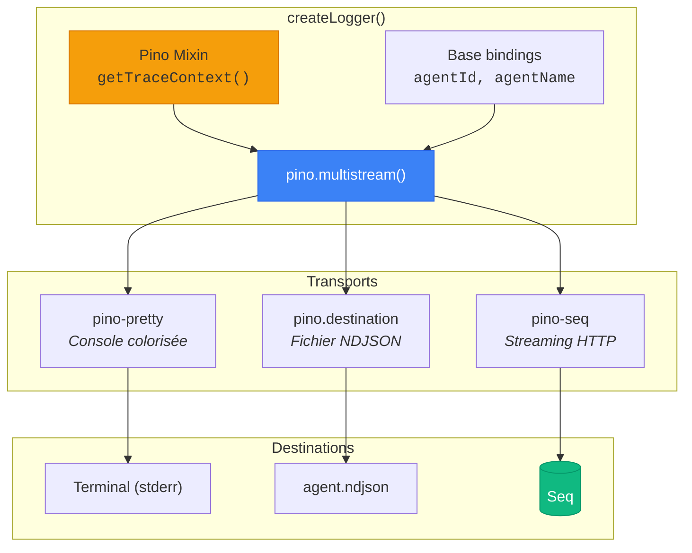
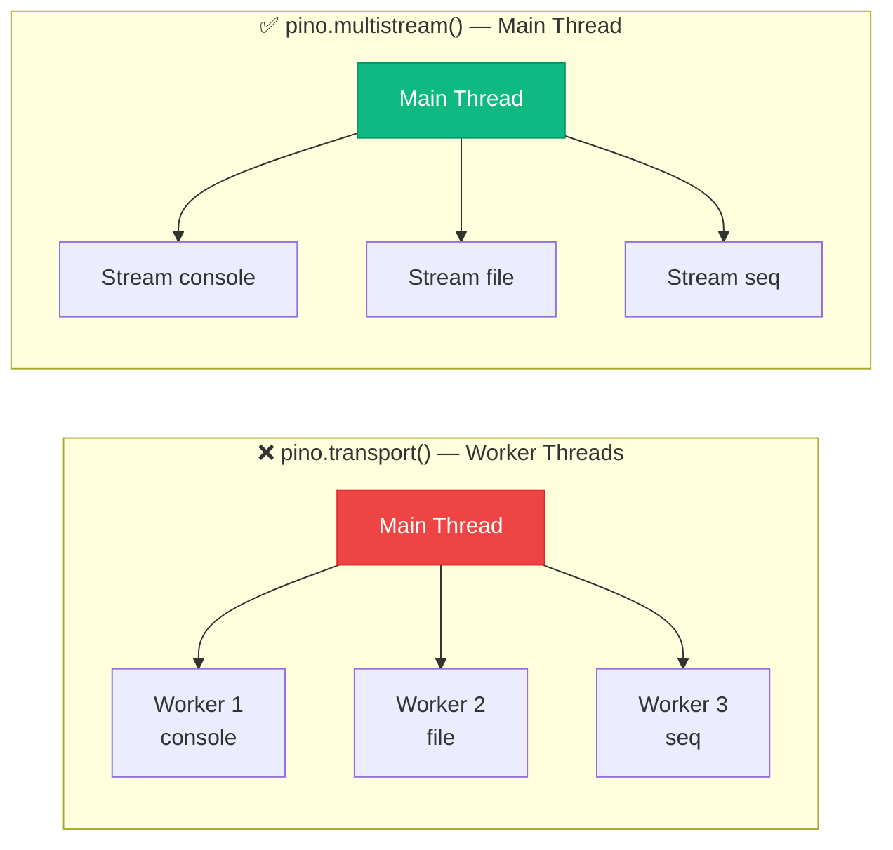
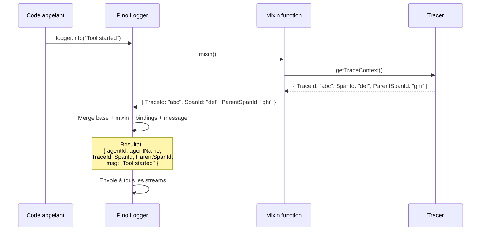
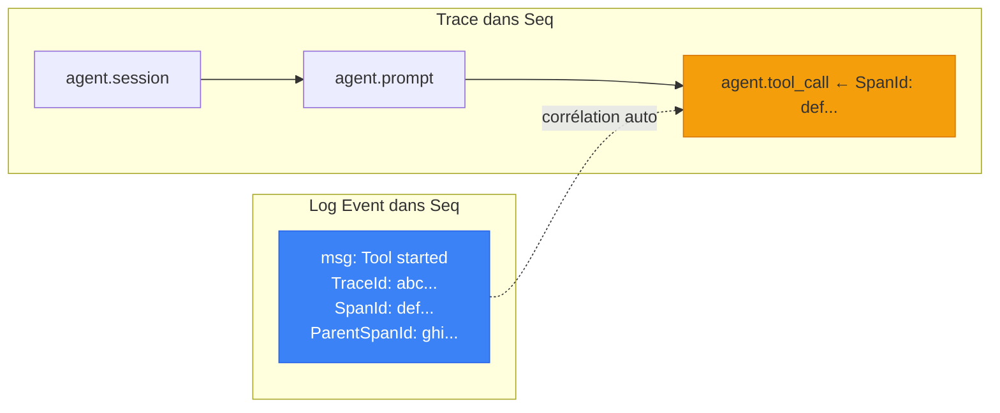
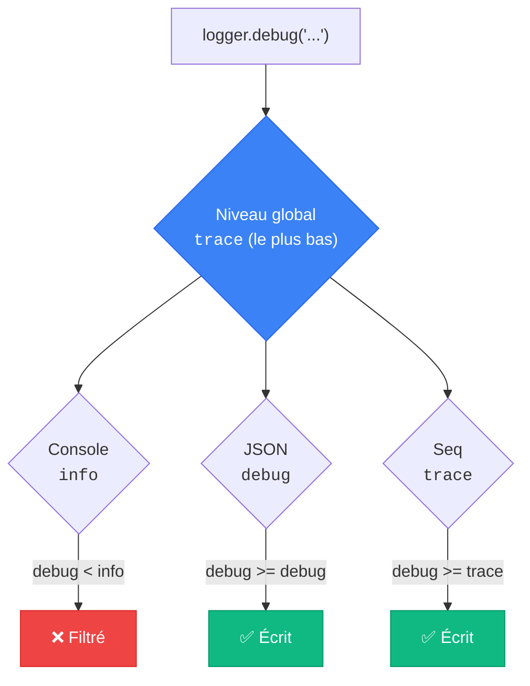
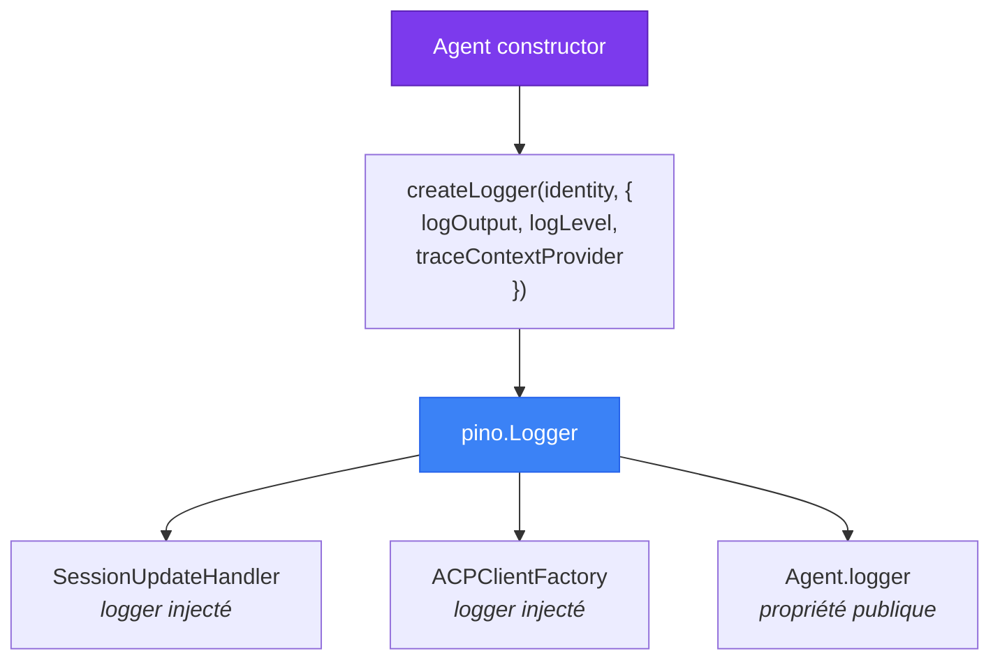

# 📝 Logger — Logging structuré avec Pino

> Le `Logger` est le système de logging multi-transport de Stark. Construit sur **Pino**,
> il envoie simultanément des logs colorisés en console, du JSON structuré dans un fichier,
> et des événements enrichis vers **Seq** — le tout avec une corrélation automatique
> aux traces OpenTelemetry.

---

## Rôle et importance

Le Logger est la **couche d'observabilité événementielle** de Stark. Là où le [Tracer](tracer.md)
capture des **durées** (spans), le Logger capture des **instants** : "Tool started",
"Prompt completed", "Terminal exited".

| Responsabilité | Description |
|----------------|-------------|
| 📤 **Multi-transport** | Console + JSON + Seq, actifs simultanément |
| 🎨 **Affichage humain** | `pino-pretty` avec couleurs et timestamps lisibles |
| 📊 **Logs structurés** | JSON avec des champs typés pour l'analyse |
| 🔗 **Corrélation traces** | Chaque log porte le `TraceId`/`SpanId` du span actif |
| 🏷️ **Identité agent** | Chaque ligne porte `agentId` et `agentName` |
| 🔇 **Mode silencieux** | Logger sans output pour les tests |
| ⚙️ **Niveaux par transport** | Console en `info`, JSON en `debug`, Seq en `trace` |



---

## Concept clé — Le multi-stream in-process

Stark utilise `pino.multistream()` au lieu de `pino.transport()`.

**Pourquoi ?** Le mécanisme `pino.transport()` utilise des `worker_threads` pour
isoler les transports dans des threads séparés. C'est performant en Node.js, mais
**Bun ne supporte pas complètement `worker_threads`**. Le multi-stream garde tout
dans le thread principal — compatible partout, et largement suffisant pour notre usage.



---

## Instanciation

### Via `createLogger()` (recommandé)

La fabrique `createLogger()` est le point d'entrée principal :

```typescript
import { createLogger } from "./logger/create-logger.ts";

const logger = createLogger(
  { id: "agent-001", name: "Swift Nova" },
  {
    logOutput: {
      console: true,
      json: "./logs/agent.ndjson",
      seq: true,
    },
    logLevel: "info",
  },
);

logger.info({ toolCallId: "tc-1" }, "Tool started");
// [14:32:07.421] INFO: Swift Nova | Tool started
//   agentId: "agent-001"
//   agentName: "Swift Nova"
//   toolCallId: "tc-1"
```

### Logger silencieux (tests)

```typescript
import { createSilentLogger } from "./logger/create-logger.ts";

const logger = createSilentLogger();
// Aucune sortie, quel que soit le niveau de log
```

### Logger minimal (console uniquement)

```typescript
const logger = createLogger(
  { id: "test", name: "Test Agent" },
  { logOutput: { console: true }, logLevel: "debug" },
);
```

---

## Les 3 transports

### 1. Console — `pino-pretty`

Le transport **console** produit une sortie humainement lisible avec des couleurs :

```
[14:32:07.421] INFO: Swift Nova | Tool started
[14:32:07.523] INFO: Swift Nova | Terminal created: docker info
[14:32:08.105] INFO: Swift Nova | Terminal exited
[14:32:08.210] INFO: Swift Nova | Prompt completed
```

**Configuration :**

```typescript
// Activé simplement
logOutput: { console: true }

// Avec un niveau personnalisé
logOutput: {
  console: { enabled: true, level: "debug" }
}

// Désactivé
logOutput: { console: false }
```

**Paramètres `pino-pretty` utilisés :**

| Paramètre | Valeur | Effet |
|-----------|--------|-------|
| `colorize` | `true` | Couleurs ANSI |
| `translateTime` | `"HH:MM:ss.l"` | Timestamps courts |
| `ignore` | `"pid,hostname"` | Masque les champs système |
| `messageFormat` | `"{agentName} \| {msg}"` | Préfixe le nom de l'agent |

---

### 2. JSON — Fichier NDJSON

Le transport **JSON** écrit des lignes JSON structurées, idéales pour l'analyse :

```json
{"level":30,"time":1705312327421,"agentId":"agent-001","agentName":"Swift Nova","toolCallId":"tc-1","msg":"Tool started","TraceId":"abc...","SpanId":"def..."}
{"level":30,"time":1705312327523,"agentId":"agent-001","agentName":"Swift Nova","terminalId":"term-1","command":"docker info","msg":"Terminal created"}
```

**Configuration :**

```typescript
// Écrire dans un fichier
logOutput: { json: "./logs/agent.ndjson" }

// Écrire sur stdout
logOutput: { json: true }

// Avec un niveau personnalisé
logOutput: {
  json: { destination: "./logs/agent.ndjson", level: "debug" }
}
```

!!! info "Création automatique"
    Le répertoire du fichier est créé automatiquement grâce à `pino.destination({ mkdir: true })`.

---

### 3. Seq — Streaming HTTP

Le transport **Seq** envoie les logs en temps réel vers une instance [Seq](https://datalust.co/seq)
via `pino-seq` :

```typescript
// Utilise l'URL par défaut (http://localhost:5341)
logOutput: { seq: true }

// URL personnalisée
logOutput: { seq: "http://my-seq-server:5341" }

// Configuration avancée
logOutput: {
  seq: { url: "http://my-seq-server:5341", level: "trace" }
}
```

**Paramètres `pino-seq` utilisés :**

| Paramètre | Valeur | Description |
|-----------|--------|-------------|
| `serverUrl` | `$SEQ_URL` ou `http://localhost:5341` | URL du serveur Seq |
| `batchSizeLimit` | `50` | Taille max d'un batch |
| `eventSizeLimit` | `1_048_576` (1 Mo) | Taille max d'un événement |
| `onError` | `console.warn(...)` | Handler d'erreur (best-effort) |

!!! tip "Docker Compose"
    Seq est fourni dans le `docker-compose.yml` du projet. Lancez `docker compose up -d`
    puis ouvrez `http://localhost:8082` pour visualiser vos logs.

---

## Corrélation Traces ↔ Logs

### Le mécanisme `mixin`

Le lien entre logs et traces est réalisé via le **mixin Pino** — une fonction appelée
à **chaque écriture de log** qui injecte dynamiquement le contexte de trace actuel :

```typescript
const logger = createLogger(identity, {
  logOutput: { console: true, seq: true },
  logLevel: "info",
  traceContextProvider: () => tracer.getTraceContext(),
  //                         ↑ Appelé à chaque log !
});
```



### Ce que ça donne dans les logs

Chaque ligne de log contient automatiquement :

| Champ | Source | Exemple |
|-------|--------|---------|
| `agentId` | Base bindings (statique) | `"a1b2c3d4-..."` |
| `agentName` | Base bindings (statique) | `"Swift Nova"` |
| `TraceId` | Mixin (dynamique) | `"abc123def456..."` (32 hex) |
| `SpanId` | Mixin (dynamique) | `"1a2b3c4d..."` (16 hex) |
| `ParentSpanId` | Mixin (dynamique) | `"5e6f7g8h..."` (16 hex, optionnel) |

### Résultat dans Seq

Seq utilise automatiquement les champs `TraceId` et `SpanId` pour :

- Regrouper les logs par trace
- Afficher les logs dans le contexte de leur span
- Reconstruire la hiérarchie span → parent même sans données OTLP



!!! info "Convention PascalCase"
    Les champs de trace sont nommés `TraceId`, `SpanId`, `ParentSpanId` (PascalCase)
    car c'est la convention attendue par Seq pour la corrélation automatique.

---

## Niveaux de log par transport

Chaque transport peut avoir son propre niveau de log, indépendamment du niveau global :

```typescript
const logger = createLogger(identity, {
  logLevel: "info",  // Niveau global par défaut
  logOutput: {
    // Console : affiche info et au-dessus
    console: { enabled: true, level: "info" },

    // JSON : capture debug et au-dessus (plus verbeux)
    json: { destination: "./logs/agent.ndjson", level: "debug" },

    // Seq : capture tout (trace, debug, info, ...)
    seq: { level: "trace" },
  },
});
```

### Résolution du niveau global

Le niveau global du logger Pino est automatiquement réglé sur le **niveau le plus bas**
parmi tous les transports actifs. Sinon, Pino filtrerait les messages avant qu'ils
n'atteignent les transports qui les veulent :



Les niveaux Pino, du plus verbeux au moins verbeux :

| Niveau | Valeur | Usage |
|--------|--------|-------|
| `trace` | 10 | Détails très fins (echo messages, etc.) |
| `debug` | 20 | Informations de débogage |
| `info` | 30 | Événements normaux (tools, prompts, etc.) |
| `warn` | 40 | Avertissements (permissions refusées, etc.) |
| `error` | 50 | Erreurs récupérables |
| `fatal` | 60 | Erreurs critiques |

---

## Configuration complète

### Types de configuration des transports

Chaque transport accepte plusieurs formes de configuration, du plus simple au plus avancé :

#### Console

```typescript
// Forme simple
console: true     // activé, utilise logLevel global
console: false    // désactivé

// Forme avancée
console: {
  enabled: true,
  level: "debug",  // surcharge le niveau global
}
```

#### JSON

```typescript
// Forme simple
json: true                    // stdout
json: false                   // désactivé
json: "./logs/agent.ndjson"   // fichier

// Forme avancée
json: {
  destination: "./logs/agent.ndjson",  // ou `true` pour stdout
  level: "debug",
}
```

#### Seq

```typescript
// Forme simple
seq: true                            // localhost:5341
seq: false                           // désactivé
seq: "http://my-seq-server:5341"     // URL custom

// Forme avancée
seq: {
  url: "http://my-seq-server:5341",  // défaut: $SEQ_URL ou localhost:5341
  level: "trace",
}
```

### Interfaces TypeScript

```typescript
interface LogOutputConfig {
  console?: boolean | ConsoleTransportConfig;
  json?: boolean | string | JsonTransportConfig;
  seq?: boolean | string | SeqTransportConfig;
}

interface ConsoleTransportConfig {
  enabled: boolean;
  level?: pino.Level;  // surcharge le logLevel global
}

interface JsonTransportConfig {
  destination: string | true;  // chemin ou true = stdout
  level?: pino.Level;
}

interface SeqTransportConfig {
  url?: string;    // défaut: $SEQ_URL → http://localhost:5341
  level?: pino.Level;
}
```

---

## Intégration avec l'Agent

L'Agent crée le logger dans son constructeur et l'injecte dans tous les sous-composants :



Le logger est aussi une **propriété publique** de l'Agent, accessible pour du logging externe :

```typescript
const agent = new Agent({ logOutput: { console: true } });
await agent.ready;

// Utiliser le logger de l'agent
agent.logger.info({ customField: "value" }, "Mon message custom");
// [14:32:07] INFO: Swift Nova | Mon message custom
```

---

## Cas spéciaux

### Aucun transport activé → logger silencieux

Si aucun transport n'est configuré (ou tous désactivés), un logger silencieux est retourné :

```typescript
const logger = createLogger(identity, {
  logOutput: { console: false, json: false, seq: false },
});

// Équivalent à :
const silent = pino({ level: "silent" });
```

### Variable d'environnement `SEQ_URL`

L'URL de Seq est résolue dans cet ordre :

1. Valeur explicite dans la config (`seq: "http://..."` ou `seq: { url: "..." }`)
2. Variable d'environnement `SEQ_URL`
3. Défaut : `http://localhost:5341`

---

## Pourquoi Pino ?

| Critère | Pino | Winston | Bunyan |
|---------|------|---------|--------|
| **Performance** | ⚡ Très rapide (JSON.stringify natif) | 🐌 Plus lent | 🐌 Plus lent |
| **Structuré par défaut** | ✅ JSON natif | ⚠️ Optionnel | ✅ JSON natif |
| **Multi-stream** | ✅ `pino.multistream()` | ✅ Transports | ⚠️ Streams |
| **Mixin dynamique** | ✅ Appel à chaque log | ❌ Non | ❌ Non |
| **Compatibilité Bun** | ✅ Via multistream | ⚠️ Partiel | ⚠️ Partiel |
| **Écosystème** | ✅ pino-pretty, pino-seq | ✅ Large | ❌ Limité |

Le **mixin dynamique** est crucial pour Stark : c'est ce qui permet d'injecter le
`TraceId`/`SpanId` du span **actuellement actif** dans chaque log, sans avoir besoin
de passer manuellement le contexte de trace partout.

---

## Résumé

| Concept | Description |
|---------|-------------|
| **Fabrique** | `createLogger()` — construit un logger Pino multi-stream |
| **Transports** | Console (pino-pretty), JSON (fichier), Seq (HTTP) |
| **Corrélation** | Mixin Pino → `tracer.getTraceContext()` → `TraceId`/`SpanId` |
| **Niveaux** | Configurable par transport, résolution automatique du global |
| **Identité** | `agentId` + `agentName` dans chaque ligne |
| **Compatibilité** | `multistream()` au lieu de `transport()` pour Bun |

---

## Liens

- [**Architecture**](../architecture/overview.md) — Vue d'ensemble du système
- [**Tracer**](tracer.md) — Fournit le `getTraceContext()` pour la corrélation
- [**Agent**](agent.md) — Crée et configure le Logger
- [**Configuration**](../guide/configuration.md) — Options `logOutput` et `logLevel`
- [**Démarrage rapide**](../guide/quickstart.md) — Voir les logs en action avec Seq