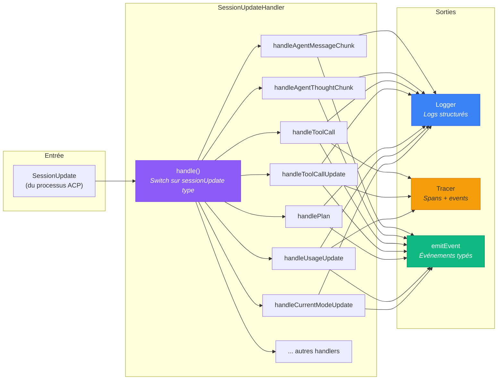
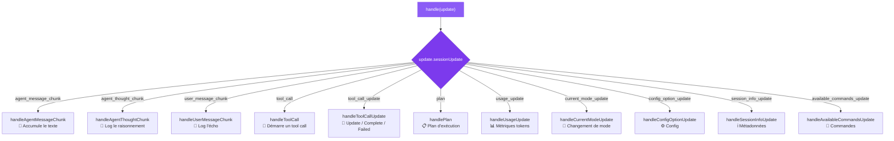
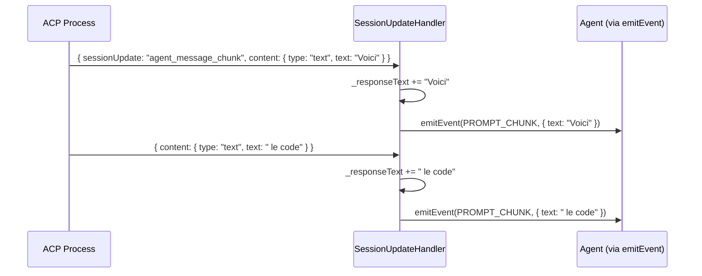
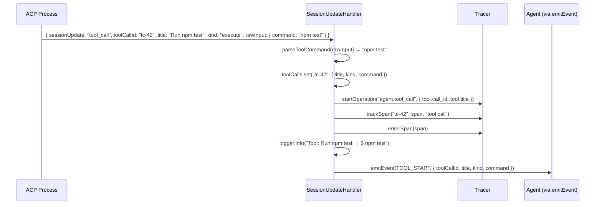
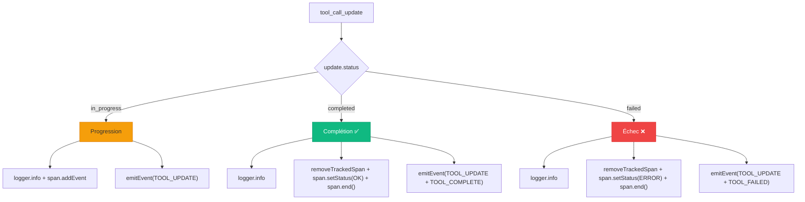
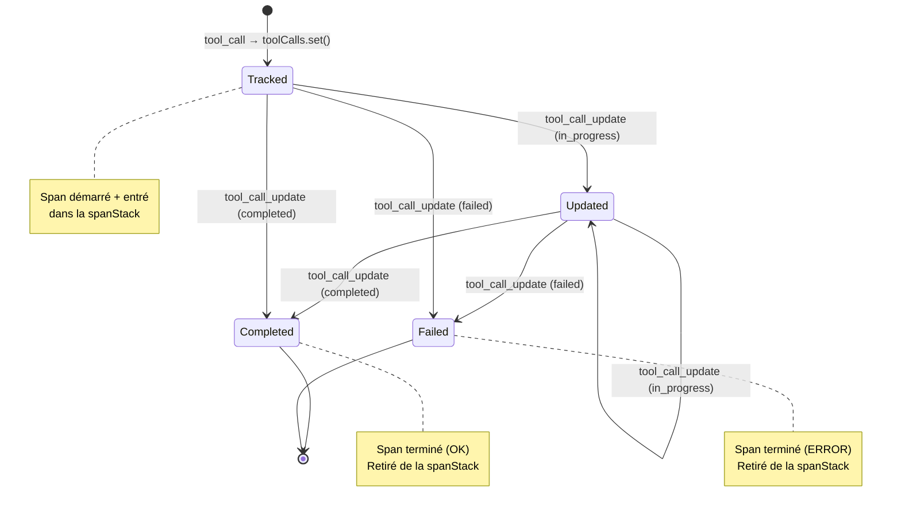
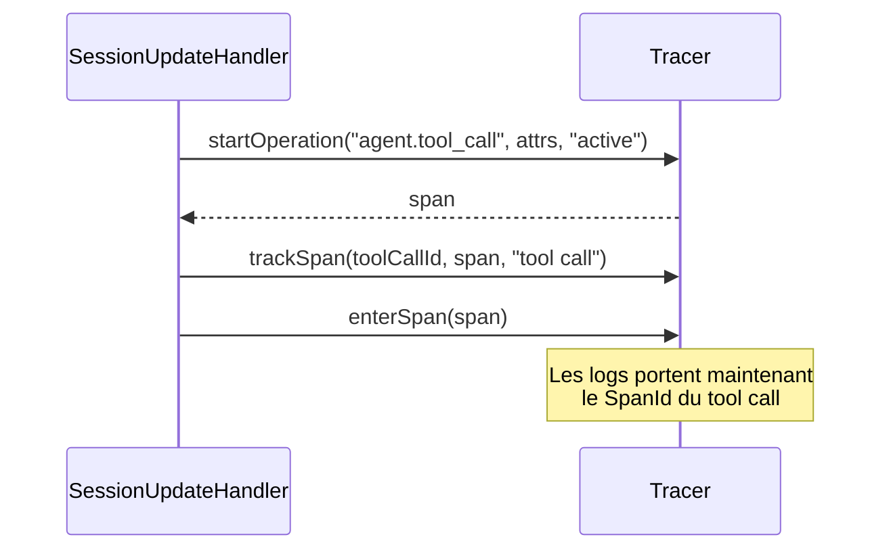
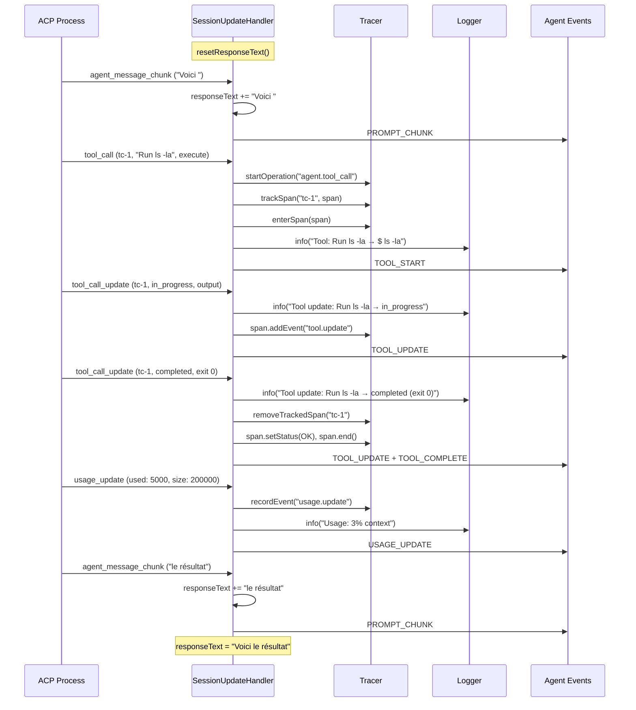
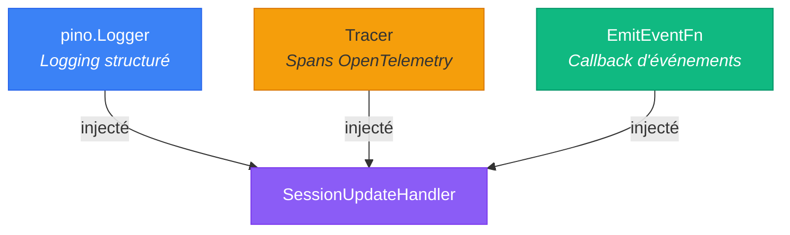

# 🔀 SessionUpdateHandler — Routeur d'événements ACP

> Le `SessionUpdateHandler` est le **centre de dispatching** de Stark. Chaque notification
> envoyée par l'agent IA pendant un prompt passe par cette brique, qui la route vers
> le bon handler pour produire des logs, des traces et des événements typés.

---

## Rôle et importance

Pendant qu'un prompt est en cours, l'agent IA envoie un **flux continu** de `SessionUpdate`
via le protocole ACP. Ces updates peuvent être des fragments de texte, des tool calls,
des mises à jour de plan, des métriques d'usage, etc.

Le SessionUpdateHandler est le **routeur** qui reçoit ce flux brut et le transforme en :

- **Logs structurés** via le [Logger](logger.md) injecté
- **Spans et événements** via le [Tracer](tracer.md) injecté
- **Événements typés** via le callback `emitEvent` injecté

| Responsabilité | Description |
|----------------|-------------|
| 🔀 **Routage** | Switch exhaustif sur le type de `SessionUpdate` |
| 📝 **Accumulation** | Concatène les fragments de réponse dans `responseText` |
| 🔧 **Tracking tool calls** | Maintient une `Map` des tool calls en cours |
| 📊 **Calcul d'usage** | Transforme les métriques brutes en pourcentages |
| 📤 **Émission** | Produit des événements typés via le callback injecté |
| 🔍 **Parsing** | Extrait commandes et exit codes des données brutes ACP |



---

## Instanciation

Le SessionUpdateHandler reçoit ses **trois dépendances** par injection dans le constructeur :

```typescript
import { AgentSessionUpdateHandler } from "./classes/agent/agent-session-update-handler.ts";

const handler = new AgentSessionUpdateHandler(
  logger,     // pino.Logger — pour le logging structuré
  tracer,     // Tracer — pour les spans OpenTelemetry
  emitEvent,  // EmitEventFn — callback d'émission d'événements
);
```

!!! info "Injecté par l'Agent"
    En pratique, c'est l'`Agent` qui crée le SessionUpdateHandler dans son constructeur
    et lui passe ses propres instances de logger, tracer et le callback `emitTyped.bind(this)`.

### Instanciation dans l'Agent

```typescript
// Dans le constructeur de Agent :
const emitEvent = this.emitTyped.bind(this);

this.sessionUpdateHandler = new AgentSessionUpdateHandler(
  this.logger,
  this.tracer,
  emitEvent,
);
```

---

## API publique

### `handle(update)` — Router un update

La méthode principale. Reçoit un `SessionUpdate` et le dispatche vers le handler approprié :

```typescript
// Le SDK ACP envoie les updates via le client
const client = acpClientFactory.build((update) => {
  handler.handle(update);  // ← Chaque update passe ici
});
```

En interne, `handle()` est un `switch` exhaustif sur le champ discriminant `sessionUpdate` :

```typescript
handle(update: SessionUpdate): void {
  switch (update.sessionUpdate) {
    case SessionUpdateType.AGENT_MESSAGE_CHUNK:
      this.handleAgentMessageChunk(update);
      break;
    case SessionUpdateType.AGENT_THOUGHT_CHUNK:
      this.handleAgentThoughtChunk(update);
      break;
    case SessionUpdateType.TOOL_CALL:
      this.handleToolCall(update);
      break;
    case SessionUpdateType.TOOL_CALL_UPDATE:
      this.handleToolCallUpdate(update);
      break;
    case SessionUpdateType.PLAN:
      this.handlePlan(update);
      break;
    case SessionUpdateType.USAGE_UPDATE:
      this.handleUsageUpdate(update);
      break;
    // ... et tous les autres types
    default:
      this.logger.warn({ update }, "Unhandled session update type");
  }
}
```

Le routage utilise l'enum `SessionUpdateType` pour garantir l'exhaustivité :



---

### `responseText` — Texte accumulé

Pendant un prompt, chaque fragment de réponse de l'agent est accumulé dans `responseText` :

```typescript
// Avant un prompt
handler.resetResponseText();

// Pendant le prompt (appelé automatiquement par handle())
// Chaque agent_message_chunk ajoute du texte

// Après le prompt
const fullText = handler.responseText;
console.log(fullText); // "Voici le serveur HTTP que j'ai créé..."
```

### `resetResponseText()` — Réinitialiser l'accumulateur

Appelé par l'Agent au début de chaque nouveau prompt pour repartir de zéro :

```typescript
handler.resetResponseText();
console.log(handler.responseText); // ""
```

---

## Les 11 handlers internes

Chaque type de `SessionUpdate` a son handler dédié. Voici le détail de chacun :

### 1. `agent_message_chunk` — Fragment de réponse

**Le plus fréquent.** Chaque morceau de la réponse texte de l'agent arrive ici.



| Action | Détail |
|--------|--------|
| Accumulation | `_responseText += text` |
| Événement | `PROMPT_CHUNK` avec le fragment |
| Log | Aucun (trop verbeux) |
| Tracing | Aucun (trop fréquent) |

---

### 2. `agent_thought_chunk` — Raisonnement interne

Les modèles avec chain-of-thought envoient leur raisonnement interne ici.

| Action | Détail |
|--------|--------|
| Log | `debug` avec le texte tronqué à 200 caractères |
| Événement | `PROMPT_THOUGHT` avec le texte complet |
| Accumulation | Non (le raisonnement n'est pas dans la réponse) |

---

### 3. `user_message_chunk` — Écho du message utilisateur

L'agent renvoit le message de l'utilisateur. Utile pour le debug.

| Action | Détail |
|--------|--------|
| Log | `trace` (niveau le plus bas) |
| Événement | Aucun |

---

### 4. `tool_call` — Nouveau tool call

L'agent décide d'utiliser un outil. C'est ici que commence le tracking du tool call.



**Ce qui est parsé depuis `rawInput` :**

Le champ `rawInput` de l'ACP est un blob opaque. Le handler utilise `parseToolCommand()`
pour en extraire la commande shell :

```typescript
// Shape connue pour les tools "execute" :
// rawInput = { command: "docker info 2>&1" }
const command = parseToolCommand(rawInput);
// → "docker info 2>&1"
```

| Action | Détail |
|--------|--------|
| Tracking | Ajout dans la `Map<toolCallId, TrackedToolCall>` |
| Tracing | Nouveau span `agent.tool_call` (enfant du span actif) |
| Log | `info` avec titre, kind, commande parsée |
| Événement | `TOOL_START` avec tous les détails |

---

### 5. `tool_call_update` — Progression ou complétion

C'est le handler **le plus complexe**. Il gère trois cas :



**Ce qui est parsé depuis `rawOutput` :**

```typescript
// Shape connue pour les tools "execute" :
// rawOutput = { content: "Tests passed\n<exited with exit code 0>" }

const output = parseToolOutput(rawOutput);
// → "Tests passed" (marqueur de sortie retiré)

const exitCode = parseExitCode(rawOutput);
// → 0
```

!!! info "Ordre important : Log avant Tracing"
    Le log est émis **avant** la fermeture du span. Cela garantit que la ligne de log
    porte encore le `SpanId` du tool call (via le mixin Pino), et non celui du prompt parent.

| Status | Actions Tracing | Événements émis |
|--------|----------------|-----------------|
| `in_progress` | `span.addEvent("tool.update")` | `TOOL_UPDATE` |
| `completed` | `removeTrackedSpan` + `leaveSpan` + `span.end()` (OK) | `TOOL_UPDATE` + `TOOL_COMPLETE` |
| `failed` | `removeTrackedSpan` + `leaveSpan` + `span.end()` (ERROR) | `TOOL_UPDATE` + `TOOL_FAILED` |

---

### 6. `plan` — Plan d'exécution

L'agent publie ou met à jour son plan d'exécution (liste de tâches avec priorités et statuts).

```typescript
// Chaque entrée du plan :
interface PlanEntry {
  content: string;          // "Créer le serveur HTTP"
  status: string;           // "completed" | "in_progress" | "pending"
  priority: string;         // "high" | "medium" | "low"
}
```

| Action | Détail |
|--------|--------|
| Log | `info` pour le résumé + une ligne par entrée |
| Événement | `PLAN_UPDATE` avec la liste complète des entrées |

---

### 7. `usage_update` — Métriques de consommation

Fournit les statistiques d'utilisation de la fenêtre de contexte et les coûts.

```typescript
// L'update brut contient :
// { used: 15000, size: 200000, cost: { amount: 0.0234, currency: "USD" } }

// Le handler calcule :
const percent = Math.round((used / size) * 100);
// → 8
```

| Action | Détail |
|--------|--------|
| Calcul | Pourcentage d'utilisation du contexte |
| Tracing | `recordEvent("active", "usage.update", attrs)` |
| Log | `info` avec used, size, percent, cost |
| Événement | `USAGE_UPDATE` avec toutes les métriques calculées |

---

### 8. `current_mode_update` — Changement de mode

L'agent change de mode (ex : `ask` → `code` → `architect`).

| Action | Détail |
|--------|--------|
| Log | `info` avec le nouveau mode |
| Événement | `MODE_CHANGE` avec le `modeId` |

---

### 9. `config_option_update` — Mise à jour de configuration

Une option de configuration de la session a changé.

| Action | Détail |
|--------|--------|
| Log | `debug` |
| Événement | `CONFIG_UPDATE` avec les options |

---

### 10. `session_info_update` — Métadonnées de session

Le titre ou d'autres métadonnées de la session ont changé.

| Action | Détail |
|--------|--------|
| Log | `debug` avec le titre |
| Événement | Aucun |

---

### 11. `available_commands_update` — Commandes disponibles

La liste des commandes slash disponibles a changé.

| Action | Détail |
|--------|--------|
| Log | `debug` avec le nombre de commandes |
| Événement | Aucun |

---

## Le tracking des tool calls

Le SessionUpdateHandler maintient une `Map` interne qui suit les tool calls en cours :

```typescript
interface TrackedToolCall {
  title: string;      // Titre humain du tool call
  kind?: string;      // Catégorie : "execute", "read", "edit", etc.
  status?: string;    // Status actuel : "in_progress", "completed", "failed"
  command?: string;   // Commande shell parsée (pour les tools "execute")
}

// Map interne :
private readonly toolCalls = new Map<string, TrackedToolCall>();
```

### Cycle de vie d'un tool call tracké



---

## Les helpers de parsing

Le SessionUpdateHandler utilise des utilitaires de parsing pour extraire des données
propres des blobs opaques `rawInput` et `rawOutput` de l'ACP :

### `parseToolCommand(rawInput)`

Extrait la commande shell d'un tool call de type "execute" :

```typescript
parseToolCommand({ command: "docker info 2>&1" });
// → "docker info 2>&1"

parseToolCommand({ something: "else" });
// → undefined

parseToolCommand(null);
// → undefined
```

### `parseToolOutput(rawOutput)`

Extrait le texte de sortie en retirant le marqueur de code de sortie :

```typescript
parseToolOutput({
  content: "Hello World\n<exited with exit code 0>",
});
// → "Hello World"

parseToolOutput({ content: "Error!\n<exited with exit code 1>" });
// → "Error!"
```

### `parseExitCode(rawOutput)`

Extrait le code de sortie numérique du marqueur ACP :

```typescript
parseExitCode({ content: "ok\n<exited with exit code 0>" });
// → 0

parseExitCode({ content: "err\n<exited with exit code 127>" });
// → 127

parseExitCode({ content: "no marker here" });
// → undefined
```

!!! info "Format ACP"
    Le processus ACP `copilot` termine la sortie des commandes avec le marqueur
    `<exited with exit code N>`. Ces helpers centralisent le parsing de ce format
    pour que les consommateurs reçoivent des données propres.

---

## Tracing des tool calls

Le SessionUpdateHandler gère 4 opérations de tracing pour les tool calls :

### `traceToolCallStart`

Démarre un span `agent.tool_call` comme enfant du span actif et le tracke par `toolCallId` :



### `traceToolCallUpdate`

Ajoute un événement au span du tool call en cours :

```typescript
// No-op si le span n'existe pas ou n'enregistre plus
const span = tracer.getTrackedSpan(toolCallId);
if (span?.isRecording()) {
  span.addEvent("tool.update", { status, output, exit_code });
}
```

### `traceToolCallEnd`

Termine le span du tool call avec le bon statut :

```typescript
const span = tracer.removeTrackedSpan(toolCallId);  // retire du tracking
span.setAttribute("tool.status", status);
span.setAttribute("tool.exit_code", exitCode);
span.setStatus(failed ? ERROR : OK);
tracer.leaveSpan(span);  // retire de la spanStack
span.end();
```

### `traceUsageUpdate`

Enregistre un événement d'usage sur le span actif (sans créer de nouveau span) :

```typescript
tracer.recordEvent("active", "usage.update", {
  "usage.context_used": used,
  "usage.context_size": size,
  "usage.context_percent": percent,
  "usage.cost_amount": cost?.amount,
  "usage.cost_currency": cost?.currency,
});
```

---

## Diagramme de séquence complet

Voici un prompt complet vu du point de vue du SessionUpdateHandler :



---

## Architecture interne

### Dépendances injectées

Le SessionUpdateHandler ne crée **aucune** de ses dépendances. Tout est injecté :



### État interne

| État | Type | Description |
|------|------|-------------|
| `toolCalls` | `Map<string, TrackedToolCall>` | Tool calls en cours, keyed par `toolCallId` |
| `_responseText` | `string` | Texte accumulé du prompt en cours |

---

## Le type `EmitEventFn`

Le callback d'émission d'événements est typé pour garantir la cohérence :

```typescript
type EmitEventFn = <K extends AgentEvent>(
  event: K,
  payload: Omit<AgentEventMap[K], keyof BaseAgentEvent>,
) => void;
```

Ce type signifie :

- Le premier argument est un membre de l'enum `AgentEvent`
- Le second argument est le payload **sans** les champs de base (event, timestamp, agent)
- Les champs de base sont injectés automatiquement par l'Agent dans `emitTyped()`

```typescript
// L'appelant fournit uniquement les champs métier :
emitEvent(AgentEvent.TOOL_START, {
  toolCallId: "tc-42",
  title: "Run npm test",
  kind: "execute",
  command: "npm test",
});

// L'Agent ajoute automatiquement :
// {
//   event: "tool:start",
//   timestamp: "2025-01-15T14:32:07.421Z",
//   agent: { id: "...", name: "..." },
//   ... les champs ci-dessus
// }
```

---

## Exemple d'utilisation autonome

Le SessionUpdateHandler peut être utilisé indépendamment pour les tests :

```typescript
import { AgentSessionUpdateHandler } from "./classes/agent/agent-session-update-handler.ts";
import { Tracer } from "./classes/tracer/tracer.ts";
import { createSilentLogger } from "./logger/create-logger.ts";
import { AgentEvent } from "./enums/agent-event.enum.ts";

// Créer les dépendances
const logger = createSilentLogger();
const tracer = new Tracer({ enabled: false });

const events: Array<{ event: AgentEvent; payload: unknown }> = [];
const emitEvent = (event: AgentEvent, payload: unknown) => {
  events.push({ event, payload });
};

// Créer le handler
const handler = new AgentSessionUpdateHandler(logger, tracer, emitEvent);

// Simuler un flux d'updates
handler.handle({
  sessionUpdate: "agent_message_chunk",
  content: { type: "text", text: "Hello " },
});

handler.handle({
  sessionUpdate: "agent_message_chunk",
  content: { type: "text", text: "World!" },
});

// Vérifier
console.log(handler.responseText); // "Hello World!"
console.log(events.length);        // 2
console.log(events[0].event);      // "prompt:chunk"
```

---

## Résumé

| Concept | Description |
|---------|-------------|
| **Entrée** | `SessionUpdate` du protocole ACP |
| **Routage** | Switch exhaustif via `SessionUpdateType` enum |
| **Sorties** | Logs (Pino) + Traces (OTel) + Events (callback) |
| **État** | `responseText` accumulé + `toolCalls` map |
| **Parsing** | `parseToolCommand`, `parseToolOutput`, `parseExitCode` |
| **Tracing** | Start/update/end des spans tool call + usage events |
| **Dépendances** | Logger, Tracer, EmitEventFn — toutes injectées |

---

## Liens

- [**Architecture**](../architecture/overview.md) — Vue d'ensemble du système
- [**Agent**](agent.md) — L'orchestrateur qui crée le SessionUpdateHandler
- [**Tracer**](tracer.md) — Utilisé pour les spans des tool calls
- [**Logger**](logger.md) — Utilisé pour le logging structuré
- [**Agent Client Protocol**](acp.md) — Source des `SessionUpdate`
- [**ACPClientFactory**](acp-client-factory.md) — L'autre consommateur du Tracer et Logger
- [**Événements typés**](../concepts/events.md) — Détail des événements émis
- [**Flux & Séquences**](../architecture/sequences.md) — Diagrammes montrant le handler en action