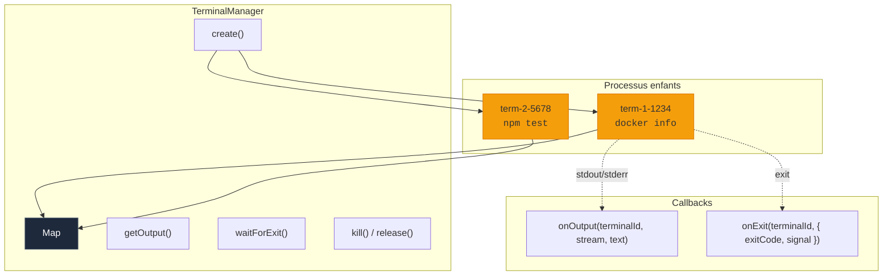
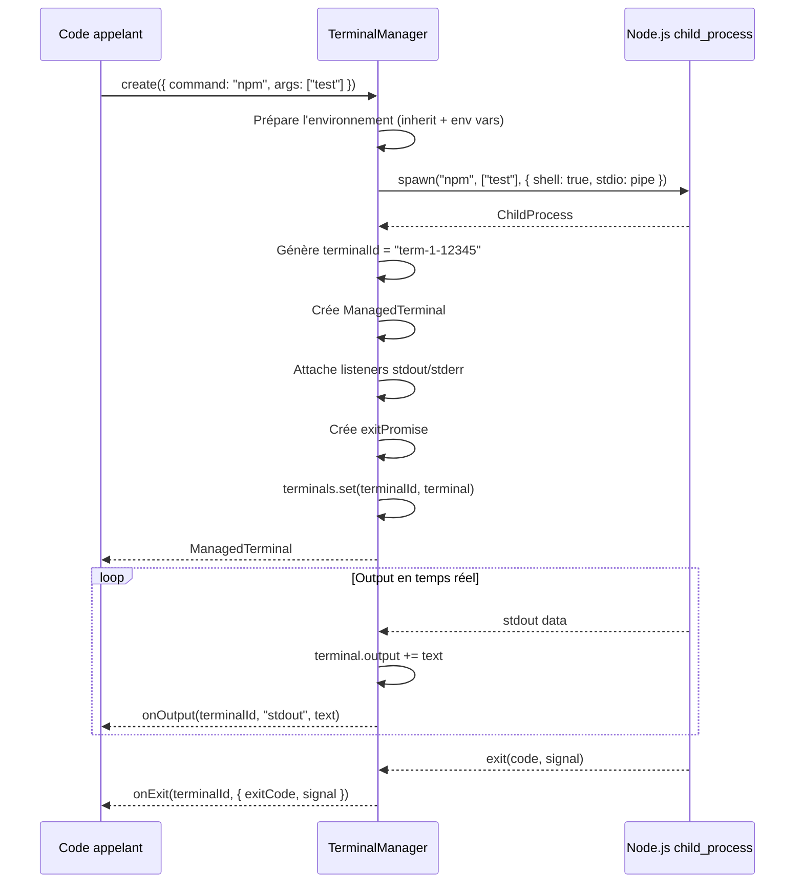
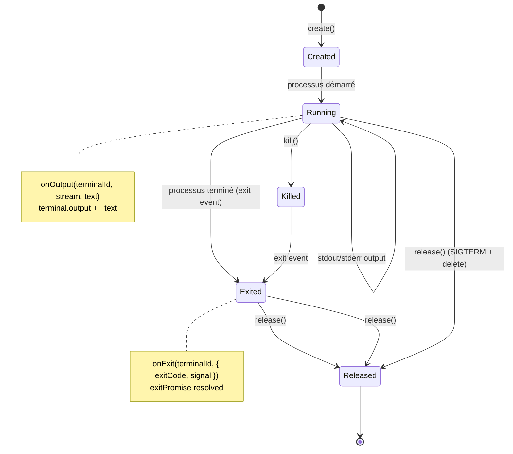
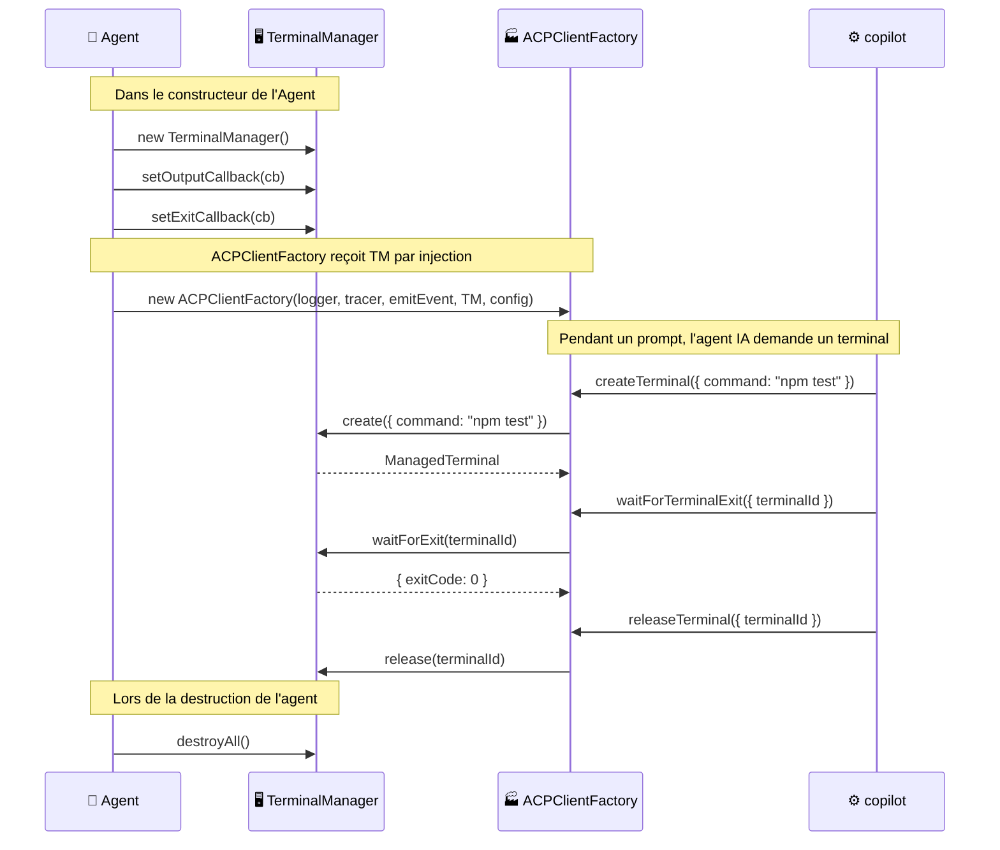
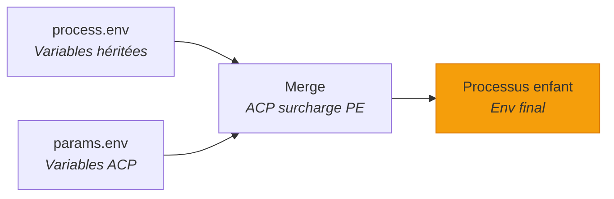

# 🖥️ TerminalManager — Gestion des processus terminaux

> Le `TerminalManager` gère le **cycle de vie complet** des processus enfants
> spawné par l'agent IA. Chaque commande shell exécutée par l'agent passe par
> cette brique : spawn, capture de la sortie, attente de fin, kill et nettoyage.

---

## Rôle et importance

Le TerminalManager est la **couche d'exécution système** de Stark. Quand l'agent IA
décide d'exécuter une commande (`docker build`, `npm test`, `cat fichier.txt`...),
c'est le TerminalManager qui traduit cette intention en un vrai processus Unix.

| Responsabilité | Description |
|----------------|-------------|
| 🚀 **Spawn** | Lance des processus enfants avec le bon environnement |
| 📤 **Capture output** | Accumule stdout + stderr et notifie en temps réel |
| ⏳ **Attente de fin** | Promise-based `waitForExit()` pour le protocole ACP |
| 📊 **Snapshots output** | Retourne l'output accumulé à la demande |
| 🔪 **Kill & Release** | SIGTERM / SIGKILL et nettoyage des ressources |
| 🔌 **Découplé** | Aucune dépendance sur Agent, ACP, Tracer ou Logger |



!!! tip "Découplage total"
    Le TerminalManager ne sait **rien** de l'ACP, du Tracer, du Logger ou de l'Agent.
    Il est conçu pour être testé et réutilisé indépendamment. L'Agent câble les
    callbacks après instanciation.

---

## Instanciation minimale

```typescript
import { TerminalManager } from "./classes/terminal-manager/terminal-manager.ts";

const manager = new TerminalManager();

// Spawner un processus
const terminal = manager.create({
  command: "echo",
  args: ["Hello World"],
  cwd: "/tmp",
});

console.log(terminal.terminalId); // "term-1-12345"
console.log(terminal.command);    // "echo"

// Attendre la fin
const result = await manager.waitForExit(terminal.terminalId);
console.log(result.exitCode);     // 0

// Lire la sortie
console.log(terminal.output);     // "Hello World\n"

// Libérer les ressources
manager.release(terminal.terminalId);
```

---

## Instanciation avec callbacks

En pratique, on veut être **notifié en temps réel** de la sortie et de la fin
des processus. Le TerminalManager expose deux hooks :

```typescript
const manager = new TerminalManager();

// Callback de sortie — appelé à chaque chunk stdout/stderr
manager.setOutputCallback((terminalId, stream, text) => {
  console.log(`[${terminalId}] (${stream}): ${text}`);
});

// Callback de fin — appelé quand le processus se termine
manager.setExitCallback((terminalId, result) => {
  console.log(`[${terminalId}] exited with code ${result.exitCode}`);
});

// Maintenant, chaque processus spawné déclenche les callbacks
const term = manager.create({ command: "ls", args: ["-la"], cwd: "." });
```

!!! info "Câblage dans l'Agent"
    L'Agent câble ces callbacks dans son constructeur pour émettre les événements
    `terminal:output` et `terminal:exit`, et pour gérer les spans de tracing.

---

## API complète

### `create(params)` — Spawner un processus

Crée un nouveau processus enfant et commence à le tracker :

```typescript
const terminal = manager.create({
  command: "docker",
  args: ["build", "-t", "myapp", "."],
  cwd: "/mon/projet",
  env: [
    { name: "NODE_ENV", value: "production" },
    { name: "CI", value: "true" },
  ],
});
```

Le type `CreateTerminalRequest` vient directement du SDK ACP :

```typescript
// Paramètres (du SDK ACP)
interface CreateTerminalRequest {
  command: string;         // Commande à exécuter
  args?: string[];         // Arguments (défaut: [])
  cwd?: string;            // Répertoire de travail (défaut: process.cwd())
  env?: EnvVar[];          // Variables d'environnement additionnelles
}

interface EnvVar {
  name: string;
  value: string;
}
```

**Ce qui se passe en interne :**



**Détails importants :**

| Aspect | Détail |
|--------|--------|
| **Shell** | `shell: true` — les commandes sont exécutées via le shell système |
| **Stdio** | `["pipe", "pipe", "pipe"]` — stdin, stdout, stderr sont tous capturés |
| **Environnement** | Hérite de `process.env` + variables supplémentaires de l'ACP |
| **ID du terminal** | Format `term-{counter}-{pid}` — déterministe et lisible |

---

### `getOutput(terminalId)` — Lire la sortie accumulée

Retourne un snapshot de la sortie accumulée et du statut de sortie :

```typescript
const output = manager.getOutput(terminal.terminalId);

console.log(output.output);     // "Building image...\nStep 1/5..."
console.log(output.truncated);  // false (jamais tronqué dans l'implem actuelle)
console.log(output.exitStatus); // { exitCode: 0 } ou undefined si encore en cours
```

Le type retourné est `TerminalOutputResponse` (du SDK ACP) :

```typescript
interface TerminalOutputResponse {
  output: string;
  truncated: boolean;
  exitStatus?: TerminalExitStatus;
}
```

!!! warning "Erreur si ID inconnu"
    Appeler `getOutput()` avec un `terminalId` inconnu lance une `Error`.

---

### `waitForExit(terminalId)` — Attendre la fin

Attend que le processus se termine et retourne son statut de sortie :

```typescript
const result = await manager.waitForExit(terminal.terminalId);

console.log(result.exitCode); // 0 (succès) ou 1, 127, etc.
console.log(result.signal);   // undefined ou "SIGTERM", "SIGKILL", etc.
```

Le type retourné est `WaitForTerminalExitResponse` (du SDK ACP) :

```typescript
interface WaitForTerminalExitResponse {
  exitCode?: number | null;
  signal?: string | null;
}
```

!!! tip "Promise-based"
    `waitForExit()` retourne une Promise qui se résout dès que le processus enfant
    émet l'événement `exit`. Si le processus est déjà terminé, la Promise est déjà résolue.

---

### `release(terminalId)` — Libérer un terminal

Envoie `SIGTERM` au processus (s'il tourne encore) et le retire du tracking :

```typescript
manager.release(terminal.terminalId);

// Après release :
manager.has(terminal.terminalId); // false
```

**Comportement :**

- Si le processus est encore en cours → `SIGTERM`
- Si le processus est déjà terminé → rien
- Le terminal est retiré de la `Map` interne
- Appeler `release()` sur un ID inconnu est un **no-op** (pas d'erreur)

---

### `kill(terminalId)` — Tuer un processus

Envoie `SIGKILL` au processus **sans le retirer** du tracking :

```typescript
manager.kill(terminal.terminalId);

// Le terminal reste tracké — on peut encore lire sa sortie
const output = manager.getOutput(terminal.terminalId);
console.log(output.output);

// Pour le retirer aussi du tracking :
manager.release(terminal.terminalId);
```

!!! info "SIGKILL vs SIGTERM"
    - `kill()` envoie `SIGKILL` (force brute, non interceptable) mais **garde** le terminal tracké
    - `release()` envoie `SIGTERM` (arrêt propre) et **retire** le terminal du tracking

---

### `has(terminalId)` — Vérifier l'existence

```typescript
if (manager.has("term-1-12345")) {
  console.log("Terminal existe et est tracké");
}
```

---

### `size` — Nombre de terminaux trackés

```typescript
console.log(`${manager.size} terminaux actifs`);
```

---

### `destroyAll()` — Nettoyage total

Tue et libère **tous** les terminaux trackés. Appelé par `Agent.destroy()` :

```typescript
manager.destroyAll();
// Tous les processus reçoivent SIGTERM
// Tous les terminaux sont retirés de la Map
console.log(manager.size); // 0
```

---

## Le `ManagedTerminal` — Structure de données

Chaque terminal tracké est représenté par un objet `ManagedTerminal` :

```typescript
interface ManagedTerminal {
  /** Le processus enfant Node.js */
  readonly child: ChildProcess;

  /** Identifiant unique "term-{counter}-{pid}" */
  readonly terminalId: string;

  /** Commande exécutée */
  readonly command: string;

  /** Arguments passés */
  readonly args: string[];

  /** Répertoire de travail */
  readonly cwd: string;

  /** Sortie accumulée (stdout + stderr mélangés) */
  output: string;

  /** Promise résolue quand le processus se termine */
  readonly exitPromise: Promise<TerminalExitResult>;
}
```

!!! info "Output mutable"
    Le champ `output` est le seul champ mutable. Il est incrémenté à chaque
    chunk reçu sur stdout ou stderr. Les deux streams sont mélangés dans l'ordre
    d'arrivée.

---

## Diagramme du cycle de vie



---

## Intégration avec l'Agent

Voici comment l'Agent utilise le TerminalManager :



### Câblage des callbacks

Dans le constructeur de l'Agent, les callbacks sont câblés pour :

1. **Émettre des événements** (`terminal:output`, `terminal:exit`)
2. **Logger** les sorties et les codes de sortie
3. **Gérer les spans** de tracing (enter/leave/end du span terminal)

```typescript
// Dans le constructeur de Agent :
this.terminalManager.setOutputCallback((terminalId, stream, text) => {
  this.logger.debug({ terminalId, stream }, truncate(text, 300));
  this.emitTyped(AgentEvent.TERMINAL_OUTPUT, {
    terminalId,
    stream,
    text,
  });
});

this.terminalManager.setExitCallback((terminalId, result) => {
  const termSpan = this.tracer.getTrackedSpan(terminalId);
  if (termSpan) this.tracer.enterSpan(termSpan);

  this.logger.info(
    { terminalId, exitCode: result.exitCode, signal: result.signal },
    "Terminal exited",
  );

  this.traceTerminalEnd(terminalId, result.exitCode, result.signal);

  this.emitTyped(AgentEvent.TERMINAL_EXIT, {
    terminalId,
    exitCode: result.exitCode,
    signal: result.signal,
  });
});
```

---

## Génération des IDs

Les IDs de terminaux sont générés avec un compteur global et le PID du processus :

```typescript
let terminalCounter = 0;

// Dans create() :
const terminalId = `term-${++terminalCounter}-${child.pid ?? "nopid"}`;
```

| Composant | Exemple | Description |
|-----------|---------|-------------|
| Préfixe | `term-` | Identifie le type de ressource |
| Compteur | `1`, `2`, `3`... | Incrémenté globalement (monotone) |
| PID | `12345` | PID du processus enfant (ou `"nopid"`) |

Exemples : `term-1-12345`, `term-2-67890`, `term-3-nopid`

!!! info "Compteur global"
    Le compteur est **global au module**, pas à l'instance. Cela garantit l'unicité
    même si plusieurs `TerminalManager` sont créés (cas de test).

---

## Gestion de l'environnement

Les processus héritent de **tout l'environnement** du processus parent, avec la possibilité
d'ajouter ou surcharger des variables :

```typescript
// Environnement = process.env + variables ACP
const env: Record<string, string | undefined> = { ...process.env };

if (params.env) {
  for (const envVar of params.env) {
    env[envVar.name] = envVar.value;
  }
}

const child = spawn(params.command, args, {
  cwd,
  stdio: ["pipe", "pipe", "pipe"],
  env,
  shell: true,
});
```



---

## Exemple complet autonome

Le TerminalManager peut s'utiliser **sans Agent** grâce à son découplage :

```typescript
import { TerminalManager } from "./classes/terminal-manager/terminal-manager.ts";

const manager = new TerminalManager();

// Configurer les callbacks
manager.setOutputCallback((id, stream, text) => {
  process.stderr.write(`[${id}] ${stream}: ${text}`);
});

manager.setExitCallback((id, result) => {
  console.log(`[${id}] Terminé: code=${result.exitCode}`);
});

// Lancer une commande
const term = manager.create({
  command: "find",
  args: [".", "-name", "*.ts", "-type", "f"],
  cwd: "/mon/projet",
});

// Attendre la fin
const result = await manager.waitForExit(term.terminalId);

// Afficher le résultat
console.log(`Exit code: ${result.exitCode}`);
console.log(`Output:\n${term.output}`);

// Nettoyer
manager.release(term.terminalId);
```

---

## Résumé

| Concept | Description |
|---------|-------------|
| **Spawn** | `spawn()` avec `shell: true`, stdio pipé, env hérité + overrides |
| **Tracking** | `Map<terminalId, ManagedTerminal>` — lookup O(1) |
| **Output** | stdout + stderr accumulés dans `terminal.output` + callback temps réel |
| **Exit** | Promise-based via `exitPromise` + callback `onExit` |
| **Kill** | `SIGKILL` (force) vs `SIGTERM` (propre) |
| **Release** | SIGTERM + suppression du tracking |
| **Découplage** | Aucune dépendance sur Agent, ACP, Tracer ou Logger |
| **IDs** | `term-{counter}-{pid}` — déterministes et lisibles |

---

## Liens

- [**Architecture**](../architecture/overview.md) — Vue d'ensemble du système
- [**Agent**](agent.md) — L'orchestrateur qui crée et câble le TerminalManager
- [**ACPClientFactory**](acp-client-factory.md) — Utilise le TerminalManager pour les callbacks ACP
- [**Flux & Séquences**](../architecture/sequences.md) — Diagrammes montrant le flux terminal complet
- [**Événements typés**](../concepts/events.md) — Events `terminal:created`, `terminal:output`, `terminal:exit`
