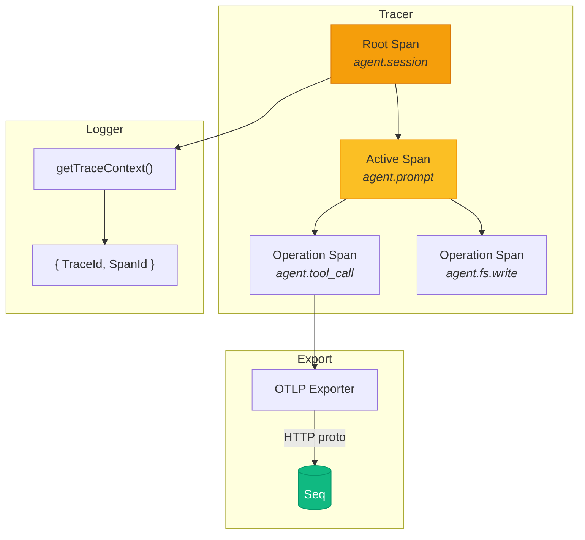
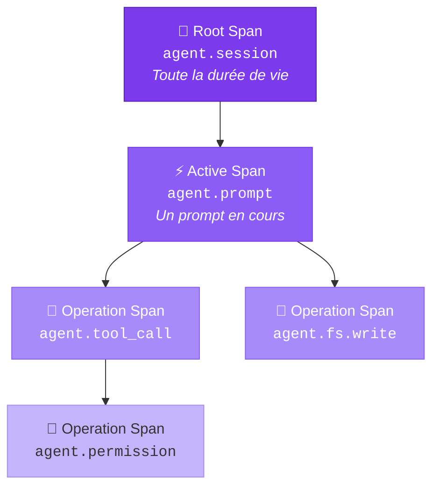
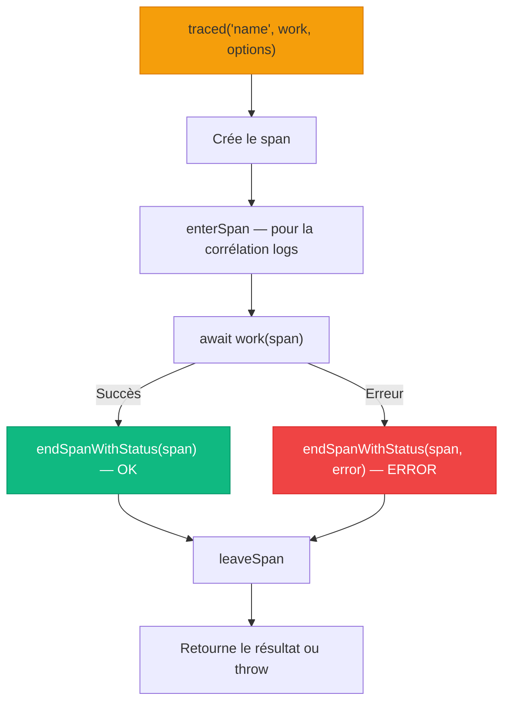
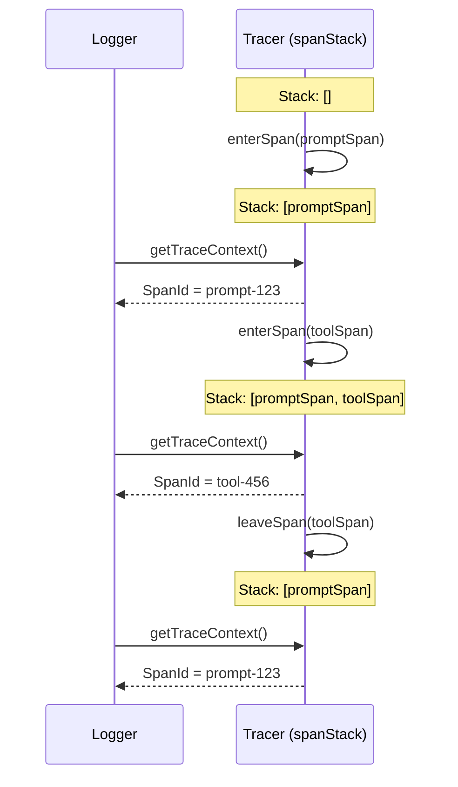
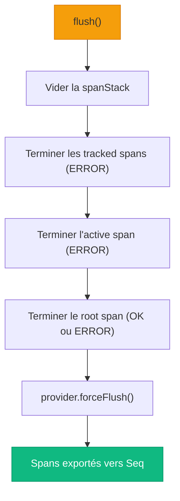
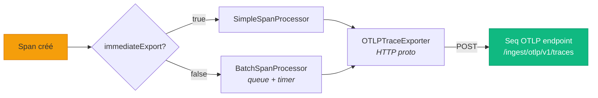

# 📡 Tracer — Tracing distribué avec OpenTelemetry

> Le `Tracer` est le wrapper générique autour d'OpenTelemetry qui donne à Stark
> une **visibilité complète** sur chaque opération. Chaque prompt, chaque tool call,
> chaque lecture de fichier est capturée sous forme de **span** et exportée vers Seq.

---

## Rôle et importance

Le Tracer est la **couche d'observabilité temporelle** de Stark. Là où le [Logger](logger.md)
capture des **événements ponctuels** (lignes de log), le Tracer capture des **durées** :
combien de temps a pris un prompt, un tool call, une écriture de fichier.

| Responsabilité | Description |
|----------------|-------------|
| 🌳 **Hiérarchie de spans** | Root → Active → Operation, avec parenté automatique |
| 🔗 **Corrélation logs ↔ traces** | Fournit `TraceId`/`SpanId` au Logger via `getTraceContext()` |
| 📦 **Tracking de spans long-lived** | Spans démarrés et terminés à des endroits différents |
| 🔄 **Pile de contexte** | Stack de spans pour la corrélation fine des logs |
| 🚀 **Export OTLP** | Envoi des traces vers Seq (ou tout backend compatible) |
| 🔇 **No-op transparent** | Quand désactivé, aucun overhead — pas de `if` dans le code appelant |



---

## Concepts clés

### La hiérarchie des spans

Le Tracer gère une hiérarchie à **trois niveaux** :



| Niveau | Slot | Cardinalité | Exemple |
|--------|------|-------------|---------|
| **Root** | `rootSpan` | 1 par Tracer | `agent.session` — du `new Agent()` au `destroy()` |
| **Active** | `activeSpan` | 0 ou 1 à la fois | `agent.prompt` — un seul prompt actif |
| **Operation** | (libre) | 0 à N | `agent.tool_call`, `agent.fs.read`, `agent.permission` |

### Le `ParentStrategy`

Chaque opération peut choisir **sous quel span** elle se place :

```typescript
type ParentStrategy = "root" | "active" | Span;
```

| Stratégie | Résolution | Cas d'usage |
|-----------|------------|-------------|
| `"root"` | Enfant direct du root span | Phases d'initialisation |
| `"active"` | Enfant du span actif (fallback: root) | Tool calls pendant un prompt |
| `Span` | Enfant d'un span explicite | Sous-opérations imbriquées |

---

## Instanciation

### Tracer activé (production)

```typescript
import { Tracer } from "./classes/tracer/tracer.ts";

const tracer = new Tracer({
  enabled: true,
  serviceName: "stark-agent",
  tracerName: "stark-agent",
  endpoint: "http://localhost:5341/ingest/otlp/v1/traces",
});
```

### Tracer désactivé (tests, CI)

```typescript
const tracer = new Tracer({ enabled: false });

// Toutes les méthodes retournent des no-op spans
const span = tracer.startRootSpan("test");
span.isRecording(); // false — aucun overhead
```

### Tracer avec provider custom (tests unitaires)

```typescript
import { InMemorySpanExporter, SimpleSpanProcessor } from "@opentelemetry/sdk-trace-base";
import { BasicTracerProvider } from "@opentelemetry/sdk-trace-base";

const exporter = new InMemorySpanExporter();
const provider = new BasicTracerProvider({
  spanProcessors: [new SimpleSpanProcessor(exporter)],
});

const tracer = new Tracer({ enabled: true, provider });

// Après les opérations :
await tracer.flush();
const spans = exporter.getFinishedSpans();
console.log(spans.length); // Nombre de spans créés
```

---

## Configuration complète

```typescript
interface TracerConfig {
  /** Active ou désactive le tracing. Défaut: true */
  enabled?: boolean;

  /** URL de l'endpoint OTLP.
   *  Défaut: $SEQ_URL/ingest/otlp/v1/traces
   *  ou http://localhost:5341/ingest/otlp/v1/traces */
  endpoint?: string;

  /** Clé API optionnelle (header X-Seq-ApiKey) */
  apiKey?: string;

  /** Nom du service dans les traces. Défaut: "stark" */
  serviceName?: string;

  /** Version du service. Défaut: "0.1.0" */
  serviceVersion?: string;

  /** Nom du tracer interne. Défaut: "stark" */
  tracerName?: string;

  /** Version du tracer interne. Défaut: "0.1.0" */
  tracerVersion?: string;

  /** Export immédiat (debug) vs batch (perf). Défaut: false */
  immediateExport?: boolean;

  /** Ratio d'échantillonnage (0.0 à 1.0). Défaut: 1.0 */
  samplingRatio?: number;

  /** Config du batch processor */
  batchConfig?: {
    maxQueueSize?: number;       // Défaut: 512
    maxExportBatchSize?: number; // Défaut: 64
    scheduledDelayMillis?: number; // Défaut: 2000
  };

  /** Provider pré-configuré (tests). Contourne la création auto */
  provider?: BasicTracerProvider;
}
```

---

## API complète

### Root Span — Durée de vie globale

Le root span englobe **toute la durée de vie** de l'entité tracée :

```typescript
// Démarrer le root span
const rootSpan = tracer.startRootSpan("agent.session", {
  "agent.id": "abc-123",
  "agent.name": "Swift Nova",
});

// ... toute la vie de l'agent ...

// Terminer proprement
tracer.endRootSpan("ok");

// Ou en cas d'erreur
tracer.endRootSpan("error", "Session crashed");
```

!!! warning "Un seul root span"
    Appeler `startRootSpan()` alors qu'un root span existe déjà termine le précédent
    avec le status `ERROR` et le message `"Root span replaced before completion"`.

---

### Active Span — Un travail en cours

Le span actif représente l'**unité de travail courante** (ex : un prompt).
Il sert de parent par défaut pour les opérations (`parent: "active"`) :

```typescript
// Démarrer un span actif (enfant du root)
const promptSpan = tracer.startActiveSpan("agent.prompt", {
  "prompt.index": 1,
  "prompt.text": "Crée un serveur HTTP",
  "prompt.text_length": 21,
});

// ... le prompt s'exécute ...

// Terminer le span actif (succès)
tracer.endActiveSpan(promptSpan);

// Ou avec une erreur
tracer.endActiveSpan(promptSpan, new Error("Prompt failed"));
```

!!! info "Un seul à la fois"
    `startActiveSpan()` remplace le span actif précédent. C'est cohérent avec
    le modèle "un seul prompt à la fois" de l'Agent.

---

### Operation Spans — Opérations arbitraires

L'API générique pour tracer n'importe quelle opération :

```typescript
// Démarrer une opération (enfant du span actif par défaut)
const span = tracer.startOperation("agent.tool_call", {
  "tool.call_id": "tc-42",
  "tool.title": "Run docker info",
  "tool.kind": "execute",
}, "active");

// Ajouter des événements en cours de route
span.addEvent("tool.progress", { status: "in_progress" });
span.setAttribute("tool.exit_code", 0);

// Terminer l'opération
tracer.endOperation(span);

// Ou avec une erreur
tracer.endOperation(span, new Error("Command failed"));
```

#### Choix du parent

```typescript
// Enfant du span actif (prompt en cours)
tracer.startOperation("db.query", attrs, "active");

// Enfant du root span (opération de haut niveau)
tracer.startOperation("agent.initialize", attrs, "root");

// Enfant d'un span explicite
const parentSpan = tracer.startOperation("parent.op", {});
tracer.startOperation("child.op", {}, parentSpan);
```

---

### `traced()` — Wrapper try/catch automatique

Pour les opérations async où l'on veut automatiquement gérer le span :

```typescript
const content = await tracer.traced(
  "agent.fs.read",
  async (span) => {
    const data = await readFile("/path/to/file", "utf-8");
    span.setAttribute("fs.content_length", data.length);
    return data;
  },
  {
    attributes: { "fs.path": "/path/to/file", "fs.operation": "read" },
    parent: "active",
  },
);
// Le span est automatiquement terminé avec OK ou ERROR
```



Il existe aussi une version synchrone :

```typescript
const parsed = tracer.tracedSync(
  "json.parse",
  (span) => {
    const obj = JSON.parse(rawData);
    span.setAttribute("json.keys", Object.keys(obj).length);
    return obj;
  },
  { attributes: { "json.length": rawData.length }, parent: "active" },
);
```

---

### Span Tracking — Spans long-lived

Pour les spans qui sont **démarrés** et **terminés** à des endroits différents du code
(ex : un terminal qui tourne en arrière-plan) :

```typescript
// Démarrer et tracker le span
const span = tracer.startOperation("agent.terminal", {
  "terminal.id": "term-1",
  "terminal.command": "npm test",
});
tracer.trackSpan("term-1", span, "terminal");

// ... plus tard, dans un autre callback ...

// Récupérer le span
const tracked = tracer.getTrackedSpan("term-1");
tracked?.addEvent("terminal.output", { text: "Tests passed" });

// Terminer et retirer du tracking
const removed = tracer.removeTrackedSpan("term-1");
if (removed) {
  removed.setStatus({ code: SpanStatusCode.OK });
  removed.end();
}
```

!!! tip "Remplacement automatique"
    Si un span est tracké avec un ID déjà existant, l'ancien span est automatiquement
    terminé avec `ERROR` et le message `"operation replaced before completion"`.

---

### Span Context Stack — Corrélation fine des logs

La pile de contexte permet d'**associer les logs au span le plus spécifique** en cours :

```typescript
// Entrer dans un span (pour la corrélation des logs)
const toolSpan = tracer.startOperation("agent.tool_call", { ... }, "active");
tracer.enterSpan(toolSpan);

// Tous les logs ici portent le SpanId du toolSpan
logger.info("Tool started");  // ← SpanId = toolSpan.spanId

// Quitter le span
tracer.leaveSpan(toolSpan);
tracer.endOperation(toolSpan);

// Les logs reprennent le SpanId du span parent
logger.info("Back to prompt"); // ← SpanId = activeSpan.spanId
```



La résolution du contexte suit un ordre de priorité :

1. **Top de la stack** (le plus spécifique)
2. **Active span** (le prompt en cours)
3. **Root span** (la session)

---

### `getTraceContext()` — Pour la corrélation logs ↔ traces

Cette méthode est appelée par le Logger Pino (via le `mixin`) à chaque ligne de log :

```typescript
const ctx = tracer.getTraceContext();

if (ctx) {
  console.log(ctx.TraceId);      // "abc123..." (32 hex chars)
  console.log(ctx.SpanId);       // "def456..." (16 hex chars)
  console.log(ctx.ParentSpanId); // "789ghi..." (si le span a un parent)
}
```

Le `ParentSpanId` est dérivé d'une `WeakMap` interne (`spanParents`) qui enregistre
le parent de chaque span à sa création. Cela permet à Seq de reconstruire la hiérarchie
complète **même sans données OTLP** — uniquement à partir des logs.

!!! info "Convention Seq"
    Les champs sont nommés en **PascalCase** (`TraceId`, `SpanId`, `ParentSpanId`)
    car c'est ce que Seq attend pour la corrélation automatique.

---

### Event Recording — Événements sur les spans

Ajouter des événements à un span sans en créer un nouveau :

```typescript
// Enregistrer un événement sur le span actif
tracer.recordEvent("active", "usage.update", {
  "usage.context_used": 15000,
  "usage.context_size": 200000,
  "usage.context_percent": 8,
});

// Sur le root span
tracer.recordEvent("root", "session.mode_change", {
  "mode.id": "architect",
});

// Sur un span explicite
const mySpan = tracer.startOperation("my.op", {});
tracer.recordEvent(mySpan, "my.event", { key: "value" });
```

---

### Flush & Shutdown

```typescript
// Flush — exporte les spans en attente sans détruire le provider
await tracer.flush();
// ⚠️ Termine aussi les spans en suspens (tracked, active) avec ERROR

// Shutdown — flush + destruction du provider
await tracer.shutdown();
// Après ça, le tracer ne peut plus créer de spans
```

Le flush suit un ordre strict :



!!! tip "Best-effort"
    Les erreurs d'export OTLP sont **silencieusement ignorées**. Le tracing ne doit
    jamais crasher l'application — c'est du best-effort.

---

## Le NOOP_SPAN

Quand le tracing est désactivé (`enabled: false`), toutes les méthodes retournent un
**span no-op** au lieu de `null` :

```typescript
const NOOP_SPAN: Span = {
  spanContext: () => ({
    traceId: "0".repeat(32),
    spanId: "0".repeat(16),
    traceFlags: 0,
  }),
  setAttribute: () => NOOP_SPAN,
  addEvent: () => NOOP_SPAN,
  setStatus: () => NOOP_SPAN,
  end: () => {},
  isRecording: () => false,
  // ...
};
```

Cela élimine le besoin de vérifications `if (span)` partout dans le code appelant.
Le pattern est :

```typescript
// ✅ Ça marche que le tracing soit activé ou non
const span = tracer.startOperation("my.op", {});
span.setAttribute("key", "value");  // no-op si désactivé
span.addEvent("something");          // no-op si désactivé
tracer.endOperation(span);           // no-op si désactivé
```

---

## Le `createTracerProvider()` — Fabrique du provider

Le Tracer utilise en interne la fonction `createTracerProvider()` pour construire
le `BasicTracerProvider` d'OpenTelemetry :

```typescript
import { createTracerProvider } from "./classes/tracer/create-tracer-provider.ts";

const provider = createTracerProvider({
  endpoint: "http://localhost:5341/ingest/otlp/v1/traces",
  serviceName: "stark-agent",
  serviceVersion: "0.1.0",
  immediateExport: false,       // batch pour la perf
  samplingRatio: 1.0,           // tout échantillonner
  batchConfig: {
    maxQueueSize: 512,
    maxExportBatchSize: 64,
    scheduledDelayMillis: 2000,
  },
});

const otelTracer = provider.getTracer("stark-agent", "0.1.0");
```

### Pipeline d'export



### Échantillonnage

Le ratio d'échantillonnage contrôle le pourcentage de traces capturées :

| Ratio | Effet | Sampler utilisé |
|-------|-------|-----------------|
| `1.0` | Toutes les traces | `AlwaysOnSampler` |
| `0.5` | ~50% des traces | `ParentBasedSampler(TraceIdRatioBasedSampler)` |
| `0.0` | Aucune trace | `AlwaysOffSampler` |

Le `ParentBasedSampler` assure que les spans enfants héritent de la décision
d'échantillonnage de leur parent — pas de traces "orphelines".

---

## Philosophie de design

### Générique par conception

Le `Tracer` est **intentionnellement domain-agnostic**. Il ne sait rien des agents,
des prompts ou des tool calls. Il fournit uniquement :

- Root span management
- Active span management
- Generic span API (`startOperation`, `traced`, `tracedSync`)
- Span tracking
- Event recording
- Context stack

### Extension par composition

Le traçage de concepts métier se fait dans les composants qui utilisent le Tracer :

```typescript
// Dans SessionUpdateHandler (pas dans Tracer !)
private traceToolCallStart(toolCallId: string, title: string): void {
  const span = this.tracer.startOperation("agent.tool_call", {
    "tool.call_id": toolCallId,
    "tool.title": title,
  }, "active");

  this.tracer.trackSpan(toolCallId, span, "tool call");
  this.tracer.enterSpan(span);
}
```

!!! tip "Open/Closed Principle"
    Ajouter un nouveau concept tracé (ex : RAG, embeddings) ne nécessite **aucune
    modification** du Tracer. On crée simplement de nouvelles fonctions helper
    qui composent l'API existante.

---

## Hiérarchie complète d'une session

```mermaid
gantt
    title Spans d'une session type
    dateFormat X
    axisFormat %s

    section Root
    agent.session                    :active, root, 0, 100

    section Init
    agent.initialize                 :init, 0, 15
    spawn-process                    :spawn, 1, 4
    acp-protocol-init                :acp, 5, 9
    create-session                   :sess, 10, 14

    section Prompt 1
    agent.prompt                     :p1, 16, 55

    section Tools (Prompt 1)
    agent.tool_call (read)           :tc1, 20, 28
    agent.permission                 :perm1, 21, 23
    agent.fs.read                    :fs1, 24, 27
    agent.tool_call (exec)           :tc2, 30, 48
    agent.terminal                   :term1, 34, 46

    section Prompt 2
    agent.prompt                     :p2, 56, 90
    agent.tool_call (write)          :tc3, 60, 72
    agent.fs.write                   :fs2, 62, 70
```



---

## Liens

- [**Architecture**](../architecture/overview.md) — Vue d'ensemble du système
- [**Logger**](logger.md) — Le système de logging qui utilise `getTraceContext()`
- [**SessionUpdateHandler**](session-update-handler.md) — Utilise le Tracer pour les tool calls
- [**ACPClientFactory**](acp-client-factory.md) — Utilise le Tracer pour les permissions et FS
- [**Flux & Séquences**](../architecture/sequences.md) — Diagrammes montrant les spans en action
- [**Agent**](agent.md) — L'orchestrateur qui crée et configure le Tracer