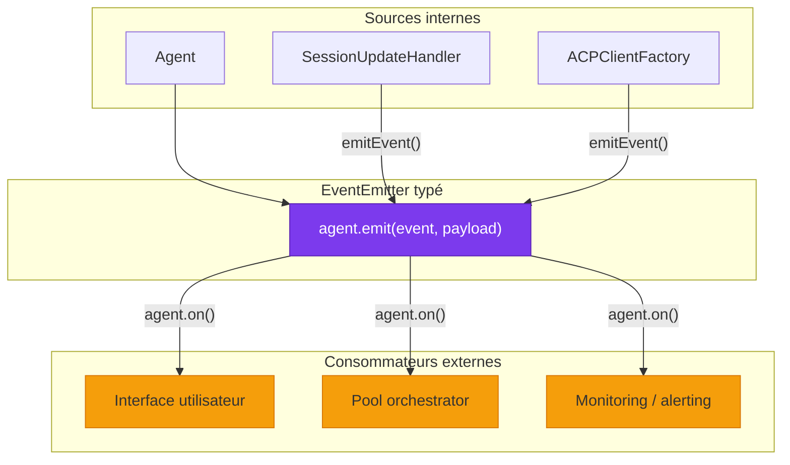
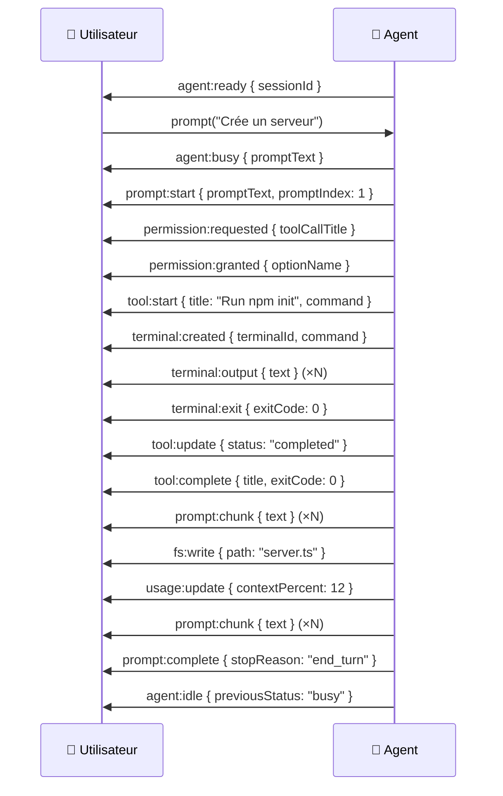

# 📡 Événements typés — Système d'orchestration événementiel

> Le système d'événements de Stark est le **mécanisme de communication** entre l'Agent
> et le monde extérieur. Chaque action significative — tool call, prompt, terminal, permission —
> produit un événement fortement typé que les consommateurs peuvent écouter.

---

## Rôle et importance

Les événements typés permettent à un code externe (orchestrateur de pool, UI, monitoring)
de **réagir en temps réel** à tout ce que fait l'agent, sans coupler le code au fonctionnement
interne du système.

| Responsabilité | Description |
|----------------|-------------|
| 📡 **Communication** | Canal de sortie entre l'Agent et les consommateurs |
| 🔒 **Typage fort** | TypeScript infère automatiquement le payload de chaque événement |
| 🏷️ **Métadonnées** | Chaque événement porte timestamp, identité agent et type |
| 🎯 **Granularité** | 24 types d'événements couvrant tous les aspects du système |
| 🔌 **Découplage** | Les consommateurs n'ont pas besoin de connaître les internals |



---

## Comment ça marche

### L'Agent comme EventEmitter typé

L'Agent étend `EventEmitter` de Node.js avec des **overrides typés** pour `on()`, `once()`,
`off()` et `emit()` :

```typescript
import { Agent } from "./classes/agent/agent.ts";
import { AgentEvent } from "./enums/agent-event.enum.ts";

const agent = new Agent({ cwd: process.cwd() });
await agent.ready;

// TypeScript infère automatiquement le type du payload
agent.on(AgentEvent.TOOL_START, (e) => {
  // e est de type ToolStartEvent
  console.log(e.title);      // ✅ string
  console.log(e.kind);       // ✅ ToolKind | undefined
  console.log(e.command);    // ✅ string | undefined
  console.log(e.toolCallId); // ✅ string
  console.log(e.timestamp);  // ✅ string (ISO-8601)
  console.log(e.agent.name); // ✅ string
});

agent.on(AgentEvent.PROMPT_CHUNK, (e) => {
  // e est de type PromptChunkEvent
  process.stdout.write(e.text); // Affichage streaming
});

agent.on(AgentEvent.USAGE_UPDATE, (e) => {
  // e est de type UsageUpdateEvent
  console.log(`${e.contextPercent}% du contexte utilisé`);
  if (e.cost) {
    console.log(`$${e.cost.amount.toFixed(4)} ${e.cost.currency}`);
  }
});
```

### Le `BaseAgentEvent` — Champs communs

**Chaque** événement émis par l'Agent contient ces champs de base :

```typescript
interface BaseAgentEvent {
  /** Le type d'événement (discriminant) */
  readonly event: AgentEvent;

  /** Timestamp ISO-8601 de l'émission */
  readonly timestamp: string;

  /** Identité de l'agent émetteur */
  readonly agent: AgentIdentity;
}

interface AgentIdentity {
  readonly id: string;    // UUID v4
  readonly name: string;  // "Swift Nova"
}
```

Ces champs sont injectés automatiquement par la méthode `emitTyped()` de l'Agent.
Les composants internes (SessionUpdateHandler, ACPClientFactory) n'ont qu'à fournir
les champs **métier** — le reste est ajouté par l'Agent :

```typescript
// Ce que le composant interne fournit :
emitEvent(AgentEvent.TOOL_START, {
  toolCallId: "tc-42",
  title: "Run npm test",
});

// Ce que le consommateur reçoit :
{
  event: "tool:start",                          // ← ajouté
  timestamp: "2025-01-15T14:32:07.421Z",       // ← ajouté
  agent: { id: "abc-123", name: "Swift Nova" }, // ← ajouté
  toolCallId: "tc-42",
  title: "Run npm test",
}
```

---

## L'enum `AgentEvent`

Tous les types d'événements sont centralisés dans l'enum `AgentEvent` :

```typescript
export enum AgentEvent {
  // ── Agent lifecycle ──────────────────────────
  AGENT_READY       = "agent:ready",
  AGENT_BUSY        = "agent:busy",
  AGENT_IDLE        = "agent:idle",
  AGENT_ERROR       = "agent:error",
  AGENT_DESTROYED   = "agent:destroyed",

  // ── Prompt turn ──────────────────────────────
  PROMPT_START      = "prompt:start",
  PROMPT_CHUNK      = "prompt:chunk",
  PROMPT_THOUGHT    = "prompt:thought",
  PROMPT_COMPLETE   = "prompt:complete",

  // ── Tool calls ───────────────────────────────
  TOOL_START        = "tool:start",
  TOOL_UPDATE       = "tool:update",
  TOOL_COMPLETE     = "tool:complete",
  TOOL_FAILED       = "tool:failed",

  // ── Execution plan ───────────────────────────
  PLAN_UPDATE       = "plan:update",

  // ── Permissions ──────────────────────────────
  PERMISSION_REQUESTED = "permission:requested",
  PERMISSION_GRANTED   = "permission:granted",
  PERMISSION_DENIED    = "permission:denied",

  // ── Terminal ─────────────────────────────────
  TERMINAL_CREATED  = "terminal:created",
  TERMINAL_OUTPUT   = "terminal:output",
  TERMINAL_EXIT     = "terminal:exit",
  TERMINAL_RELEASED = "terminal:released",

  // ── File system ──────────────────────────────
  FS_READ           = "fs:read",
  FS_WRITE          = "fs:write",

  // ── Usage & cost ─────────────────────────────
  USAGE_UPDATE      = "usage:update",

  // ── Context injection ────────────────────────
  CONTEXT_INJECTED  = "context:injected",

  // ── Session mode ─────────────────────────────
  MODE_CHANGE       = "mode:change",

  // ── Session config ───────────────────────────
  CONFIG_UPDATE     = "config:update",
}
```

---

## Référence complète — Tous les événements

### 🤖 Agent Lifecycle

#### `agent:ready`

Émis quand l'agent a terminé son initialisation et est prêt à recevoir des prompts.

| Champ | Type | Description |
|-------|------|-------------|
| `sessionId` | `string` | L'ID de session ACP créé |

```typescript
agent.on(AgentEvent.AGENT_READY, (e) => {
  console.log(`Agent prêt, session: ${e.sessionId}`);
});
```

**Émis par :** `Agent` (fin de `initialize()`)

---

#### `agent:busy`

Émis quand l'agent commence à traiter un prompt.

| Champ | Type | Description |
|-------|------|-------------|
| `promptText` | `string` | Le texte du prompt envoyé |

```typescript
agent.on(AgentEvent.AGENT_BUSY, (e) => {
  console.log(`Traitement en cours: ${e.promptText.slice(0, 80)}...`);
});
```

**Émis par :** `Agent` (début de `prompt()`)

---

#### `agent:idle`

Émis quand l'agent a terminé son travail et retourne à l'état idle.

| Champ | Type | Description |
|-------|------|-------------|
| `previousStatus` | `AgentStatus` | Le status avant la transition |

```typescript
agent.on(AgentEvent.AGENT_IDLE, (e) => {
  console.log(`Agent de retour au repos (était: ${e.previousStatus})`);
});
```

**Émis par :** `Agent` (fin de `prompt()`)

---

#### `agent:error`

Émis quand l'agent rencontre une erreur.

| Champ | Type | Description |
|-------|------|-------------|
| `error` | `Error` | L'erreur rencontrée |
| `context` | `string` | Description de ce qui était en cours |

```typescript
agent.on(AgentEvent.AGENT_ERROR, (e) => {
  console.error(`Erreur (${e.context}): ${e.error.message}`);
});
```

**Émis par :** `Agent` (erreurs d'init, de prompt, ou de processus)

---

#### `agent:destroyed`

Émis quand l'agent est détruit.

| Champ | Type | Description |
|-------|------|-------------|
| *(aucun champ métier)* | | Uniquement les champs de base |

```typescript
agent.on(AgentEvent.AGENT_DESTROYED, (e) => {
  console.log(`Agent ${e.agent.name} détruit`);
});
```

**Émis par :** `Agent` (fin de `destroy()`)

---

### 💬 Prompt Turn

#### `prompt:start`

Émis au début de chaque prompt.

| Champ | Type | Description |
|-------|------|-------------|
| `promptText` | `string` | Le texte complet du prompt (avec contexte prépendé) |
| `promptIndex` | `number` | Numéro séquentiel du prompt pour cette instance |

```typescript
agent.on(AgentEvent.PROMPT_START, (e) => {
  console.log(`Prompt #${e.promptIndex}: ${e.promptText.slice(0, 100)}`);
});
```

**Émis par :** `Agent` (début de `prompt()`)

---

#### `prompt:chunk`

Émis pour chaque fragment de texte de la réponse de l'agent. C'est l'événement le plus
fréquent — il permet le **streaming en temps réel**.

| Champ | Type | Description |
|-------|------|-------------|
| `text` | `string` | Le fragment de texte reçu |

```typescript
agent.on(AgentEvent.PROMPT_CHUNK, (e) => {
  process.stdout.write(e.text); // Affichage streaming
});
```

**Émis par :** `SessionUpdateHandler` (sur `agent_message_chunk`)

!!! tip "Streaming"
    Cet événement est émis à chaque fragment, ce qui peut être très fréquent.
    Utilisez `process.stdout.write()` plutôt que `console.log()` pour éviter
    les retours à la ligne intempestifs.

---

#### `prompt:thought`

Émis pour chaque fragment du raisonnement interne de l'agent (chain-of-thought).

| Champ | Type | Description |
|-------|------|-------------|
| `text` | `string` | Le fragment de raisonnement |

```typescript
agent.on(AgentEvent.PROMPT_THOUGHT, (e) => {
  process.stderr.write(`💭 ${e.text}`);
});
```

**Émis par :** `SessionUpdateHandler` (sur `agent_thought_chunk`)

---

#### `prompt:complete`

Émis quand un prompt est terminé.

| Champ | Type | Description |
|-------|------|-------------|
| `stopReason` | `StopReason` | Pourquoi l'agent s'est arrêté (`"end_turn"`, etc.) |
| `fullText` | `string` | Le texte complet accumulé de la réponse |
| `usage` | `Usage \| null` | Statistiques de tokens (optionnel) |

```typescript
agent.on(AgentEvent.PROMPT_COMPLETE, (e) => {
  console.log(`Terminé: ${e.stopReason} (${e.fullText.length} chars)`);
  if (e.usage) {
    console.log(`Tokens: ${e.usage.inputTokens} in / ${e.usage.outputTokens} out`);
  }
});
```

**Émis par :** `Agent` (fin de `prompt()`)

---

### 🔧 Tool Calls

#### `tool:start`

Émis quand l'agent IA invoque un outil.

| Champ | Type | Description |
|-------|------|-------------|
| `toolCallId` | `string` | Identifiant unique du tool call |
| `title` | `string` | Description humaine de l'action |
| `kind` | `ToolKind \| undefined` | Catégorie : `"execute"`, `"read"`, `"edit"`, etc. |
| `locations` | `ToolCallLocation[] \| undefined` | Fichiers affectés |
| `command` | `string \| undefined` | Commande shell (parsée depuis rawInput) |
| `rawInput` | `unknown` | Données brutes du protocole ACP |

```typescript
agent.on(AgentEvent.TOOL_START, (e) => {
  const kind = e.kind ? ` [${e.kind}]` : "";
  console.log(`🔧 ${e.title}${kind}`);
  if (e.command) {
    console.log(`   $ ${e.command}`);
  }
  if (e.locations) {
    for (const loc of e.locations) {
      console.log(`   📄 ${loc.path}${loc.line ? `:${loc.line}` : ""}`);
    }
  }
});
```

**Émis par :** `SessionUpdateHandler` (sur `tool_call`)

---

#### `tool:update`

Émis lors d'une progression ou d'un changement de status d'un tool call.

| Champ | Type | Description |
|-------|------|-------------|
| `toolCallId` | `string` | Le tool call concerné |
| `title` | `string \| null` | Titre mis à jour (optionnel) |
| `status` | `ToolCallStatus \| null` | Status : `"in_progress"`, `"completed"`, `"failed"` |
| `locations` | `ToolCallLocation[] \| null` | Fichiers affectés mis à jour |
| `output` | `string \| undefined` | Sortie nettoyée (marqueur exit retiré) |
| `exitCode` | `number \| undefined` | Code de sortie du processus |
| `rawOutput` | `unknown` | Données brutes du protocole ACP |

```typescript
agent.on(AgentEvent.TOOL_UPDATE, (e) => {
  if (e.output) {
    const preview = e.output.length > 200
      ? e.output.slice(0, 200) + "..."
      : e.output;
    console.log(`   ${preview}`);
  }
});
```

**Émis par :** `SessionUpdateHandler` (sur `tool_call_update`)

---

#### `tool:complete`

Émis quand un tool call se termine avec succès.

| Champ | Type | Description |
|-------|------|-------------|
| `toolCallId` | `string` | Le tool call terminé |
| `title` | `string` | Titre final |
| `command` | `string \| undefined` | La commande shell exécutée |
| `output` | `string \| undefined` | Sortie finale nettoyée |
| `exitCode` | `number \| undefined` | Code de sortie |

```typescript
agent.on(AgentEvent.TOOL_COMPLETE, (e) => {
  const exit = e.exitCode != null ? ` (exit ${e.exitCode})` : "";
  console.log(`✅ ${e.title}${exit}`);
});
```

**Émis par :** `SessionUpdateHandler` (sur `tool_call_update` avec `status: "completed"`)

---

#### `tool:failed`

Émis quand un tool call échoue.

| Champ | Type | Description |
|-------|------|-------------|
| `toolCallId` | `string` | Le tool call échoué |
| `title` | `string` | Titre final |
| `command` | `string \| undefined` | La commande shell exécutée |
| `output` | `string \| undefined` | Sortie d'erreur |
| `exitCode` | `number \| undefined` | Code de sortie (non-zéro) |

```typescript
agent.on(AgentEvent.TOOL_FAILED, (e) => {
  console.error(`❌ ${e.title} (exit ${e.exitCode})`);
  if (e.output) {
    console.error(`   ${e.output}`);
  }
});
```

**Émis par :** `SessionUpdateHandler` (sur `tool_call_update` avec `status: "failed"`)

---

### 📋 Execution Plan

#### `plan:update`

Émis quand l'agent publie ou met à jour son plan d'exécution.

| Champ | Type | Description |
|-------|------|-------------|
| `entries` | `PlanEntry[]` | Liste des étapes du plan |

Chaque `PlanEntry` contient :

| Champ | Type | Description |
|-------|------|-------------|
| `content` | `string` | Description de l'étape |
| `status` | `string` | `"pending"`, `"in_progress"`, `"completed"` |
| `priority` | `string` | `"high"`, `"medium"`, `"low"` |

```typescript
agent.on(AgentEvent.PLAN_UPDATE, (e) => {
  console.log("📋 Plan d'exécution :");
  for (const entry of e.entries) {
    const icon = entry.status === "completed" ? "✅"
               : entry.status === "in_progress" ? "⚙️"
               : "⏳";
    console.log(`  ${icon} [${entry.priority}] ${entry.content}`);
  }
});
```

**Émis par :** `SessionUpdateHandler` (sur `plan`)

---

### 🔐 Permissions

#### `permission:requested`

Émis quand l'agent IA demande la permission d'effectuer une action.

| Champ | Type | Description |
|-------|------|-------------|
| `toolCallId` | `string` | Le tool call qui nécessite une permission |
| `toolCallTitle` | `string \| null` | Description de l'action |
| `options` | `PermissionOption[]` | Options disponibles (allow, deny, etc.) |

```typescript
agent.on(AgentEvent.PERMISSION_REQUESTED, (e) => {
  console.log(`🔒 Permission demandée: ${e.toolCallTitle}`);
  for (const opt of e.options) {
    console.log(`   - ${opt.name} (${opt.kind})`);
  }
});
```

**Émis par :** `ACPClientFactory` (dans `handlePermission`)

---

#### `permission:granted`

Émis quand une permission est accordée.

| Champ | Type | Description |
|-------|------|-------------|
| `toolCallId` | `string` | Le tool call autorisé |
| `optionId` | `string` | L'ID de l'option sélectionnée |
| `optionName` | `string` | Le nom de l'option sélectionnée |

```typescript
agent.on(AgentEvent.PERMISSION_GRANTED, (e) => {
  console.log(`🔓 Permission accordée: ${e.optionName}`);
});
```

**Émis par :** `ACPClientFactory` (quand autoApprove sélectionne une option "allow")

---

#### `permission:denied`

Émis quand une permission est refusée.

| Champ | Type | Description |
|-------|------|-------------|
| `toolCallId` | `string` | Le tool call refusé |
| `reason` | `string` | Raison du refus |

```typescript
agent.on(AgentEvent.PERMISSION_DENIED, (e) => {
  console.log(`🔒 Permission refusée: ${e.reason}`);
});
```

**Émis par :** `ACPClientFactory` (quand autoApprove est off ou aucune option allow)

---

### 🖥️ Terminal

#### `terminal:created`

Émis quand un nouveau processus terminal est créé.

| Champ | Type | Description |
|-------|------|-------------|
| `terminalId` | `string` | Identifiant unique du terminal |
| `command` | `string` | La commande exécutée |
| `args` | `string[]` | Les arguments |
| `cwd` | `string` | Le répertoire de travail |

```typescript
agent.on(AgentEvent.TERMINAL_CREATED, (e) => {
  console.log(`▶️  ${e.command} ${e.args.join(" ")} (dans ${e.cwd})`);
});
```

**Émis par :** `ACPClientFactory` (dans `handleCreateTerminal`)

---

#### `terminal:output`

Émis à chaque chunk de sortie (stdout ou stderr) d'un terminal.

| Champ | Type | Description |
|-------|------|-------------|
| `terminalId` | `string` | Le terminal qui produit la sortie |
| `stream` | `"stdout" \| "stderr"` | Le flux source |
| `text` | `string` | Le contenu de la sortie |

```typescript
agent.on(AgentEvent.TERMINAL_OUTPUT, (e) => {
  const prefix = e.stream === "stderr" ? "⚠️" : "📤";
  process.stderr.write(`${prefix} [${e.terminalId}] ${e.text}`);
});
```

**Émis par :** `Agent` (via le callback du TerminalManager)

!!! info "Fréquence élevée"
    Cet événement peut être très fréquent pour les commandes verbeuses.
    Envisagez de throttle ou de filtrer si nécessaire.

---

#### `terminal:exit`

Émis quand un processus terminal se termine.

| Champ | Type | Description |
|-------|------|-------------|
| `terminalId` | `string` | Le terminal terminé |
| `exitCode` | `number \| null` | Code de sortie (0 = succès) |
| `signal` | `string \| null` | Signal ayant tué le processus (ex: `"SIGTERM"`) |

```typescript
agent.on(AgentEvent.TERMINAL_EXIT, (e) => {
  const icon = e.exitCode === 0 ? "✅" : "❌";
  console.log(`${icon} Terminal ${e.terminalId} exited (code=${e.exitCode})`);
});
```

**Émis par :** `Agent` (via le callback du TerminalManager)

---

#### `terminal:released`

Émis quand un terminal est libéré et ses ressources nettoyées.

| Champ | Type | Description |
|-------|------|-------------|
| `terminalId` | `string` | Le terminal libéré |

```typescript
agent.on(AgentEvent.TERMINAL_RELEASED, (e) => {
  console.log(`🗑️  Terminal ${e.terminalId} libéré`);
});
```

**Émis par :** `ACPClientFactory` (dans `handleReleaseTerminal`)

---

### 📂 File System

#### `fs:read`

Émis quand l'agent lit un fichier.

| Champ | Type | Description |
|-------|------|-------------|
| `path` | `string` | Chemin du fichier lu |
| `contentLength` | `number` | Taille du contenu en caractères |

```typescript
agent.on(AgentEvent.FS_READ, (e) => {
  console.log(`📖 Read: ${e.path} (${e.contentLength} chars)`);
});
```

**Émis par :** `ACPClientFactory` (dans `handleReadTextFile`)

---

#### `fs:write`

Émis quand l'agent écrit un fichier.

| Champ | Type | Description |
|-------|------|-------------|
| `path` | `string` | Chemin du fichier écrit |
| `contentLength` | `number` | Taille du contenu en caractères |

```typescript
agent.on(AgentEvent.FS_WRITE, (e) => {
  console.log(`💾 Write: ${e.path} (${e.contentLength} chars)`);
});
```

**Émis par :** `ACPClientFactory` (dans `handleWriteTextFile`)

---

### 📊 Usage & Cost

#### `usage:update`

Émis quand les métriques d'utilisation de tokens sont mises à jour.

| Champ | Type | Description |
|-------|------|-------------|
| `contextSize` | `number` | Taille totale de la fenêtre de contexte en tokens |
| `contextUsed` | `number` | Tokens actuellement utilisés |
| `contextPercent` | `number` | Pourcentage d'utilisation (0-100) |
| `cost` | `Cost \| null` | Coût cumulé (montant + devise) |

```typescript
agent.on(AgentEvent.USAGE_UPDATE, (e) => {
  const bar = "█".repeat(Math.round(e.contextPercent / 5))
            + "░".repeat(20 - Math.round(e.contextPercent / 5));
  console.log(`📊 Context: ${bar} ${e.contextPercent}%`);

  if (e.cost) {
    console.log(`   💰 $${e.cost.amount.toFixed(4)} ${e.cost.currency}`);
  }
});
```

**Émis par :** `SessionUpdateHandler` (sur `usage_update`)

---

### 💉 Context Injection

#### `context:injected`

Émis quand de nouvelles instructions sont injectées dans le contexte de l'agent.

| Champ | Type | Description |
|-------|------|-------------|
| `instructions` | `string` | Le texte des instructions injectées |
| `queued` | `boolean` | `true` si mis en file (agent BUSY), `false` si envoyé immédiatement |

```typescript
agent.on(AgentEvent.CONTEXT_INJECTED, (e) => {
  const status = e.queued ? "📥 en file d'attente" : "📤 envoyé";
  console.log(`💉 Context ${status}: ${e.instructions.slice(0, 80)}...`);
});
```

**Émis par :** `Agent` (dans `injectContext()`)

---

### 🔄 Session Mode

#### `mode:change`

Émis quand le mode de session de l'agent change.

| Champ | Type | Description |
|-------|------|-------------|
| `modeId` | `string` | Le nouveau mode (`"ask"`, `"code"`, `"architect"`, etc.) |

```typescript
agent.on(AgentEvent.MODE_CHANGE, (e) => {
  console.log(`🔄 Mode: ${e.modeId}`);
});
```

**Émis par :** `SessionUpdateHandler` (sur `current_mode_update`)

---

### ⚙️ Session Config

#### `config:update`

Émis quand une option de configuration de session est mise à jour.

| Champ | Type | Description |
|-------|------|-------------|
| `configOptions` | `SessionConfigOption[]` | Les options mises à jour |

```typescript
agent.on(AgentEvent.CONFIG_UPDATE, (e) => {
  console.log(`⚙️  Config mise à jour (${e.configOptions.length} options)`);
});
```

**Émis par :** `SessionUpdateHandler` (sur `config_option_update`)

---

## Le type `AgentEventMap`

Le typage fort est rendu possible par l'interface `AgentEventMap` qui mappe chaque
membre de l'enum vers son type de payload :

```typescript
interface AgentEventMap {
  [AgentEvent.AGENT_READY]:         AgentReadyEvent;
  [AgentEvent.AGENT_BUSY]:          AgentBusyEvent;
  [AgentEvent.AGENT_IDLE]:          AgentIdleEvent;
  [AgentEvent.AGENT_ERROR]:         AgentErrorEvent;
  [AgentEvent.AGENT_DESTROYED]:     AgentDestroyedEvent;

  [AgentEvent.PROMPT_START]:        PromptStartEvent;
  [AgentEvent.PROMPT_CHUNK]:        PromptChunkEvent;
  [AgentEvent.PROMPT_THOUGHT]:      PromptThoughtEvent;
  [AgentEvent.PROMPT_COMPLETE]:     PromptCompleteEvent;

  [AgentEvent.TOOL_START]:          ToolStartEvent;
  [AgentEvent.TOOL_UPDATE]:         ToolUpdateEvent;
  [AgentEvent.TOOL_COMPLETE]:       ToolCompleteEvent;
  [AgentEvent.TOOL_FAILED]:         ToolFailedEvent;

  [AgentEvent.PLAN_UPDATE]:         PlanUpdateEvent;

  [AgentEvent.PERMISSION_REQUESTED]: PermissionRequestedEvent;
  [AgentEvent.PERMISSION_GRANTED]:   PermissionGrantedEvent;
  [AgentEvent.PERMISSION_DENIED]:    PermissionDeniedEvent;

  [AgentEvent.TERMINAL_CREATED]:    TerminalCreatedEvent;
  [AgentEvent.TERMINAL_OUTPUT]:     TerminalOutputEvent;
  [AgentEvent.TERMINAL_EXIT]:       TerminalExitEvent;
  [AgentEvent.TERMINAL_RELEASED]:   TerminalReleasedEvent;

  [AgentEvent.FS_READ]:             FsReadEvent;
  [AgentEvent.FS_WRITE]:            FsWriteEvent;

  [AgentEvent.USAGE_UPDATE]:        UsageUpdateEvent;
  [AgentEvent.CONTEXT_INJECTED]:    ContextInjectedEvent;
  [AgentEvent.MODE_CHANGE]:         ModeChangeEvent;
  [AgentEvent.CONFIG_UPDATE]:       ConfigUpdateEvent;
}
```

Ce mapping permet à TypeScript d'inférer automatiquement le type correct dans les appels `on()` :

```typescript
// TypeScript sait que `e` est de type `ToolStartEvent`
agent.on(AgentEvent.TOOL_START, (e) => { ... });

// TypeScript sait que `e` est de type `UsageUpdateEvent`
agent.on(AgentEvent.USAGE_UPDATE, (e) => { ... });
```

---

## Le type `EmitEventFn`

Le callback utilisé par les composants internes pour émettre des événements :

```typescript
type EmitEventFn = <K extends AgentEvent>(
  event: K,
  payload: Omit<AgentEventMap[K], keyof BaseAgentEvent>,
) => void;
```

Le `Omit<..., keyof BaseAgentEvent>` signifie que l'appelant ne fournit que les champs **métier**.
Les champs `event`, `timestamp` et `agent` sont ajoutés automatiquement par l'Agent.

---

## Chronologie des événements — Prompt typique



---

## Patterns d'utilisation

### Streaming en temps réel

```typescript
agent.on(AgentEvent.PROMPT_CHUNK, (e) => {
  process.stdout.write(e.text);
});
```

### Monitoring de la consommation

```typescript
agent.on(AgentEvent.USAGE_UPDATE, (e) => {
  if (e.contextPercent > 80) {
    console.warn(`⚠️  Attention: ${e.contextPercent}% du contexte utilisé`);
  }
});
```

### Journalisation des actions

```typescript
const actions: string[] = [];

agent.on(AgentEvent.TOOL_START, (e) => {
  actions.push(`🔧 ${e.title}`);
});

agent.on(AgentEvent.FS_WRITE, (e) => {
  actions.push(`💾 Wrote ${e.path}`);
});

agent.on(AgentEvent.TERMINAL_CREATED, (e) => {
  actions.push(`▶️  Ran: ${e.command} ${e.args.join(" ")}`);
});

// Plus tard :
console.log("Actions effectuées:", actions);
```

### Collecte des métriques

```typescript
agent.on(AgentEvent.PROMPT_COMPLETE, (e) => {
  metrics.recordPrompt({
    stopReason: e.stopReason,
    responseLength: e.fullText.length,
    usage: e.usage,
  });
});

agent.on(AgentEvent.TOOL_COMPLETE, (e) => {
  metrics.recordToolCall({
    title: e.title,
    exitCode: e.exitCode,
    success: e.exitCode === 0 || e.exitCode === undefined,
  });
});
```

---

## Résumé par domaine

| Domaine | Événements | Count |
|---------|-----------|-------|
| **Agent lifecycle** | `ready`, `busy`, `idle`, `error`, `destroyed` | 5 |
| **Prompt turn** | `start`, `chunk`, `thought`, `complete` | 4 |
| **Tool calls** | `start`, `update`, `complete`, `failed` | 4 |
| **Plan** | `update` | 1 |
| **Permissions** | `requested`, `granted`, `denied` | 3 |
| **Terminal** | `created`, `output`, `exit`, `released` | 4 |
| **File system** | `read`, `write` | 2 |
| **Usage** | `update` | 1 |
| **Context** | `injected` | 1 |
| **Mode** | `change` | 1 |
| **Config** | `update` | 1 |
| **Total** | | **27** |

---

## Liens

- [**Architecture**](../architecture/overview.md) — Vue d'ensemble du système
- [**Agent**](../components/agent.md) — L'EventEmitter typé qui émet les événements
- [**SessionUpdateHandler**](../components/session-update-handler.md) — Source de la plupart des événements
- [**ACPClientFactory**](../components/acp-client-factory.md) — Source des événements permissions et FS
- [**Cycle de vie**](lifecycle.md) — Les transitions de status qui déclenchent les événements lifecycle
- [**Flux & Séquences**](../architecture/sequences.md) — Les événements dans leur contexte temporel