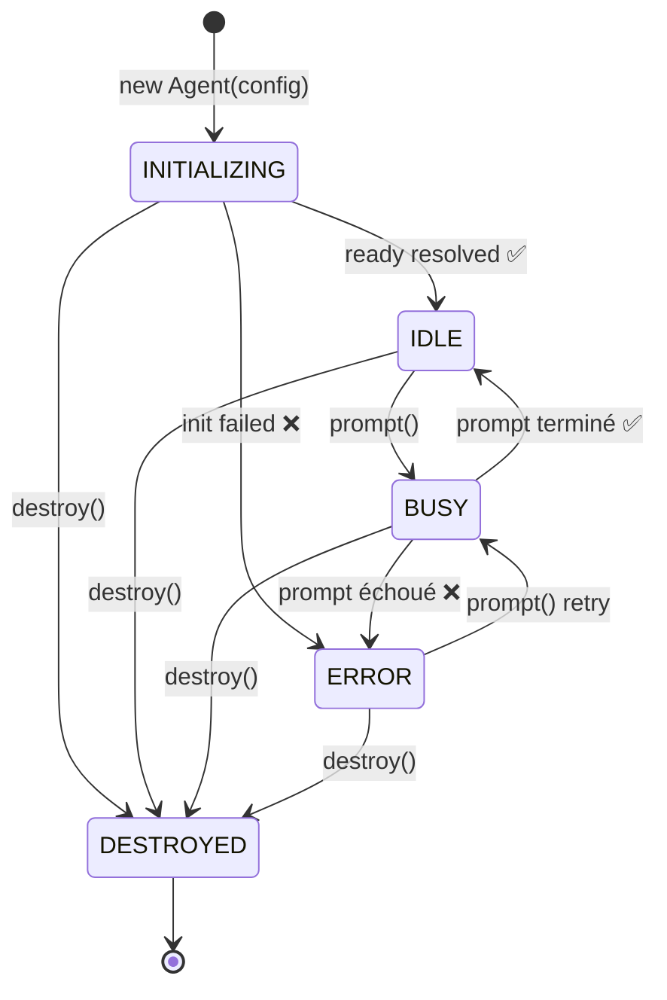
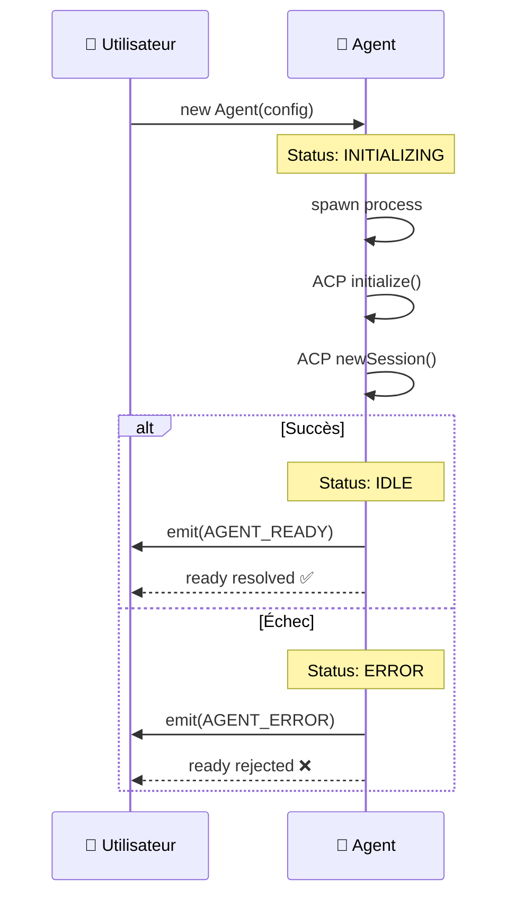
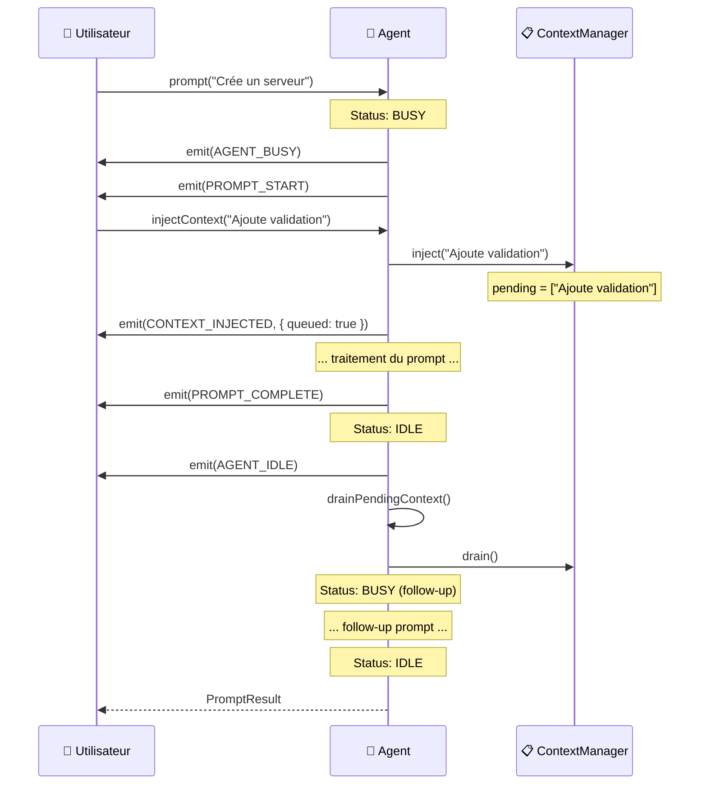
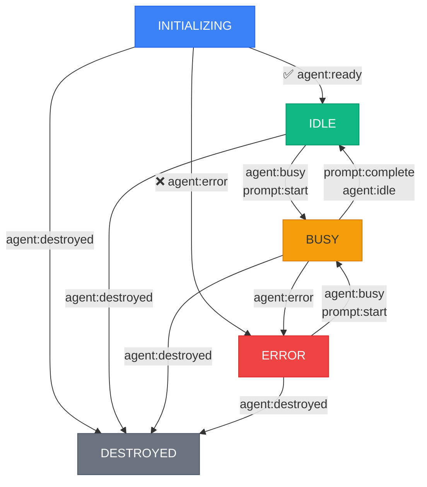
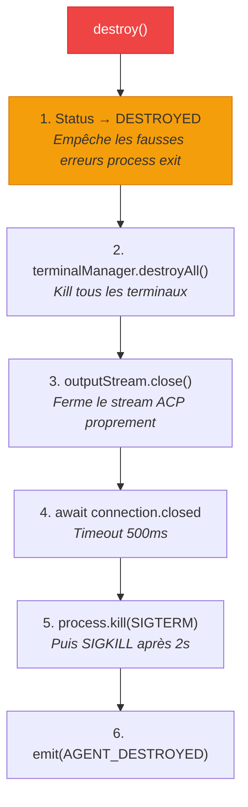

# 🔄 Cycle de vie — Machine à états de l'agent

> L'agent Stark suit une **machine à états stricte** qui gouverne tout son comportement.
> Comprendre ces états et leurs transitions est essentiel pour utiliser l'agent correctement
> et pour construire des orchestrateurs de pool robustes.

---

## Vue d'ensemble

L'agent traverse **5 états** au cours de sa vie, de sa création à sa destruction.
Chaque état détermine quelles opérations sont autorisées et comment l'agent réagit
aux appels de l'utilisateur.



---

## Les 5 états

### `INITIALIZING` — Démarrage en cours

| Propriété | Valeur |
|-----------|--------|
| **Valeur enum** | `"initializing"` |
| **Durée** | Quelques secondes (spawn + handshake ACP) |
| **Opérations autorisées** | `on()`, `once()`, `destroy()` |
| **Opérations interdites** | `prompt()`, `injectContext()` |

C'est l'état initial de l'agent, dès l'appel à `new Agent(config)`. Pendant cet état,
l'agent :

1. Spawne le processus `copilot --acp --stdio`
2. Négocie le protocole ACP (`initialize()`)
3. Crée une session de travail (`newSession()`)

```typescript
const agent = new Agent({ cwd: process.cwd() });

console.log(agent.status); // "initializing"

// ⚠️ Interdit pendant l'initialisation :
agent.prompt("..."); // ❌ Error: Agent is still initializing

// ✅ Autorisé — on peut écouter les événements tout de suite :
agent.on(AgentEvent.AGENT_READY, (e) => {
  console.log(`Prêt ! Session: ${e.sessionId}`);
});

// Attendre la fin de l'initialisation :
await agent.ready;
console.log(agent.status); // "idle"
```



**Transitions possibles :**

| Vers | Déclencheur | Événement émis |
|------|-------------|----------------|
| `IDLE` | Initialisation réussie | `agent:ready` |
| `ERROR` | Erreur d'initialisation | `agent:error` |
| `DESTROYED` | Appel à `destroy()` | `agent:destroyed` |

---

### `IDLE` — Prêt et en attente

| Propriété | Valeur |
|-----------|--------|
| **Valeur enum** | `"idle"` |
| **Durée** | Indéfinie — attend une action |
| **Opérations autorisées** | `prompt()`, `injectContext()`, `snapshot()`, `destroy()` |
| **Opérations interdites** | Aucune |

C'est l'état "nominal" de l'agent. Il est connecté, a une session active, et attend
qu'on lui donne du travail.

```typescript
await agent.ready;
console.log(agent.status); // "idle"

// ✅ Toutes les opérations sont autorisées :
const snap = agent.snapshot();
agent.injectContext("Utilise TypeScript strict mode"); // envoi immédiat
const result = await agent.prompt("Crée un serveur HTTP");
await agent.destroy();
```

!!! tip "Injection de contexte en IDLE"
    Quand `injectContext()` est appelé sur un agent `IDLE`, les instructions sont
    envoyées **immédiatement** comme follow-up prompt (via `drainPendingContext()`).
    L'agent passe brièvement en `BUSY` puis revient en `IDLE`.

**Transitions possibles :**

| Vers | Déclencheur | Événement émis |
|------|-------------|----------------|
| `BUSY` | Appel à `prompt()` | `agent:busy` + `prompt:start` |
| `DESTROYED` | Appel à `destroy()` | `agent:destroyed` |

---

### `BUSY` — Traitement d'un prompt

| Propriété | Valeur |
|-----------|--------|
| **Valeur enum** | `"busy"` |
| **Durée** | Variable — dépend de la complexité du prompt |
| **Opérations autorisées** | `injectContext()` (file d'attente), `snapshot()`, `destroy()` |
| **Opérations interdites** | `prompt()` (un seul à la fois) |

L'agent est en train de traiter un prompt. Pendant cet état :

- La réponse arrive en streaming (événements `prompt:chunk`)
- Des tool calls peuvent se déclencher (événements `tool:*`)
- Des terminaux peuvent être créés (événements `terminal:*`)
- Les métriques d'usage sont mises à jour (événements `usage:update`)

```typescript
// Lancer un prompt
const resultPromise = agent.prompt("Crée un serveur HTTP");

console.log(agent.status); // "busy"

// ⚠️ Interdit — un seul prompt à la fois :
agent.prompt("Autre chose"); // ❌ Error: Agent is already processing a prompt

// ✅ Autorisé — injection en file d'attente :
agent.injectContext("Ajoute de la validation");
// → Les instructions seront envoyées APRÈS la fin du prompt

// ✅ Autorisé — inspection de l'état :
const snap = agent.snapshot();
console.log(snap.pendingContextCount); // 1

// Attendre la fin
const result = await resultPromise;
console.log(agent.status); // "idle"
```



**Transitions possibles :**

| Vers | Déclencheur | Événement émis |
|------|-------------|----------------|
| `IDLE` | Prompt terminé avec succès | `prompt:complete` + `agent:idle` |
| `ERROR` | Erreur pendant le prompt | `agent:error` |
| `DESTROYED` | Appel à `destroy()` | `agent:destroyed` |

---

### `ERROR` — Erreur rencontrée

| Propriété | Valeur |
|-----------|--------|
| **Valeur enum** | `"error"` |
| **Durée** | Jusqu'à la prochaine tentative ou destruction |
| **Opérations autorisées** | `prompt()` (retry), `snapshot()`, `destroy()` |
| **Opérations interdites** | Aucune (mais `injectContext()` lance si `DESTROYED`) |

L'agent a rencontré une erreur mais n'est pas détruit. Il peut potentiellement
se récupérer si l'erreur était transitoire.

```typescript
try {
  await agent.prompt("...");
} catch (err) {
  console.log(agent.status); // "error"
  console.error(err.message);

  // On peut retenter :
  try {
    const result = await agent.prompt("Réessaye...");
    console.log(agent.status); // "idle" (récupéré !)
  } catch {
    // Toujours en erreur — mieux vaut détruire
    await agent.destroy();
  }
}
```

**Sources d'erreur :**

| Source | Contexte | Récupérable ? |
|--------|----------|---------------|
| Initialisation | Processus introuvable, handshake échoué | ❌ Non — `ready` rejetée |
| Prompt | Timeout, erreur ACP, connexion perdue | ⚠️ Peut-être |
| Process exit | Le processus copilot a crashé | ❌ Non — connexion perdue |

**Transitions possibles :**

| Vers | Déclencheur | Événement émis |
|------|-------------|----------------|
| `BUSY` | Nouvel appel à `prompt()` (retry) | `agent:busy` + `prompt:start` |
| `DESTROYED` | Appel à `destroy()` | `agent:destroyed` |

!!! warning "Récupération non garantie"
    Passer de `ERROR` à `BUSY` ne garantit pas que le prompt réussira.
    Si le processus sous-jacent a crashé, l'erreur se reproduira. Dans ce cas,
    mieux vaut détruire l'agent et en créer un nouveau.

---

### `DESTROYED` — Arrêté définitivement

| Propriété | Valeur |
|-----------|--------|
| **Valeur enum** | `"destroyed"` |
| **Durée** | Permanent (état terminal) |
| **Opérations autorisées** | `snapshot()`, `status`, `id`, `name` (lecture seule) |
| **Opérations interdites** | `prompt()`, `injectContext()`, `destroy()` (no-op) |

C'est l'état terminal et **irréversible**. L'agent a été nettoyé :

- Tous les terminaux sont tués
- Le stream ACP est fermé
- Le processus copilot est terminé (SIGTERM → SIGKILL)

```typescript
await agent.destroy();

console.log(agent.status); // "destroyed"

// ⚠️ Irréversible :
agent.prompt("...");
// ❌ Error: Agent "Swift Nova" (abc-123) has been destroyed

agent.injectContext("...");
// ❌ Error: Agent "Swift Nova" (abc-123) has been destroyed

// ✅ Re-appeler destroy() est un no-op sûr :
await agent.destroy(); // Aucun effet

// ✅ Lecture seule toujours possible :
console.log(agent.name);   // "Swift Nova"
console.log(agent.id);     // "abc-123"
const snap = agent.snapshot();
```

**Transitions possibles :**

| Vers | Déclencheur |
|------|-------------|
| Aucune | État terminal — pas de transition |

---

## Matrice des opérations par état

| Opération | INITIALIZING | IDLE | BUSY | ERROR | DESTROYED |
|-----------|:---:|:---:|:---:|:---:|:---:|
| `await ready` | ✅ | ✅ (résolu) | ✅ (résolu) | ⚠️ (rejeté) | ✅ (résolu/rejeté) |
| `prompt()` | ❌ throws | ✅ | ❌ throws | ✅ (retry) | ❌ throws |
| `injectContext()` | ⚠️ | ✅ (immédiat) | ✅ (file) | ⚠️ | ❌ throws |
| `snapshot()` | ✅ | ✅ | ✅ | ✅ | ✅ |
| `on() / once()` | ✅ | ✅ | ✅ | ✅ | ✅ |
| `destroy()` | ✅ | ✅ | ✅ | ✅ | ✅ (no-op) |

**Légende :**

- ✅ Autorisé
- ❌ Lance une `Error`
- ⚠️ Comportement spécial (voir la section correspondante)

---

## Diagramme des événements par transition

Chaque transition de status émet un ou plusieurs événements :



### Tableau complet

| Transition | Événements émis | Description |
|------------|----------------|-------------|
| `INITIALIZING` → `IDLE` | `agent:ready` | Initialisation réussie |
| `INITIALIZING` → `ERROR` | `agent:error` | Échec d'initialisation |
| `IDLE` → `BUSY` | `agent:busy`, `prompt:start` | Début de prompt |
| `BUSY` → `IDLE` | `prompt:complete`, `agent:idle` | Prompt terminé |
| `BUSY` → `ERROR` | `agent:error` | Erreur pendant un prompt |
| `ERROR` → `BUSY` | `agent:busy`, `prompt:start` | Retry de prompt |
| `*` → `DESTROYED` | `agent:destroyed` | Destruction de l'agent |

---

## Chronologie typique d'un agent

Voici la chronologie des transitions d'état pour un usage typique :

```mermaid
gantt
    title Cycle de vie d'un agent
    dateFormat X
    axisFormat %s

    section Status
    INITIALIZING             :active, init, 0, 5
    IDLE (attente)           :idle1, 5, 8
    BUSY (prompt 1)          :crit, busy1, 8, 30
    IDLE (entre prompts)     :idle2, 30, 32
    BUSY (prompt 2)          :crit, busy2, 32, 50
    IDLE (attente)           :idle3, 50, 53
    BUSY (context drain)     :crit, busy3, 53, 55
    IDLE (final)             :idle4, 55, 58
    DESTROYED                :done, dest, 58, 60
```



```typescript
// T=0: INITIALIZING
const agent = new Agent({ cwd: process.cwd() });

// T=5: IDLE (après ready)
await agent.ready;

// T=8→30: BUSY (prompt 1)
const r1 = await agent.prompt("Crée un serveur HTTP");

// T=30: IDLE

// T=32→50: BUSY (prompt 2)
const r2 = await agent.prompt("Ajoute un endpoint /health");

// T=50: IDLE

// T=53: injection de contexte → BUSY (drain automatique)
agent.injectContext("Utilise des tests Jest");

// T=55: IDLE (après drain)

// T=58: DESTROYED
await agent.destroy();
```

---

## Gestion d'erreur — Patterns recommandés

### Pattern 1 — Retry simple

```typescript
async function promptWithRetry(
  agent: Agent,
  text: string,
  maxRetries = 2,
): Promise<PromptResult> {
  for (let attempt = 1; attempt <= maxRetries; attempt++) {
    try {
      return await agent.prompt(text);
    } catch (err) {
      if (attempt === maxRetries) throw err;
      console.warn(`Attempt ${attempt} failed, retrying...`);
      // Petit délai avant retry
      await new Promise((r) => setTimeout(r, 1000));
    }
  }
  throw new Error("Unreachable");
}
```

### Pattern 2 — Surveillance de la santé

```typescript
function watchHealth(agent: Agent): void {
  agent.on(AgentEvent.AGENT_ERROR, (e) => {
    console.error(`⚠️  Agent ${e.agent.name} en erreur: ${e.error.message}`);

    // Décision basée sur le contexte
    if (e.context === "process_exit") {
      // Le processus a crashé — destruction et recréation
      console.error("Processus crashé, reconstruction...");
      agent.destroy().then(() => {
        // Créer un nouvel agent...
      });
    }
    // Sinon, on peut tenter un retry au prochain prompt
  });

  agent.on(AgentEvent.USAGE_UPDATE, (e) => {
    if (e.contextPercent > 90) {
      console.warn(`⚠️  Contexte presque plein: ${e.contextPercent}%`);
      // Envisager de détruire et recréer l'agent avec un contexte frais
    }
  });
}
```

### Pattern 3 — Pool d'agents avec status monitoring

```typescript
function selectIdleAgent(agents: Agent[]): Agent | undefined {
  return agents.find((a) => {
    const snap = a.snapshot();
    return snap.status === "idle";
  });
}

function getPoolStatus(agents: Agent[]): Record<string, number> {
  const counts: Record<string, number> = {};
  for (const agent of agents) {
    const status = agent.status;
    counts[status] = (counts[status] ?? 0) + 1;
  }
  return counts;
}

// { idle: 3, busy: 2, error: 1, destroyed: 0 }
```

---

## Le `setStatus()` interne

Les transitions de status sont gérées par la méthode privée `setStatus()` de l'Agent.
Elle :

1. Vérifie que le nouveau status est différent de l'actuel (no-op sinon)
2. Met à jour le champ `_status`
3. Logue la transition au niveau `debug`

```typescript
private setStatus(newStatus: AgentStatus): void {
  const prev = this._status;
  if (prev === newStatus) return;

  this._status = newStatus;
  this.logger.debug(
    { from: prev, to: newStatus },
    `Status: ${prev} → ${newStatus}`,
  );
}
```

Le `assertReady()` est appelé avant chaque `prompt()` pour garantir que l'agent
est dans un état valide :

```typescript
private assertReady(): void {
  if (this._status === AgentStatus.DESTROYED) {
    throw new Error(`Agent "${this.name}" (${this.id}) has been destroyed`);
  }
  if (this._status === AgentStatus.INITIALIZING) {
    throw new Error(
      `Agent "${this.name}" (${this.id}) is still initializing — await agent.ready first`,
    );
  }
  if (this._status === AgentStatus.BUSY) {
    throw new Error(
      `Agent "${this.name}" (${this.id}) is already processing a prompt`,
    );
  }
}
```

!!! info "L'état ERROR autorise `prompt()`"
    Remarquez que `assertReady()` ne bloque **pas** l'état `ERROR`. C'est intentionnel :
    un agent en erreur peut tenter un retry. Le status passera à `BUSY` si le prompt
    démarre, puis à `IDLE` ou `ERROR` selon le résultat.

---

## Destruction — Ordre critique

L'ordre des opérations dans `destroy()` est **critique** pour éviter les erreurs parasites :



**Pourquoi cet ordre ?**

1. **Status DESTROYED en premier** → Le handler `process.exit` vérifie le status.
   Sans ça, il émettrait un faux `agent:error` quand le processus se termine suite
   à notre `SIGTERM`.

2. **Terminaux avant le process** → Les terminaux sont des processus enfants du process
   principal. Mieux vaut les tuer proprement avant de tuer le parent.

3. **Stream avant le process** → Fermer le stream empêche le SDK ACP de tenter des
   écritures sur un stream mort (ce qui produirait des erreurs console bruyantes).

---

## L'enum `AgentStatus`

```typescript
export enum AgentStatus {
  /** Agent is being set up: spawning process, initializing ACP, creating session. */
  INITIALIZING = "initializing",

  /** Agent is ready and waiting for instructions. */
  IDLE = "idle",

  /** Agent is actively processing a prompt. */
  BUSY = "busy",

  /** Agent encountered an unrecoverable error during the last operation. */
  ERROR = "error",

  /** Agent has been shut down and cannot be reused. */
  DESTROYED = "destroyed",
}
```

### Utilisation dans le code

```typescript
import { AgentStatus } from "./enums/agent-status.enum.ts";

// Vérification directe
if (agent.status === AgentStatus.IDLE) {
  await agent.prompt("...");
}

// Via snapshot
const snap = agent.snapshot();
if (snap.status === "idle") {
  // Les valeurs sont des strings, comparaison possible
}
```

---

## Résumé

| État | Peut `prompt()` | Peut `injectContext()` | Peut `destroy()` | Prochain état possible |
|------|:---:|:---:|:---:|---|
| **INITIALIZING** | ❌ | ⚠️ | ✅ | IDLE, ERROR, DESTROYED |
| **IDLE** | ✅ | ✅ (immédiat) | ✅ | BUSY, DESTROYED |
| **BUSY** | ❌ | ✅ (file) | ✅ | IDLE, ERROR, DESTROYED |
| **ERROR** | ✅ (retry) | ⚠️ | ✅ | BUSY, DESTROYED |
| **DESTROYED** | ❌ | ❌ | ✅ (no-op) | *(terminal)* |

---

## Liens

- [**Architecture**](../architecture/overview.md) — Vue d'ensemble du système
- [**Agent**](../components/agent.md) — L'orchestrateur et ses méthodes publiques
- [**Événements typés**](events.md) — Les événements émis à chaque transition
- [**Flux & Séquences**](../architecture/sequences.md) — Les transitions dans leur contexte temporel
- [**Configuration**](../guide/configuration.md) — Options qui affectent le cycle de vie
- [**Démarrage rapide**](../guide/quickstart.md) — Voir le cycle de vie en action