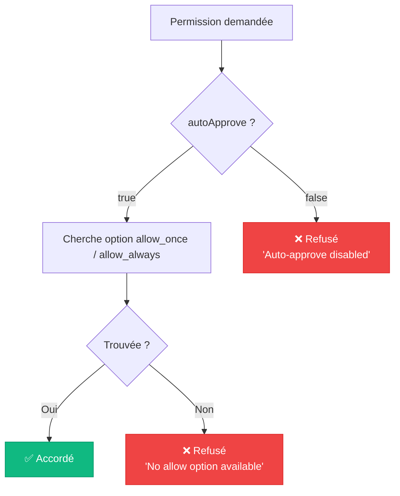

# ⚙️ Configuration — Référence complète

> Ce guide documente **toutes les options de configuration** disponibles dans Stark.
> Chaque option est décrite avec son type, sa valeur par défaut, et des exemples d'utilisation.

---

## Vue d'ensemble

La configuration de l'agent se fait via l'objet `AgentConfig` passé au constructeur :

```typescript
import { Agent } from "./classes/agent/agent.ts";

const agent = new Agent({
  // Identité
  name: "Mon Agent",
  id: "agent-001",

  // Processus ACP
  executable: "copilot",
  cwd: "/mon/projet",
  autoApprove: true,

  // Logging
  logOutput: {
    console: true,
    json: "./logs/agent.ndjson",
    seq: true,
  },
  logLevel: "info",

  // MCP Servers
  mcpServers: [],
});
```

---

## Toutes les options

### `name` — Nom de l'agent

| Propriété | Valeur |
|-----------|--------|
| **Type** | `string \| undefined` |
| **Défaut** | Généré automatiquement par Faker.js (`"Adjective FirstName"`) |
| **Requis** | Non |

Le nom humain de l'agent, utilisé dans les logs et les événements.

```typescript
// Nom auto-généré (ex: "Swift Nova", "Clever Atlas", "Bold Orion")
const agent = new Agent();
console.log(agent.name); // "Swift Nova"

// Nom personnalisé
const agent = new Agent({ name: "Jarvis" });
console.log(agent.name); // "Jarvis"
```

**Où apparaît le nom :**

| Contexte | Champ |
|----------|-------|
| Logs Pino | `agentName` (dans chaque ligne) |
| Événements | `event.agent.name` |
| Console (pino-pretty) | Préfixe du message : `Swift Nova \| Tool started` |

---

### `id` — Identifiant programmatique

| Propriété | Valeur |
|-----------|--------|
| **Type** | `string \| undefined` |
| **Défaut** | UUID v4 généré via `crypto.randomUUID()` |
| **Requis** | Non |

L'identifiant unique de l'agent, utilisé pour le tracking dans les pools et registres.

```typescript
// ID auto-généré
const agent = new Agent();
console.log(agent.id); // "a1b2c3d4-e5f6-7890-abcd-ef1234567890"

// ID personnalisé
const agent = new Agent({ id: "agent-prod-001" });
console.log(agent.id); // "agent-prod-001"
```

**Où apparaît l'ID :**

| Contexte | Champ |
|----------|-------|
| Logs Pino | `agentId` |
| Événements | `event.agent.id` |
| Snapshot | `snapshot().identity.id` |

---

### `executable` — Chemin de l'exécutable ACP

| Propriété | Valeur |
|-----------|--------|
| **Type** | `string \| undefined` |
| **Défaut** | `$COPILOT_CLI_PATH` → `"copilot"` |
| **Requis** | Non |

Le chemin ou le nom de l'exécutable de l'agent IA compatible ACP. La résolution suit cet ordre :

1. Valeur explicite dans la config
2. Variable d'environnement `COPILOT_CLI_PATH`
3. `"copilot"` (recherche dans le `PATH` système)

```typescript
// Utilise le PATH système
const agent = new Agent(); // → cherche "copilot" dans $PATH

// Chemin explicite
const agent = new Agent({
  executable: "/usr/local/bin/copilot",
});

// Via variable d'environnement
// COPILOT_CLI_PATH=/opt/copilot/bin/copilot
const agent = new Agent(); // → utilise $COPILOT_CLI_PATH
```

L'exécutable est lancé avec les flags `--acp --stdio` :

```bash
# Ce qui est exécuté en interne :
/usr/local/bin/copilot --acp --stdio
```

!!! warning "Erreur si introuvable"
    Si l'exécutable n'existe pas ou n'est pas dans le `PATH`, l'initialisation échoue
    avec l'erreur `"Failed to spawn ACP process"`. La promise `agent.ready` est rejetée.

---

### `cwd` — Répertoire de travail

| Propriété | Valeur |
|-----------|--------|
| **Type** | `string \| undefined` |
| **Défaut** | `process.cwd()` |
| **Requis** | Non |

Le répertoire de travail dans lequel l'agent opère. C'est passé à la session ACP
lors de `newSession({ cwd })` et utilisé par le [TerminalManager](../components/terminal-manager.md)
comme répertoire par défaut pour les processus enfants.

```typescript
const agent = new Agent({
  cwd: "/home/user/projects/my-app",
});
```

!!! tip "Influence sur l'agent IA"
    Le `cwd` est transmis à l'agent IA qui l'utilise pour :

    - Résoudre les chemins relatifs des fichiers
    - Exécuter les commandes dans le bon répertoire
    - Comprendre la structure du projet

---

### `autoApprove` — Approbation automatique des permissions

| Propriété | Valeur |
|-----------|--------|
| **Type** | `boolean \| undefined` |
| **Défaut** | `true` |
| **Requis** | Non |

Contrôle le comportement de l'agent face aux demandes de permission.

```typescript
// Auto-approve activé (défaut) — approuve toutes les actions
const agent = new Agent({ autoApprove: true });

// Auto-approve désactivé — refuse toutes les actions
const agent = new Agent({ autoApprove: false });
```

**Comportement selon la valeur :**

| Valeur | Effet | Usage |
|--------|-------|-------|
| `true` | Sélectionne automatiquement la première option `"allow_once"` ou `"allow_always"` | Développement, CI/CD, scripts automatisés |
| `false` | Refuse toutes les demandes (`{ outcome: "cancelled" }`) | Production, environnements sensibles |



!!! warning "Sécurité en production"
    En production, `autoApprove: false` est recommandé. Vous pouvez implémenter
    votre propre logique de permission en écoutant l'événement `permission:requested`
    et en construisant un [ACPClientFactory](../components/acp-client-factory.md) personnalisé.

---

### `logOutput` — Configuration des transports de log

| Propriété | Valeur |
|-----------|--------|
| **Type** | `LogOutputConfig \| undefined` |
| **Défaut** | `{ console: true }` (implicite si non spécifié) |
| **Requis** | Non |

Configure les trois transports de logging disponibles : console, JSON et Seq.
Chaque transport peut être activé/désactivé indépendamment et avoir son propre niveau de log.

```typescript
interface LogOutputConfig {
  console?: boolean | ConsoleTransportConfig;
  json?: boolean | string | JsonTransportConfig;
  seq?: boolean | string | SeqTransportConfig;
}
```

#### `logOutput.console` — Sortie console colorisée

| Forme | Exemple | Effet |
|-------|---------|-------|
| `true` | `{ console: true }` | Activé, utilise `logLevel` global |
| `false` | `{ console: false }` | Désactivé |
| Objet | `{ console: { enabled: true, level: "debug" } }` | Activé avec niveau personnalisé |

```typescript
// Simple — utilise le logLevel global
logOutput: { console: true }

// Avec un niveau personnalisé
logOutput: {
  console: { enabled: true, level: "debug" },
}
```

Le transport console utilise [pino-pretty](https://github.com/pinojs/pino-pretty) avec :

- Couleurs ANSI
- Timestamps courts (`HH:MM:ss.l`)
- Format : `[14:32:07.421] INFO: Swift Nova | Tool started`

---

#### `logOutput.json` — Fichier NDJSON structuré

| Forme | Exemple | Effet |
|-------|---------|-------|
| `true` | `{ json: true }` | Écrit sur stdout |
| `false` | `{ json: false }` | Désactivé |
| `string` | `{ json: "./logs/agent.ndjson" }` | Écrit dans le fichier spécifié |
| Objet | `{ json: { destination: "./logs/agent.ndjson", level: "debug" } }` | Fichier + niveau personnalisé |

```typescript
// Écrire dans un fichier
logOutput: { json: "./logs/agent.ndjson" }

// Écrire sur stdout
logOutput: { json: true }

// Configuration avancée
logOutput: {
  json: {
    destination: "./logs/agent.ndjson",
    level: "debug",  // Capture plus de détails que la console
  },
}
```

!!! info "Création automatique du répertoire"
    Le répertoire parent du fichier est créé automatiquement si nécessaire
    (via `pino.destination({ mkdir: true })`).

---

#### `logOutput.seq` — Streaming vers Seq

| Forme | Exemple | Effet |
|-------|---------|-------|
| `true` | `{ seq: true }` | Envoie à `$SEQ_URL` ou `http://localhost:5341` |
| `false` | `{ seq: false }` | Désactivé |
| `string` | `{ seq: "http://mon-seq:5341" }` | URL personnalisée |
| Objet | `{ seq: { url: "http://mon-seq:5341", level: "trace" } }` | URL + niveau personnalisé |

```typescript
// URL par défaut (localhost:5341)
logOutput: { seq: true }

// URL personnalisée
logOutput: { seq: "http://seq.internal:5341" }

// Configuration avancée
logOutput: {
  seq: {
    url: "http://seq.internal:5341",
    level: "trace",  // Capture tout dans Seq
  },
}
```

**Résolution de l'URL Seq :**

1. Valeur explicite dans la config
2. Variable d'environnement `SEQ_URL`
3. Défaut : `http://localhost:5341`

!!! tip "Docker Compose"
    Le `docker-compose.yml` fourni dans le projet lance Seq sur `http://localhost:5341`
    (ingestion) et `http://localhost:8082` (interface web).

---

#### Exemples combinés

```typescript
// ── Développement : tout activé ─────────────────────────
const agent = new Agent({
  logOutput: {
    console: true,
    json: "./logs/agent.ndjson",
    seq: true,
  },
  logLevel: "info",
});

// ── Production : JSON + Seq, pas de console ─────────────
const agent = new Agent({
  logOutput: {
    console: false,
    json: { destination: "/var/log/stark/agent.ndjson", level: "info" },
    seq: { url: "http://seq.prod:5341", level: "warn" },
  },
  logLevel: "info",
});

// ── Tests : rien (logger silencieux) ────────────────────
const agent = new Agent({
  logOutput: {
    console: false,
    json: false,
    seq: false,
  },
});

// ── Debug : niveaux différents par transport ────────────
const agent = new Agent({
  logOutput: {
    console: { enabled: true, level: "info" },    // Affiche info+
    json: { destination: "./logs/debug.ndjson", level: "debug" }, // Capture debug+
    seq: { level: "trace" },                        // Capture TOUT
  },
  logLevel: "info",  // Niveau global (base)
});
```

---

### `logLevel` — Niveau global de log

| Propriété | Valeur |
|-----------|--------|
| **Type** | `pino.Level \| undefined` |
| **Défaut** | `"info"` |
| **Requis** | Non |

Le niveau minimum de log global. Les transports qui ne spécifient pas leur propre
niveau utilisent cette valeur.

| Niveau | Valeur | Usage |
|--------|--------|-------|
| `"trace"` | 10 | Détails très fins (écho messages, etc.) |
| `"debug"` | 20 | Informations de débogage |
| `"info"` | 30 | Événements normaux (tools, prompts, etc.) — **défaut** |
| `"warn"` | 40 | Avertissements (permissions refusées, etc.) |
| `"error"` | 50 | Erreurs récupérables |
| `"fatal"` | 60 | Erreurs critiques |

```typescript
// Niveau par défaut
const agent = new Agent({ logLevel: "info" });

// Mode debug
const agent = new Agent({ logLevel: "debug" });

// Mode silencieux (sauf erreurs)
const agent = new Agent({ logLevel: "error" });
```

!!! info "Résolution automatique du niveau global"
    En interne, le niveau global du logger Pino est réglé sur le **niveau le plus bas**
    parmi tous les transports actifs. Par exemple, si la console est en `info` mais Seq
    en `trace`, le niveau global sera `trace` pour ne pas filtrer les logs avant Seq.

---

### `mcpServers` — Serveurs MCP

| Propriété | Valeur |
|-----------|--------|
| **Type** | `McpServer[] \| undefined` |
| **Défaut** | `[]` |
| **Requis** | Non |

Liste des serveurs MCP (Model Context Protocol) à connecter lors de la création de session.
Les serveurs MCP fournissent des outils et du contexte supplémentaires à l'agent IA.

```typescript
const agent = new Agent({
  mcpServers: [
    {
      name: "my-tools",
      url: "http://localhost:3001",
    },
  ],
});
```

---

## Variables d'environnement

Stark utilise plusieurs variables d'environnement comme fallbacks :

| Variable | Usage | Défaut |
|----------|-------|--------|
| `COPILOT_CLI_PATH` | Chemin de l'exécutable ACP | `"copilot"` |
| `SEQ_URL` | URL du serveur Seq (logs + traces) | `http://localhost:5341` |
| `SEQ_UI_PORT` | Port de l'UI Seq (docker-compose) | `8082` |
| `SEQ_INGEST_PORT` | Port d'ingestion Seq (docker-compose) | `5341` |
| `SEQ_ADMIN_PASSWORD` | Mot de passe admin Seq (docker-compose) | `"stark"` |
| `DOCS_PORT` | Port du serveur MkDocs (docker-compose) | `8083` |

---

## Configuration du docker-compose

Le fichier `docker-compose.yml` accepte ces variables pour personnaliser les ports :

```yaml
# .env (créez ce fichier à la racine du projet)
SEQ_UI_PORT=8082
SEQ_INGEST_PORT=5341
SEQ_ADMIN_PASSWORD=stark
SEQ_URL=http://localhost:5341
DOCS_PORT=8083
```

### Service Seq

```yaml
services:
  seq:
    image: datalust/seq:latest
    container_name: stark-seq
    ports:
      - "${SEQ_UI_PORT:-8082}:80"       # Interface web
      - "${SEQ_INGEST_PORT:-5341}:5341" # API d'ingestion
    environment:
      ACCEPT_EULA: "Y"
      SEQ_FIRSTRUN_ADMINPASSWORD: "${SEQ_ADMIN_PASSWORD:-stark}"
```

### Service MkDocs

```yaml
  docs:
    image: squidfunk/mkdocs-material:latest
    container_name: stark-docs
    ports:
      - "${DOCS_PORT:-8083}:8000"       # Documentation
    volumes:
      - ./docs:/docs/docs               # Contenu markdown
      - ./mkdocs.yml:/docs/mkdocs.yml   # Configuration
    command: serve --dev-addr=0.0.0.0:8000 --watch-theme
```

!!! tip "Hot reload"
    Le service MkDocs utilise `--watch-theme` pour recharger automatiquement
    la documentation quand vous modifiez les fichiers dans `docs/`.

---

## Configurations types

### Développement local

```typescript
const agent = new Agent({
  cwd: process.cwd(),
  logOutput: {
    console: true,                       // Voir les logs en temps réel
    json: "./logs/agent.ndjson",         // Garder un historique
    seq: true,                           // Visualiser dans Seq
  },
  logLevel: "info",
  autoApprove: true,                     // Pas de blocage
});
```

### Tests unitaires

```typescript
const agent = new Agent({
  cwd: "/tmp/test-workspace",
  logOutput: {
    console: false,
    json: false,
    seq: false,
  },
  autoApprove: true,
});
```

### CI/CD

```typescript
const agent = new Agent({
  cwd: process.env.WORKSPACE ?? process.cwd(),
  logOutput: {
    console: false,                      // Pas de bruit dans la CI
    json: { destination: "./artifacts/agent.ndjson", level: "debug" },
    seq: false,                          // Pas de Seq en CI
  },
  logLevel: "debug",                     // Capturer les détails
  autoApprove: true,
});
```

### Production (monitoring strict)

```typescript
const agent = new Agent({
  name: `worker-${process.env.HOSTNAME}`,
  id: `prod-${process.env.HOSTNAME}-${Date.now()}`,
  executable: "/opt/copilot/bin/copilot",
  cwd: "/app/workspace",
  logOutput: {
    console: false,
    json: {
      destination: "/var/log/stark/agent.ndjson",
      level: "info",
    },
    seq: {
      url: process.env.SEQ_URL ?? "http://seq.internal:5341",
      level: "info",
    },
  },
  logLevel: "info",
  autoApprove: false,  // ⚠️ Sécurité !
});
```

---

## Interface TypeScript complète

```typescript
interface AgentConfig {
  /** Nom humain de l'agent. Défaut: généré par Faker.js */
  name?: string;

  /** ID programmatique. Défaut: UUID v4 */
  id?: string;

  /** Chemin de l'exécutable ACP. Défaut: $COPILOT_CLI_PATH → "copilot" */
  executable?: string;

  /** Répertoire de travail. Défaut: process.cwd() */
  cwd?: string;

  /** Serveurs MCP à connecter. Défaut: [] */
  mcpServers?: McpServer[];

  /** Configuration des transports de log */
  logOutput?: LogOutputConfig;

  /** Niveau minimum de log global. Défaut: "info" */
  logLevel?: pino.Level;

  /** Auto-approve des permissions. Défaut: true */
  autoApprove?: boolean;
}

interface LogOutputConfig {
  /** Console colorisée (pino-pretty). Défaut: true */
  console?: boolean | ConsoleTransportConfig;

  /** Fichier JSON structuré. Défaut: false */
  json?: boolean | string | JsonTransportConfig;

  /** Streaming vers Seq. Défaut: false */
  seq?: boolean | string | SeqTransportConfig;
}

interface ConsoleTransportConfig {
  enabled: boolean;
  level?: pino.Level;
}

interface JsonTransportConfig {
  destination: string | true;
  level?: pino.Level;
}

interface SeqTransportConfig {
  url?: string;
  level?: pino.Level;
}
```

---

## Résumé des options

| Option | Type | Défaut | Description |
|--------|------|--------|-------------|
| `name` | `string` | Faker.js | Nom humain de l'agent |
| `id` | `string` | UUID v4 | Identifiant programmatique |
| `executable` | `string` | `$COPILOT_CLI_PATH` → `"copilot"` | Chemin de l'exécutable ACP |
| `cwd` | `string` | `process.cwd()` | Répertoire de travail |
| `autoApprove` | `boolean` | `true` | Approbation automatique des permissions |
| `logOutput.console` | `boolean \| object` | `true` | Sortie console colorisée |
| `logOutput.json` | `boolean \| string \| object` | `false` | Fichier NDJSON structuré |
| `logOutput.seq` | `boolean \| string \| object` | `false` | Streaming HTTP vers Seq |
| `logLevel` | `pino.Level` | `"info"` | Niveau minimum de log global |
| `mcpServers` | `McpServer[]` | `[]` | Serveurs MCP à connecter |

---

## Liens

- [**Démarrage rapide**](quickstart.md) — Installer et lancer votre premier agent
- [**Agent**](../components/agent.md) — L'orchestrateur qui consomme cette configuration
- [**Logger**](../components/logger.md) — Détail des transports de logging
- [**ACPClientFactory**](../components/acp-client-factory.md) — Comportement de `autoApprove`
- [**Architecture**](../architecture/overview.md) — Vue d'ensemble du système