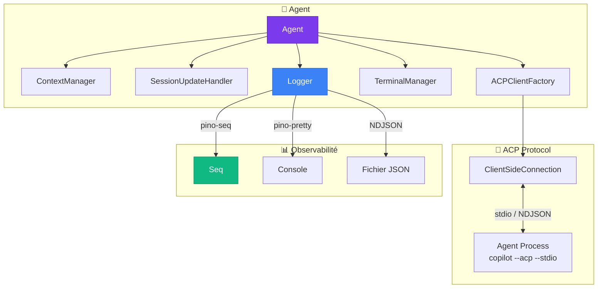

---
hide:
  - navigation
---

# 🤖 Stark — Documentation Technique

> **Stark** est un système d'agents autonomes construit sur l'**Agent Client Protocol (ACP)**.
> Il orchestre des processus d'IA capables d'exécuter des commandes, manipuler des fichiers,
> et raisonner sur des tâches complexes — le tout avec une observabilité complète via
> **Pino**.

---

## 📑 Sommaire

### 🏗️ Architecture

| Page | Description |
|------|-------------|
| [Vue d'ensemble](architecture/overview.md) | Architecture globale, composants et leurs relations |
| [Flux & Séquences](architecture/sequences.md) | Diagrammes de séquence détaillés de chaque flux |

### 🧱 Briques du système

| Brique | Description |
|--------|-------------|
| [Agent Client Protocol (ACP)](components/acp.md) | Le protocole de communication entre le client et l'agent IA |
| [Agent](components/agent.md) | La classe principale — orchestrateur de toutes les briques |
| [Logger](components/logger.md) | Logging structuré multi-transport avec Pino |
| [TerminalManager](components/terminal-manager.md) | Gestion du cycle de vie des processus terminaux |
| [AgentContextManager](components/context-manager.md) | File d'attente d'injection de contexte |
| [SessionUpdateHandler](components/session-update-handler.md) | Routeur d'événements ACP → logs, events |
| [ACPClientFactory](components/acp-client-factory.md) | Construction du client ACP (permissions, FS, terminal) |

### 💡 Concepts

| Concept | Description |
|---------|-------------|
| [Événements typés](concepts/events.md) | Système d'événements fortement typé pour l'orchestration |
| [Cycle de vie](concepts/lifecycle.md) | Machine à états de l'agent et transitions |

### 🚀 Guide

| Guide | Description |
|-------|-------------|
| [Démarrage rapide](guide/quickstart.md) | Installer, configurer et lancer votre premier agent |
| [Configuration](guide/configuration.md) | Toutes les options de configuration détaillées |

---

## 🧬 Stack technique

| Technologie | Rôle |
|-------------|------|
| **Bun** | Runtime TypeScript ultra-rapide |
| **ACP SDK** (`@agentclientprotocol/sdk`) | Communication avec les agents IA via le protocole ACP |
| **Pino** | Logging structuré haute performance |
| **pino-pretty** | Affichage colorisé en console |
| **pino-seq** | Streaming des logs vers Seq |
| **Seq** | Interface web de visualisation des logs |
| **Faker.js** | Génération de noms d'agents mémorables |
| **Docker Compose** | Orchestration des services (Seq, MkDocs) |

---

## 🗺️ Carte des composants



---

## ⚡ Démarrage en 30 secondes

```bash
# 1. Installer les dépendances
bun install

# 2. Lancer Seq + la documentation
docker compose up -d

# 3. Lancer un agent
bun run start "Crée un fichier hello.ts"

# 4. Visualiser
#    Logs → http://localhost:8082
#    Documentation → http://localhost:8083
```

!!! tip "Besoin de plus de détails ?"
    Consultez le [guide de démarrage rapide](guide/quickstart.md) pour une installation pas-à-pas.

---

<div style="text-align: center; margin-top: 3em; opacity: 0.5;">
    <em>Stark — Built with 🤖 and ☕</em>
</div>